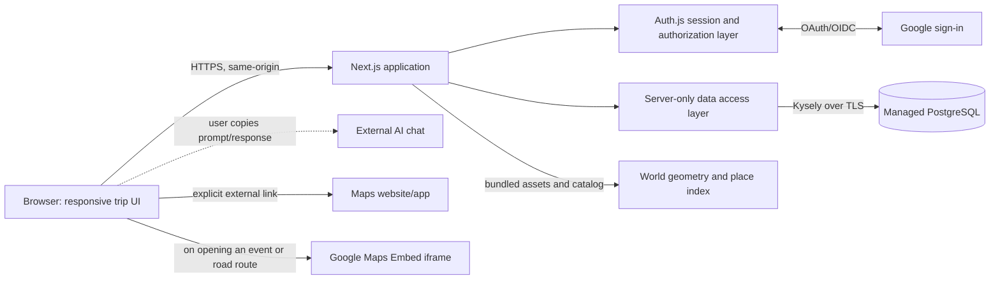
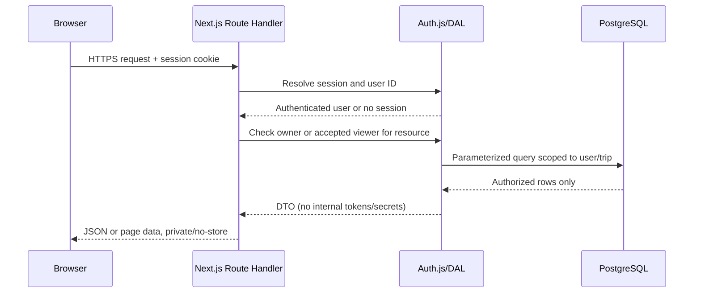
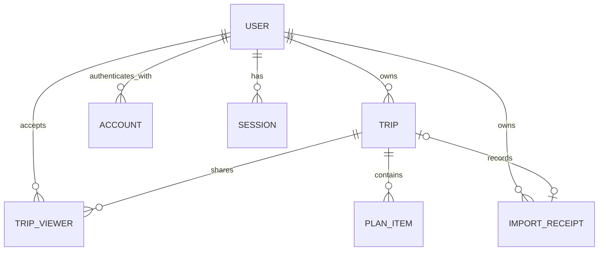

# Travel Planner — Technical Design

**Status:** Implementation baseline, pending deployment configuration  
**Product requirements:** [`PRD.md`](../../PRD.md), MVP baseline v1.2

Current as of 1 Oct 2026. Design-phase history: [archive/technical-design-design-phase.md](archive/technical-design-design-phase.md).

This document describes the system as built. Requirement IDs such as TRIP-10 refer to the PRD, which this document does not restate. Setup and commands are in the README; build status is in [`implementation-handoff.md`](../implementation-handoff.md). Layout and visual detail are in [Atlas v1](atlas-v1.md) and [Trip page v1](trip-page-v1.md).

## 1. Overview

### Purpose and scope

Travel Planner is one TypeScript web application with a server-side data-access layer (DAL) and one managed PostgreSQL database. Users sign in with Google through Auth.js, and sessions are stored in the database. All trip reads and writes run on the server. The browser never connects to PostgreSQL.

Built: sign-in, the dashboard and globe, trips, the trip page with events, costs and day map, the event side panel, account deletion, owner-only AI import into a new trip with optional owner-reviewed place lookup, read-only viewer invitations, pasted-coordinate pins and pilot counts. Not built: importing into an existing trip (TRIP-7, proposed; see [Open questions](#open-questions)) and ATLAS-4's click-the-globe point picker (owners set a point through catalog search only); no health-check route or structured request logging yet (see [Observability](#observability)).

Out of scope, per the PRD's MVP scope: in-app AI, weather, live flight status, email or push reminders, booking and payment, currency conversion, paid-spend accounting, packing lists, attachments, offline use, collaborative editing, and any app-owned street basemap, tiles, routing engine or background geocoding outside an owner-triggered import preview or event edit. The dataset is personal: a modest number of trips, at most 250 items each, and a few invited viewers.

The main product risk is the pasted AI response: it is untrusted, validated against a strict contract, previewed, committed atomically only after confirmation, and never stored or logged.

### Stack

All dependencies are pinned exactly.

| Layer | Choice |
|---|---|
| Web and server | Next.js 16.3 (App Router, Node.js runtime; `src/proxy.ts` replaces middleware), React 19.3, TypeScript 5.9 strict |
| Authentication | next-auth 5.0.0-beta.32 (Auth.js v5) with `@auth/kysely-adapter` 1.11 and database sessions |
| Database | PostgreSQL through Kysely 0.28.17 (the adapter's peer range excludes 0.29) and `pg` 8. Managed Supabase Postgres is the initial hosting target. |
| Validation | zod 4; `jsonc-parser` 3.3 for import parsing |
| Maps | `d3-geo`, `world-atlas` and `topojson-client`; bundled Natural Earth and OurAirports data |
| Tests and local database | Vitest 3.2 (4.x hit an npm install bug in this environment); `embedded-postgres` (PostgreSQL 17) |

### Integrations

- **Google sign-in** (OAuth/OIDC) for identity only. The app requests no Gmail, Calendar, Drive or travel scopes and keeps no Google API tokens.
- **Google Maps Embed API** (optional key) for an opened event's map and the opt-in day road route. Neither loads until the user opens it.
- **Geoapify forward geocoding** (optional server-only key) resolves non-flight place names during AI import preview. Only the place and destination are sent; candidates are shown before the owner confirms a pin. The provider permits its coordinates on the custom outline map with Geoapify and OpenStreetMap attribution. Failure leaves the import usable without pins.
- **External map links** open in a new tab on click; the server never fetches or resolves them.
- **Bundled data** (places, airports, geometry, city labels), so the dashboard and default trip page make no third-party request.
- **External AI chat**, run by the user outside the app; the app never calls an AI provider.

### Key decisions

- One deployable Next.js app and one database; no separate API service, queue, cache or microservice.
- The server-side DAL (`src/server/auth/access.ts`) is the only per-trip authorization boundary.
- Owners come from an email allowlist; everyone else needs an accepted invitation. The default deployment is a public sign-in shell.
- Schedules are local date/time plus an IANA zone; a flight item is one segment in airport-local times.
- One `plan_items` table holds booking state; the booking list is derived.
- Money is exact decimal, grouped by currency, never converted.
- The globe (canvas, `d3-geo`) and day map (SVG outline) use bundled data only.
- Deleting an item is a soft delete with a 10-minute restore.

## 2. Architecture

### Components



Next.js renders authenticated pages and exposes same-origin Route Handlers. Route Handlers call feature services in the server-only DAL, which query PostgreSQL through Kysely. UI components never build SQL, hold a database connection or make authorization decisions.

| Component | Responsibilities |
|---|---|
| Next.js UI | Screens, forms and states; responsive and keyboard-accessible. Client validation is for usability only. |
| Auth.js | Google OAuth (state and PKCE), user and account records, database sessions, sign-out. Google is the only provider; email-based account linking is off. |
| Route Handlers | Thin wrappers per [API conventions](#api-conventions). Every handler is a public entry point. |
| DAL services | Access checks, validation, time zones, totals, invitations, transactions, DTOs. |
| PostgreSQL | All app and Auth.js data, with constraints, indexes and transactions. |
| Globe and place catalog | Bundled geometry and place search; the globe shows authorized trip points only. |

### Trust boundaries

1. **Browser to app.** HTTPS; all input is untrusted. Session cookies are `HttpOnly`, `SameSite=Lax` and `Secure` in production. Mutations also need `Origin` equal to `APP_ORIGIN`.
2. **App to database.** TLS, server-only credentials, no DDL at runtime (see [Secrets and configuration](#secrets-and-configuration)).
3. **App to Google sign-in.** Identity only, under the sign-in gate in [Authentication and authorization](#authentication-and-authorization).
4. **App to external sites.** Links open only on click, with `noopener`/`noreferrer`, built from encoded, validated text. Trip content reaches Google only when the user opens an event (its place, pin or airports) or a day road route (that segment's points).
5. **Pasted AI response.** The external provider's data policy is the owner's concern; the app warns against pasting passport, card or booking-confirmation data. The server keeps the response in request memory only.

### Request flow



`src/proxy.ts` only sets the per-request CSP nonce and security headers; it is not the authorization boundary. Private pages send an anonymous visitor to sign-in through `pageActor` (`src/server/auth/session.ts`). The DAL checks access on every read and write, as the [Next.js authentication guide](https://nextjs.org/docs/app/guides/authentication) requires for Route Handlers and Server Functions.

### Code layout and file map

| Area | Files |
|---|---|
| Routes and pages | `src/app`: `sign-in/page.tsx`, `invite/page.tsx` (public invitation landing), `(private)/page.tsx` (dashboard), `(private)/import/page.tsx`, `(private)/trips/[tripId]/page.tsx`, `(private)/trips/[tripId]/items/[itemId]/page.tsx` (authorized event page), `(private)/layout.tsx`. Pages fetch data and render one screen component. |
| API | `src/app/api/**/route.ts`, each a few lines on `server/core/http/route.ts`. |
| Auth | `src/server/auth/`: `auth.ts` (Auth.js with the Kysely adapter), `session.ts`, `actor.ts`, `sign-in-gate.ts`, and `access.ts`, the per-trip authorization boundary. |
| Domain and data | `src/server/modules/<feature>/`: `*.service.ts` (rules and access checks), `*.repository.ts` (SQL only), `*.mapper.ts` (rows to DTOs). Features: `trips` (with `budget.repository.ts` and `time-zone.service.ts`), `items` (with `items.rules.ts`), `dashboard`, `account`, `places` (bundled catalog and airports plus `geocode.service.ts` for the bounded provider call and `geocode.rules.ts` for pure query/matching rules), `import` (with `import.rules.ts`), `invitations` (with `invitations.rules.ts` for token, status and staging-cookie helpers), and `usage` (`usage.rules.ts` for count names and report maths, `usage.service.ts` for best-effort `countUsage`). |
| Database | `src/server/core/db/client.ts` and `schema.ts`, `db/migrations/`, `db/migrate.ts` (migration provider), `scripts/migrate.ts` (`npm run db:migrate`), `scripts/dev.ts`, `scripts/dev-db.ts`, `scripts/pilot-report.ts`, `scripts/seed-hawaii.ts` and `scripts/demo-trips.ts`. |
| Shared | `src/shared`: zod schemas, DTO types, time, money, currency codes and names (`currencies.ts`), the FLIGHT-2 booking check (`booking.ts`), map links (`map-links.ts`, including pasted coordinates and embed URLs) and redirect helpers (`safe-path.ts`), used by browser and server. `src/lib/client-value.ts` holds browser-only values; `src/lib/use-dialog.ts` holds shared dialog behavior. |
| Bundled data | `src/data/places.json` (Natural Earth 10m populated places v5.1.2 plus `world-atlas` 50m country centroids), `src/data/airports.json` (OurAirports large and medium airports with IATA codes), `src/data/map-cities.json` (day-map city labels). Built by `npm run data:build`; sources and licenses in `src/data/SOURCES.md`. |
| UI building blocks | `src/components/ui/<Name>/` (Button, Tag, Field, Card, Banner, Modal, Toast, Menu, Section, TaskList, ProgressBar, Logo, Icon) and `src/components/layout/` (AppShell, AppHeader with AccountMenu, PageMessage). |
| Screens | `src/features/<feature>/<Screen>/`: `dashboard/Dashboard` (Hero, TripList, Globe), `trips/TripPage` (TripHeader, TripViewNav, TripHighlights, DayTabs, DaySection, Timeline, MapPanel with DayMap, EventPanel with EventMap and NotesEditor, FlightCard, CostsSection, BookingList, GlobeLocation), `trips/EventPage` (reuses EventPanel as a page), `trips/BookingTask` (one booking-list row), `trips/TripForm`, `trips/ItemForm`, `trips/TripPage/ShareDialog` (InviteLink, ViewerList), `import/ImportPage` (with `place-lookup.ts` for client request generations and reviewed-choice state, and `DraftItemEditor/MapSuggestion` for candidate review), `invitations/InvitePage`, `currency`, `auth/SignInCard`. |
| Styles | `src/styles` (tokens, base, utilities, motion) plus one `.module.css` per component. |
| Tests | `tests/unit` (pure logic) and `tests/db` (DAL, route handlers, sign-in gate and the test-trip seed against embedded PostgreSQL). |
| Configuration | `.env.example` lists variable names only; the README covers Google OAuth setup. |

Code rules:

- Each component has its own folder with `Name.tsx` and `Name.module.css`, nested under the component that uses it. A component used in several places moves up to `components/ui`.
- Global styles are tokens, element defaults and a few utilities, loaded in cascade layers so component modules always win. Shared keyframes are referenced through `--kf-*` variables because CSS modules rename animation names. State that CSS reacts to is a `data-*` attribute (for example `data-lit` for the linked highlight). A component's override of a shared component's style is parent-qualified so it does not depend on CSS load order.
- Route handlers stay thin; rules live in services and SQL in repositories.
- Values that differ between server and browser are never rendered on the server. Currency names are bundled in `src/shared/currencies.ts` (generated once from Node's `Intl.DisplayNames`), because Node and browsers ship different ICU data and the difference caused hydration error #418 on `/import`. The device time zone, the full IANA zone list and today's date are read after hydration through `useClientValue` (a `useSyncExternalStore` with a server fallback). Until then the zone picker omits **This device** and the zone count, and the dashboard omits the date.

## 3. Data model

Primary keys are UUIDs and audit timestamps are UTC `timestamptz`. Calendar dates are SQL `DATE`; local clock values are stored apart from their IANA zone. Money is never stored as floating point. Mutable rows have `created_at` and `updated_at`; `trips` and `plan_items` also have an integer `version` for optimistic concurrency. Import receipts have only `created_at`.

### Entity relationship



Columns are listed in the tables below; `usage_counts` stands alone. Flight fields are explicit `plan_items` columns; local times are never stored as UTC or copied into the generic date/time columns.

### Tables and constraints

#### Auth.js tables

`User`, `Account`, `Session` and `VerificationToken` use the Kysely adapter's default names and camel-case columns (`userId`, `sessionToken`). Do not rename them without a deliberate adapter mapping. `User` is the app's user identity; there is no profile table. The Google provider subject is the stable identity; email is normalized for invitation matching and is not a key. The Google provider's `account()` callback returns `{}`, so no access or refresh token is stored (see the [Auth.js provider reference](https://authjs.dev/reference/core/providers)).

#### `trips`

| Field | Type/constraint | Meaning |
|---|---|---|
| `id` | UUID PK | Trip identity. |
| `owner_user_id` | UUID FK `User.id`, not null, `ON DELETE CASCADE` | Sole owner. Sharing never transfers ownership. |
| `title` | Text, required, trimmed, length 1–120 | User-facing title. |
| `destination` | Text, required, trimmed, length 1–160 | Human-readable destination; not a geocoded place ID. |
| `atlas_latitude`, `atlas_longitude`, `atlas_source` | Nullable `NUMERIC(8,5)` pair plus `catalog`/`owner` provenance; all present or all null; valid latitude/longitude bounds | One approximate globe point, set by an exact, unique catalog match or an owner edit. Never guessed for an ambiguous or unmatched destination. See [Atlas v1](atlas-v1.md). |
| `start_date`, `end_date` | SQL `DATE`, required, `start_date <= end_date` | Planned inclusive range. Metadata only: it never hides items. |
| `time_zone` | Text, required, valid IANA zone, at most 100 characters, stored in canonical spelling | Default zone for status, inherited item times and due dates. |
| `budget_amount`, `budget_currency` | Nullable `NUMERIC(18,4)` plus uppercase ISO 4217 code; both null or both set; 0 to 99999999999999.9999 | Optional trip budget. |
| `version` | Integer, required, starts at 1 | Incremented on each trip edit and once per transaction that changes any child item. |
| `created_at`, `updated_at` | `timestamptz`, required | Audit and display metadata. |

A new trip or import starts at version 1 after its initial items. The single per-transaction increment lets a time-zone preview work against a consistent snapshot and stops a stale confirmation from overwriting concurrent edits, without hundreds of parent updates during a large import.

#### `import_receipts`

A small idempotency tombstone, not import history. One row per unique `(owner_user_id, idempotency_key)`, with `trip_id` (FK `trips.id ON DELETE SET NULL`), `payload_hash` (SHA-256 of the canonical normalized commit payload) and `created_at`. `owner_user_id` references `User.id ON DELETE CASCADE`. A live receipt has both `trip_id` and `payload_hash`; after trip deletion both are null. It holds no pasted response or trip content and lives until account deletion. The commit and deletion rules are in [Import](#import) and [Deletion and retention](#deletion-and-retention).

#### `trip_viewers`

One row per `(trip_id, invitee_email_normalized)`, so a trip has at most one current grant per email. A user may own one trip and view another; role is per trip.

| Field | Type/constraint | Meaning |
|---|---|---|
| `id`, `trip_id` | UUID PK, UUID FK `trips.id ON DELETE CASCADE` | Invitation/grant identity and parent trip. |
| `invitee_email_normalized` | Text, not null | Trimmed, lowercased email. Provider aliases are not rewritten. |
| `viewer_user_id` | Nullable UUID FK `User.id ON DELETE CASCADE` | Set only on acceptance. |
| `status` | `pending`, `accepted` or `revoked` | `expired` is derived: `pending` with `expires_at <= now()`. No cron. |
| `invitation_token_hash` | Nullable bytes, unique while non-null | SHA-256 of a random 256-bit token. |
| `expires_at` | `timestamptz`, required while pending | Seven days from issue. |
| `accepted_at`, `revoked_at` | Nullable `timestamptz` | Lifecycle timestamps. |
| `created_at`, `updated_at` | `timestamptz` | Audit metadata. |

Check constraints: pending requires token hash and expiry; accepted requires viewer and accepted time; revoked clears the token hash and never authorizes reads. An accepted grant keeps its hash so the bound account can reopen the link; it cannot bind a second account. Reissuing a pending, expired or revoked row rotates the hash and expiry in place, which invalidates the old link; reissuing a revoked row also clears the viewer binding and timestamps. An accepted grant must be revoked before it can be reissued.

#### `plan_items`

One table holds itinerary items and the booking list; there is no `booking_tasks` table. The booking list is the items with `booking_status = 'needs_booking'`.

| Field group | Fields and rules |
|---|---|
| Identity | `id` UUID PK; `trip_id` FK `ON DELETE CASCADE`; `version` integer. |
| Content | `type` enum `flight`, `lodging`, `transport`, `meal`, `activity`, `other`; trimmed `title` 1–200 characters; nullable `location` (up to 500) and `notes` (up to 5,000); `links` JSON array of at most 20 `{label,url}` entries (label up to 80, URL up to 2,048, `http` or `https`). |
| Map pin | `map_url TEXT NULL` (https, at most 2,048 characters after normalization, separate from `links`); `latitude NUMERIC(8,5) NULL` and `longitude NUMERIC(8,5) NULL`, both null or both set, range-checked, and allowed only with a `map_url`. Only the server sets coordinates, as described in [Map links and pins](#map-links-and-pins). A flight's airport pin is derived at read time and not stored. |
| Provenance | `source` enum `ai` or `manual`, set by the server. It is not a booking state. |
| Non-flight schedule | `local_date DATE NULL`, `local_time TIME NULL`, `time_zone TEXT NULL` (null inherits the trip zone; at most 100 characters), `time_disambiguation` (`earlier`/`later`), `duration_minutes INTEGER NULL` (manual maximum 20,160; JSON v1 import maximum 1,440). A time requires a date. Flight rows cannot use these columns. |
| Flight schedule | `planned_departure_date DATE NULL` (trip zone, placeholder only); nullable `airline` (up to 120 characters) and `flight_number` (up to 24); for each endpoint, `departure_`/`arrival_` plus `airport_code` (3–4 uppercase alphanumeric), `local_datetime` (`TIMESTAMP WITHOUT TIME ZONE`), `time_zone` (IANA) and `disambiguation` (`earlier`/`later`). A supplied local date-time requires its zone. An exact departure date-time excludes the placeholder date. When both endpoints are present, the arrival instant must follow departure. **Booked** requires both airport codes, both local date-times and both zones (FLIGHT-2). |
| Booking | `booking_status` enum `not_required`, `needs_booking`, `booked`. Flights are `needs_booking` or `booked`. `booking_due_date DATE NULL` only while `needs_booking`; marking booked clears it. |
| Planned cost | `planned_amount NUMERIC(18,4) NULL`, `planned_currency TEXT NULL`, `price_label` (`estimate` or `quote`), `price_source` (`ai` or `owner`). Amount and currency are both set or both null; label and source are null exactly when there is no price. Rules are in [Money](#money). |
| Soft delete | `deleted_at timestamptz NULL`. Every read, total, booking list, cap count and dashboard aggregate excludes deleted rows. Rows deleted more than 10 minutes ago are purged inside every item write (create, update, delete, restore, duplicate). Trip deletion still cascades immediately. |
| Timestamps | `created_at`, `updated_at`. Creation time breaks ordering ties. |

Check constraints cover: amount/currency/label/source pairing; nonnegative amount; `local_time` implies `local_date`; due date requires `needs_booking`; flights cannot be `not_required`; booked-flight completeness; flight and non-flight schedule columns do not mix; no placeholder date with an exact departure; a local date-time requires its zone. The domain service validates IANA zones, DST choices and arrival-after-departure, which a check constraint cannot.

Limits: 250 items per trip (including flight segments) and 20 links per item. Manual create, duplicate and restore enforce the item cap under a lock on the parent trip row; import checks it before inserting. Shared validation applies the same field and link limits to manual and imported data. The 1 MiB request limit is the aggregate ceiling.

#### `usage_counts`

Daily pilot totals for the PRD's "Validation and MVP acceptance" pilot, added by migration `0003_usage_counts`: `day DATE` (the database's `current_date`), `name TEXT` (lower_snake_case, at most 64 characters, checked), `count BIGINT` (at least 0), primary key `(day, name)`. No foreign keys and no user, trip, item or content columns, so trip and account deletion leave it untouched and it needs no retention rule. Names and counting rules are in [Pilot counts](#pilot-counts).

### Indexes

- `trips(owner_user_id, start_date)` for the owner dashboard.
- Unique `import_receipts(owner_user_id, idempotency_key)`; `import_receipts(trip_id)` for deletion.
- `trip_viewers(viewer_user_id, status, trip_id)` for accepted shared trips.
- Unique `trip_viewers(trip_id, invitee_email_normalized)`; unique token hash where non-null.
- `plan_items(trip_id, local_date, created_at)` for timeline sections.
- Partial `plan_items(trip_id, booking_due_date)` where `booking_status = 'needs_booking'` and a due date exists.
- `plan_items(trip_id, created_at)` for stable ordering of undated items.

Flight sort instants are computed in the domain layer, not materialized.

### Migrations

Migrations are TypeScript modules of raw SQL in `db/migrations`, listed explicitly in a static Kysely migration provider (`db/migrate.ts`) so every runtime sees the same set:

- `0001_initial`: Auth.js tables and the app tables `trips`, `trip_viewers`, `plan_items` (including `map_url`, coordinates, `price_source` and `deleted_at`) and `import_receipts`, with their constraints and indexes.
- `0002_import_v1_limits`: widens trip and item IANA zones to 100 characters, airline to 120, flight number to 24, and airport codes to 3–4 uppercase alphanumeric characters, matching JSON v1. Manual validation and form lengths match.
- `0003_usage_counts`: the pilot counts table.

Deployment runs `npm run db:migrate` with a schema-owner credential (`MIGRATION_DATABASE_URL`); the runtime credential cannot run DDL. Migrating on `npm run dev` is for local development only. Take a provider snapshot before a production migration. Write a rollback only when it cannot destroy user data; otherwise use a forward corrective migration. Never seed production trips.

### Deletion and retention

- **Trip deletion** is owner-only and transactional: lock the trip and its import receipts, set each receipt's `trip_id` and `payload_hash` to null, then delete the trip. Items and viewer rows cascade. The trip disappears from owner and viewer queries at once. There is no undo.
- **Item deletion** is a soft delete with a 10-minute restore (TRIP-8); see `plan_items`.
- **Account deletion** removes the `User` row and, by cascade, every owned trip (with the trip-deletion effects), session, account, viewer grant and import receipt (ACCESS-10).
- **Backups** may keep deleted rows until the provider's retention window ends. "Delete" means removed from the live app at once. Record the chosen plan's backup retention and restore behavior before launch.
- There is no audit-history table. `created_at`/`updated_at`, Auth.js sessions and provider logs are enough for debugging.

## 4. API and interfaces

### API conventions

All routes are same-origin HTTPS Route Handlers built on `route()` in `server/core/http/route.ts`. It checks `Origin` against `APP_ORIGIN` on every state-changing method first (missing or mismatched is 403, even without a session), then resolves the session (401 without one) and applies `requireOwnerAccount` when a route is owner-only, enforces the 1 MiB limit on the raw UTF-8 body bytes before parsing (not only on `Content-Length`; hosting ingress needs a compatible cap), validates the body, maps errors to the stable body below and marks every response `Cache-Control: private, no-store`. `POST /api/invitations/stage` is the one route without a session; it uses `publicRoute()`, which keeps every other rule.

```json
{
  "error": {
    "code": "validation_error",
    "message": "Correct the highlighted fields.",
    "fields": [{ "path": "items[2].flightDetails.departure.timeZone", "code": "invalid_time_zone", "message": "Enter a valid IANA time zone." }]
  }
}
```

Responses never include SQL, stack traces, session or invitation tokens, or other users' identifiers.

### Endpoint summary

"Owner" means an allowlisted owner of that trip. A trip the caller cannot read returns 404; a viewer calling an owner route gets 403.

| Endpoint | Purpose/input | Authorization and behavior |
|---|---|---|
| `GET /api/trips` | Dashboard data. | Signed-in user. Owned trips (while allowlisted) plus accepted shared trips, each with `role`. |
| `GET /api/atlas/places?q=...` | Catalog search: 2–160-character query, at most ten results. | Allowlisted owner. No trip data; no external geocoder. |
| `POST /api/places/resolve` | `{ "location": "...", "destination": "..." }`; returns `{ candidates, suggestedIndex }` with at most three labeled coordinate candidates and a nullable suggested index. | Allowlisted owner. Sends only those two fields to Geoapify when configured; no database write, bounded timeout, and no logging of query or result. |
| `POST /api/trips` | Title, destination, inclusive dates, IANA zone, optional budget. | Allowlisted owner. Creates an empty trip; an exact, unique catalog match sets the globe point. |
| `GET /api/trips/{tripId}` | Trip, items and totals. | Owner or accepted viewer. |
| `POST /api/trips/{tripId}/time-zone-preview` | `{ "timeZone": "...", "expectedVersion": 4 }`. | Owner. Read-only impact list (see [Time zones](#time-zones)). |
| `PATCH /api/trips/{tripId}` | Trip fields and `expectedVersion`. Optional `atlasLocation`: omitted (no point edit), `{latitude,longitude}` (owner point) or `null` (clear). A zone change adds `confirmTimeZoneImpact: true` and `timeDisambiguationByItem`. | Owner. A destination edit rematches catalog points, keeps an owner-set point with an editor warning, and yields to an explicit `atlasLocation`. A zone change applies in one transaction, rejecting DST gaps (with item paths) and unresolved overlaps, and bumps the version of each affected item. |
| `DELETE /api/trips/{tripId}` | `{ "confirm": true, "expectedVersion": 4 }`. | Owner. See [Deletion and retention](#deletion-and-retention). |
| `POST /api/trips/{tripId}/items` | New item or flight segment, including `mapUrl`, `plannedPrice` and `bookingStatus`. | Owner. `source` forced to `manual`; trip lock and 250-item cap. |
| `POST /api/trips/{tripId}/items/{itemId}/duplicate` | Source item's `expectedVersion`. | Owner. Trip lock and cap. Copies content and provenance with a new ID, clears the due date, and turns `booked` into `needs_booking`. |
| `PATCH /api/trips/{tripId}/items/{itemId}` | Item fields and `expectedVersion`; `confirmTypeChange: true` to switch to or from flight; optional `confirmPrice: true`. | Owner; the item must belong to the trip. A confirmed type change clears incompatible schedule fields, and a `not_required` item becoming a flight becomes `needs_booking`. |
| `DELETE /api/trips/{tripId}/items/{itemId}` | `{ "expectedVersion": 2 }`. | Owner. Sets `deleted_at` and bumps the trip version. |
| `PATCH /api/trips/{tripId}/items/{itemId}/notes` | `{ "notes": string \| null, "expectedVersion": 3 }` (TRIP-10). | Owner. Stores trimmed notes only (blank is null, at most 5,000 characters) with the same lock, purge and version rules as a full edit. |
| `PATCH /api/trips/{tripId}/items/{itemId}/booking` | `{ "bookingStatus": "needs_booking" \| "booked", "bookingDueDate": "2026-10-03" \| null, "expectedVersion": 3 }` (BOOK-3, BOOK-4). | Owner. Changes only the booking state and book-by date, with the same lock, purge and version rules as a full edit. **Booked** clears the date; it is 422 `flight_incomplete` for a flight without its FLIGHT-2 fields, and a date sent with **Booked** is 422. |
| `POST /api/trips/{tripId}/items/{itemId}/restore` | Undo a deletion. | Owner. Clears `deleted_at` on the same row and bumps the trip version. 410 after 10 minutes; 409 if the cap is full; 409 `restore_time_invalid` if the local time no longer exists or is now ambiguous in the trip zone. |
| `GET /api/import/schema` | The JSON v1 schema. | Allowlisted owner. Serves `docs/design/json-v1.schema.json` unchanged. |
| `POST /api/import/preview` | `{ "responseText": "...", "ownerProvidedBudget": MoneyDTO \| null }`. | Allowlisted owner. See [JSON v1 contract](#json-v1-contract). Writes only a pilot count. |
| `POST /api/import/commit` | Normalized trip and included items, optional owner-selected `confirmedMapUrls` parallel to items, `ownerProvidedBudget`, `Idempotency-Key` UUID header, `expectedFormatVersion: 1`, optional `previewSkipped` (0–250). | Allowlisted owner. See [Import](#import). `trip.budget` must equal `ownerProvidedBudget`. Map choices are validated and included in the idempotency hash; `previewSkipped` feeds only the pilot count and is not hashed. |
| `POST /api/trips/{tripId}/invitations` | `{ "email": "..." }`. | Owner. Creates or reissues the entry, rotating token and expiry. Own email is 422; an accepted viewer is 409 until revoked. No email is sent. |
| `GET /api/trips/{tripId}/invitations` | Viewer and invitation entries. | Owner. Never returns a token, hash or link. |
| `DELETE /api/trips/{tripId}/invitations/{invitationId}` | Revoke. | Owner. Effective on the next request. |
| `POST /api/invitations/stage` | `{ "token": "..." }` from the URL fragment. | No session. Accepts a pending, unexpired token, or an accepted one for its bound account; sets the staging cookie; returns no trip detail. Unusable links get 404 `invitation_invalid`. |
| `POST /api/invitations/accept` | Staging cookie plus session; no token in the URL. | Signed-in user. Binds `viewer_user_id` per [Sharing and invitations](#sharing-and-invitations). Wrong account is 403 `invitation_wrong_account`; a same-user repeat is idempotent. |
| `DELETE /api/account` | `{ "confirm": "DELETE" }`. | Current user. Deletes the account and clears the session cookie. |

Every write that takes `expectedVersion` returns 409 when it is stale.

Auth.js owns `/api/auth/*` and the OAuth callback; these need HTTPS and correct Google redirect URIs.

### Response DTOs

Responses are explicit camel-case DTOs from `src/shared/dto.ts` and `src/shared/import.ts`, never database rows. They never expose owner IDs, Auth.js records, token or import hashes, or internal fields.

```ts
type Role = "owner" | "viewer";
type TripStatus = "upcoming" | "ongoing" | "past";
type DueState = "upcoming" | "due_today" | "overdue";
type MoneyDTO = { amount: string; currency: string };
type TimeChoiceDTO = "earlier" | "later";
type LatLon = { latitude: number; longitude: number };

type TripSummaryDTO = {
  id: string;
  title: string;
  destination: string;
  startDate: string; // YYYY-MM-DD
  endDate: string;   // inclusive
  timeZone: string;
  status: TripStatus;
  daysToStart: number | null;  // upcoming only, trip time zone
  dayIndex: number | null;     // ongoing only, 1-based
  daysSinceEnd: number | null; // past only, trip time zone
  dayCount: number;            // inclusive length
  role: Role;
  ownerName: string | null;    // viewers only ("shared by")
  atlasLocation: (LatLon & { source: "catalog" | "owner" }) | null;
};

type BookingTaskDTO = {
  tripId: string; tripTitle: string; itemId: string; itemTitle: string;
  dueDate: string | null; state: DueState | "no_due_date";
};

type DashboardDTO = {
  canCreateTrips: boolean;     // from the server-side owner allowlist
  recentCurrencies: string[];  // newest first; empty for viewers
  trips: TripSummaryDTO[];
  ownerBookingTasks: BookingTaskDTO[];
};

type TripDetailDTO = {
  trip: TripSummaryDTO & { version: number; budget: MoneyDTO | null; today: string };
  items: PlanItemDTO[]; // timeline order; the booking list is derived from these
  plannedTotals: Array<{
    currency: string; total: string; unverifiedCount: number; priceCount: number;
    byType: Array<{ type: PlanItemDTO["type"]; amount: string }>;
  }>;
  budgetComparison: { currency: string; budget: string; planned: string; remaining: string; over: boolean } | null;
  recentCurrencies: string[]; // empty for viewers
};

type FlightEndpointDTO = {
  airportCode: string | null;
  localDateTime: string | null; // YYYY-MM-DDTHH:mm, no offset
  timeZone: string | null;
  timeDisambiguation: TimeChoiceDTO | null;
};

type FlightDetailsDTO = {
  plannedDepartureDate: string | null;
  airline: string | null;
  flightNumber: string | null;
  departure: FlightEndpointDTO;
  arrival: FlightEndpointDTO;
};

type PlanItemDTO = {
  id: string; version: number;
  type: "flight" | "lodging" | "transport" | "meal" | "activity" | "other";
  title: string; source: "ai" | "manual";
  location: string | null; notes: string | null;
  links: Array<{ label: string; url: string }>;
  mapUrl: string | null;
  mapProvider: "Google Maps" | "Apple Maps" | "OpenStreetMap" | "Amap" | "Baidu Maps" | string | null; // exact-host match, else the host
  coordinates: (LatLon & { source: "map_link" | "airport" }) | null;
  bookingStatus: "not_required" | "needs_booking" | "booked";
  bookingDueDate: string | null;
  bookingDueState: DueState | null;
  plannedPrice: (MoneyDTO & { label: "estimate" | "quote"; source: "ai" | "owner" }) | null;
  localDate: string | null; localTime: string | null; timeZone: string | null;
  durationMinutes: number | null;
  timeDisambiguation: TimeChoiceDTO | null;
  timelineDate: string | null; sortInstant: string | null;
  flightDetails: FlightDetailsDTO | null;
  createdAt: string; updatedAt: string;
};

type PlaceDTO = { id: string; label: string; latitude: number; longitude: number; kind: "city" | "country"; timeZones: string[] }; // zones best first

// Import drafts omit persistence IDs, source, versions, timestamps and computed fields.
type TripDraftDTO = {
  title: string; destination: string; startDate: string; endDate: string;
  timeZone: string; budget: MoneyDTO | null;
};

type PlanItemDraftDTO = {
  type: PlanItemDTO["type"];
  title: string;
  location: string | null; notes: string | null;
  links: Array<{ label: string; url: string }>;
  bookingStatus: "not_required" | "needs_booking";
  bookingDueDate: string | null;
  plannedPrice: MoneyDTO | null; // no label; commit assigns estimate and source ai
  // No mapUrl in external JSON v1; owner-selected lookup pins travel separately in the commit.
  localDate: string | null; localTime: string | null; timeZone: string | null;
  durationMinutes: number | null;
  timeDisambiguation: TimeChoiceDTO | null;
  flightDetails: FlightDetailsDTO | null;
};

type FieldError = { path: string; code: string; message: string };

type ImportPreviewDTO = {
  trip: {
    values: Partial<Record<keyof TripDraftDTO, unknown>>;
    errors: FieldError[];
    warnings: FieldError[]; // informational; fields are already normalized safely
    aiBudget: MoneyDTO | null; // a valid AI budget that differs from the owner's; offered, never applied
  };
  items: Array<{
    index: number;
    values: Partial<Record<keyof PlanItemDraftDTO, unknown>>; // whitelisted keys; invalid values stay editable
    sourceErrors: FieldError[]; // source-contract errors; stay until the owner fixes or removes the field
    errors: FieldError[];       // errors on the normalized draft
    included: boolean;          // defaults true; an invalid included row blocks commit
  }>;
};

type InvitationDTO = {
  id: string; email: string;
  status: "pending" | "accepted" | "expired" | "revoked";
  expiresAt: string | null; acceptedAt: string | null; revokedAt: string | null;
};

type InvitationLinkDTO = { invitationId: string; invitationUrl: string; expiresAt: string; invitation: InvitationDTO };
```

Return types: `GET /api/trips` returns `DashboardDTO`; trip detail returns `TripDetailDTO`; trip creation returns `TripSummaryDTO`; item create, update, duplicate, notes, booking and restore return `PlanItemDTO`; place search returns `PlaceDTO[]`; import preview returns `ImportPreviewDTO`; commit and invitation acceptance return `{ tripId }`; invitation creation or reissue returns `InvitationLinkDTO` once, and the URL is never stored or listed; delete and revoke return `204`. The server computes due states, totals and trip status so the browser's zone or floating-point behavior cannot change them.

### API validation and error semantics

| Status | Use |
|---|---|
| `200` | Read or update success, or an idempotent retry. |
| `201` | Created trip, item or invitation. |
| `204` | Delete or revoke with no body. |
| `400` | Malformed request envelope or invalid idempotency-key format. Malformed JSON inside `responseText` is an import validation error, not a malformed envelope. |
| `401` | Missing or expired session. |
| `403` | Signed in but forbidden (a viewer write, a non-owner calling an owner-only route, a missing or mismatched `Origin`, `invitation_wrong_account`). |
| `404` | Missing item or trip, no read access to the trip, or `invitation_invalid`. |
| `409` | Version conflict, same idempotency key with a different payload, incompatible invitation state, the 250-item cap (`item_cap`) on create, duplicate or restore, `time_zone_confirmation_required`, or `restore_time_invalid`. |
| `410` | An import receipt whose trip was deleted (use a new key), or a restore after the 10-minute window. |
| `413` | Body over 1 MiB. For import, the message says to shorten the response (drop optional notes and links or reduce detail) and paste again; it does not suggest splitting, because a new-trip import cannot merge parts. |
| `422` | Well-formed request with invalid fields, or malformed or unsupported pasted content, with error paths. Also inviting the owner's own email. Correctable import errors come back inside a preview instead. |
| `500` | Sanitized unexpected error with a request ID; retry guidance where the operation is safe. |

Queries are parameterized. Trip and item writes are conditional on `version = expectedVersion` and bump `version` and `updated_at` in the same statement. Item transactions lock the parent trip row first, so the time-zone preview and the item cap cannot race a child edit. On `409` the UI keeps the user's input, explains the record changed elsewhere and offers reload and reapply. There is no merge UI.

### JSON v1 contract

The normative contract is [`json-v1.schema.json`](json-v1.schema.json), with [`import-prompt-v1.md`](import-prompt-v1.md) and [`import-example-v1.json`](import-example-v1.json); consult all three together. Trip fields nest under `trip`, unknown keys are rejected, and prices are decimal strings so a JSON number cannot alter money. v1 is immutable after release; an incompatible change needs a new `formatVersion`. A price carries only amount and currency: every imported price becomes an `estimate` with `price_source = 'ai'`, and only the owner can later make it a `quote`. The prompt asks for one item per flight segment, 24-hour `HH:mm` local times, explicit event or airport IANA zones where they differ from the trip zone, omission of uncertain prices and links, and output under 400 KiB UTF-8 to leave room in the 1 MiB request. The fixture's budget is an example of an owner-supplied value, not a model estimate.

```json
{
  "formatVersion": 1,
  "trip": {
    "title": "Kyoto weekend",
    "destination": "Kyoto, Japan",
    "startDate": "2027-04-09",
    "endDate": "2027-04-12",
    "timeZone": "Asia/Tokyo",
    "budget": { "amount": "90000", "currency": "JPY" }
  },
  "items": [
    {
      "type": "flight",
      "title": "Outbound flight",
      "bookingStatus": "Needs booking",
      "plannedPrice": { "amount": "680.00", "currency": "USD" },
      "flightDetails": {
        "plannedDepartureDate": "2027-04-09",
        "departure": { "airportCode": "SFO" },
        "arrival": { "airportCode": "KIX" }
      }
    },
    {
      "type": "activity",
      "title": "Visit Nishiki Market",
      "bookingStatus": "Not required",
      "localDate": "2027-04-10",
      "localTime": "10:30",
      "location": "Nishiki Market, Kyoto"
    }
  ]
}
```

The flight is a placeholder on purpose: an import cannot mark a flight booked or invent its details.

**Parser pipeline:**

1. Enforce the body limit; require a string response and a validated `ownerProvidedBudget` or `null`.
2. Trim. Accept plain JSON or exactly one surrounding Markdown JSON code fence; reject prose around it.
3. Parse with `jsonc-parser` in AST mode, comments and trailing commas disabled. Reject parser diagnostics and repeated decoded property names in one object before `JSON.parse` could keep only the last value. Then validate `formatVersion === 1` strictly, with JSON-path errors for unknown keys and unsupported values.
4. Check cross-field rules: `startDate <= endDate`; money pairs; a local time needs a date; a flight local date-time needs a valid zone; URLs are `http` or `https`; `bookingStatus` is `Needs booking` or `Not required` only (`Booked` is rejected); flights must be `Needs booking`; no placeholder date with an exact departure; arrival after departure. Booked-flight completeness is checked later, at the owner action.
5. Build the preview. Replace the parsed `trip.budget` with `ownerProvidedBudget`. Warn (without blocking) when the model omitted or changed the owner's budget or supplied one when the owner gave none. If the AI budget is valid and differs, return it as `trip.aiBudget`; the warning offers **Use this budget ($1,200)**, which sets it as the owner-provided budget in the preview. Nothing from the AI is applied without an owner action.
6. On commit, revalidate the normalized draft and reject client-supplied `source`, IDs, ownership, `Booked`, totals and other server-owned fields.

Preview correction rules:

- Malformed JSON, an unsupported version or an unparseable structure blocks the preview. Trip-field errors must be fixed; each invalid item must be fixed or skipped. Unknown item fields are blocking errors until removed or the item is skipped; nothing is dropped silently.
- Source-contract errors are kept apart from errors on the normalized draft. Explicit invalid source values (for example `links: null` or a null flight endpoint) stay visible; editing another field does not clear them, but editing or replacing the affected field does. For optional null source fields already shown as empty, **Omit invalid empty values** clears them explicitly.
- Draft and DST errors are revalidated from current values.
- A repair prompt shows the exact text to be copied; **copy errors only** never includes `responseText`.

## 5. Domain rules

### Time zones

- Trip `start_date` and `end_date` are inclusive calendar dates, not instants. Trip status and day counts use today's date in the trip zone.
- A non-flight item stores a date and an optional local time. A null item zone inherits the trip's current zone; an explicit item zone wins.
- Placement: a date-only item appears under **Unscheduled** for its date; an item with no date appears under **Undated**; a time without a date is invalid. A flight placeholder uses `planned_departure_date` in the trip zone and appears under **Undated flights** when that is absent. An exact flight segment appears on its departure local date and sorts by its departure instant; each endpoint uses its airport's zone.
- Local times are never parsed as UTC. One tested module (`src/shared/time.ts`) converts local date/time and zone to instants. The browser uses it too (the import preview's grouping and checks), but the server's result is authoritative.
- A local time in a DST gap is invalid. A repeated local time needs an owner choice of the earlier or later offset, stored in `time_disambiguation`. Nothing shifts silently.
- Zone names are stored in canonical spelling (`asia/tokyo` becomes `Asia/Tokyo`).
- Order is derived from the schedule; there is no drag ordering. Equal instants and date-only or undated items fall back to creation order.
- Editing the trip date range keeps item dates; items outside the range stay visible with a warning. The edit-trip warning counts only events inside the current range that the new range would leave out (`newlyOutside` in `src/features/trips/TripForm/date-range.ts`); events already outside are not counted again.

**Changing the trip time zone.** The preview (`POST …/time-zone-preview`) lists every event whose local time will be read in the new zone and every booking task with a book-by date, stating whether its due state changes. It flags repeated times that need an earlier/later choice and nonexistent times the owner must fix (edit the time or give the item its own zone) before saving. On confirmation, dates and wall-clock times stay as saved; only non-flight items that inherit the trip zone are reinterpreted, and ordering is recomputed. Explicit item zones, airport zones and book-by dates never change.

### Money

- Amounts are nonnegative decimal strings with at most 14 integer and 4 fractional digits, stored as `NUMERIC(18,4)`. JSON numbers are rejected. Currency codes are uppercase and checked against a maintained ISO 4217 list. Manual and imported amounts share these bounds. Nothing is rounded or converted.
- Every imported price is an `estimate` with `price_source = 'ai'`. The UI's "unverified estimate" means `price_source = 'ai'` (BUDGET-4). An owner save that changes the amount, currency or label makes the price owner-entered. Saving an unchanged AI price keeps AI provenance unless the owner ticks the confirmation control, which sends `confirmPrice: true`. The comparison uses normalized decimal strings, never floating point.
- `server/modules/trips/budget.repository.ts` sums with exact decimal arithmetic and returns `plannedTotals` (per currency and item type, with `unverifiedCount` and `priceCount`) and `budgetComparison` (only for the budget's currency), all as decimal strings. There is no mixed-currency sum. The browser formats with `Intl.NumberFormat` and never adds money.
- Display: whole amounts show no decimals; amounts with a fraction show at least the currency's usual minor digits (`$12.50`).
- A future `conversion: { rates, asOf, source }` field would be additive. Live rates would need a server-side provider, a privacy review and a timestamp on every converted figure.

### Booking status and due state

No reminder process runs. On each read, the server computes today in the trip zone:

```text
if booking_status != needs_booking: omit
else if booking_due_date is null: no due date (trip booking view and dashboard count)
else if today < booking_due_date: upcoming
else if today == booking_due_date: due today
else: overdue
```

```text
not_required ──owner action (non-flight)──> needs_booking
needs_booking ──owner books──> booked
booked ──owner reopens task──> needs_booking
needs_booking ──owner clears need──> not_required
```

Only the owner changes status. Flights are never `not_required`; a new or imported flight starts as `needs_booking`. Moving to `booked` validates flight completeness and clears the due date; reopening needs a new due date if wanted. Imports can set only `not_required` or `needs_booking`, and flights only `needs_booking`. A trip-zone change can change the due state but never the stored date. There is no cron, scheduler, email provider or push-token table.

**Booking view.** Each trip has a dedicated `?view=bookings` view, linked from its dashboard card when an owned trip has pending tasks. `BookingList` derives the tasks from the trip items and groups them into due now (overdue or due today), coming up and no date. `BookingTask` opens the event (TRIP-10). For the owner, **Mark booked** and the inline book-by date call `PATCH …/booking`. **Mark booked** is offered only when `flightReadyToBook` (`src/shared/booking.ts`) passes; the server checks again. Its toast's **Undo** sends `needs_booking` with the previous date and the new version. A row shows the saved result at once and then refreshes the page data; a 409 keeps the row's message and reloads the data so a retry uses the newer version. Viewers get the same grouping without write controls.

### Dashboard

- One query returns owned trips (while allowlisted) and accepted shared trips, deduplicated, each with a `role`. It feeds both the list and the globe; nothing else reaches the globe. `canCreateTrips` drives the empty state and create actions; an account with no trips sees an empty state with account settings and deletion.
- `ownerBookingTasks` covers only owned trips and includes tasks with no book-by date (`no_due_date`). The dashboard uses it only for a per-trip count and overdue count; each owned card with tasks links to `/trips/{tripId}?view=bookings`. There is no dashboard task list, global booking action or paid-spend summary.
- `Hero` uses the presence of trips in the authorized DTO to choose the compact returning-user heading or the empty-state introduction. Current/next-trip links use `daysToStart` and `dayIndex`, computed in each trip's zone. The hero shows the viewer's own local date, read in the browser. On narrow screens, the existing trip list precedes the globe.
- The status filter lives in `?filter=` and applies to list and globe. Returning from a trip (Back or All trips) restores the filter, list scroll and focus on that trip's card or booking shortcut.
- The list renders at once; the globe loads lazily. If it fails, a short error replaces it and the list, filters and point editor keep working. A trip without a point stays in the list, and the owner can set one.
- **Desktop layout.** At 901 px wide and 620 px tall or more, the dashboard fits one screen and the page never scrolls. The intro and trip list form a left column that scrolls inside itself; the globe fills the right. The initial left width is 38% of the viewport, clamped to 500–760 px; resizing keeps at least 480 px for the list and 360 px for the globe, and caps the list at 62%. A visible separator supports pointer drag, Left/Right (Shift for larger steps), Home/End and Enter or double-click reset. Store only its width ratio in local storage, with a safe default when storage is unavailable. The globe canvas spans the whole area, centered in the right-hand stage, so when zoomed it spills under the left column, which veils it (paper at 86% opacity, fading out at its right edge). Observe the stage width as well as the canvas wrapper so resizing redraws the globe in the correct place. Wheel over the list scrolls it; wheel over the globe zooms. Phones (900 px and narrower) stack and hide the separator; short windows scroll normally.
- **Globe.** A canvas orthographic globe from `d3-geo` and `world-atlas` land-110m, with no WebGL. It keeps the [Atlas v1](atlas-v1.md) behaviors: intro spin, a pulse that stops after 10 s idle, drag, wheel and button zoom, reduced motion and the shared-point callout. Borders are a `topojson` mesh of `world-atlas` countries-110m, stroked thinly. Country names sit at the centroid of each country's largest polygon, largest countries first, and show only when the country is wide enough on screen, away from the horizon and clear of other names, markers and marker labels.
- **Globe motion** (`globe-motion.ts`). Wheel, keys and buttons set a zoom target the camera approaches exponentially (settling in about 0.6 s). A drag released while moving coasts and decays (about half a second); a drag that pauses first does not coast. Reduced motion zooms directly and never coasts.
- **Phone header.** At 600 px and below, the header hides its **Atlas** link because the logo goes to the dashboard. Booking work is reached from each trip rather than the global header.

### Trip and event forms

- **Saving.** Explicit submit; the form shows `Saving`, `Saved` or `Could not save` and keeps its values on failure. A `409` offers reload and reapply.
- **Main destination** suggests places from the bundled catalog as you type (WAI-ARIA combobox); free text is still allowed for multi-stop trips. Picking a suggestion stores its exact label, so the trip gets a globe point.
- **End date** follows the start date (set to it when empty or earlier) and cannot be earlier.
- **Trip time zone** shows about 60 zones with one or two well-known places each, ordered by current GMT offset ("GMT-7 · Los Angeles, Vancouver"; a second zone at the same offset only where clock rules differ, such as Phoenix). The destination's suggested zones and this device's zone sit above the list, and **Not listed? Show all** switches to every IANA zone by region. On a new trip the destination's main zone applies until the owner picks one.
- **Place zones.** `places.json` stores each place's IANA zones (`tz`) and a prominence rank from Natural Earth's full populated-places file. The data build corrects bad source zones: a zone more than 3.5 hours from solar time is dropped, a zone that disagrees with 3 or more agreeing neighbors within 150 km is replaced, and a place without a zone borrows the nearest one in the same country. A country lists the zones of its places, capital first.
- **Currency pickers** (budget and event price) list the owner's recently used currencies first (budgets by trip creation, prices by last edit, deleted events excluded), then popular travel currencies, then all codes A to Z, each with its name. A new budget defaults to the most recent currency; a new price defaults to the last currency used on that trip, then the trip budget's. **Budget** is one control: amount and currency side by side at the same height.
- **Event and airport zones.** The event's own zone and both airport zones use `TimeZoneSelect` with a label, hint and empty first choice (`Trip zone (GMT-10 · Honolulu)` or `Choose the airport's zone`). The full zone list loads after hydration, so the server-rendered phone edit page cannot mismatch.
- **Outside-trip note.** Event and flight forms show a note while the chosen date (a flight's departure or planned date) is outside the trip range. Date inputs have no min or max, because events outside the trip (parking the night before) are allowed.
- **Flights.** **Booked** stays disabled until both airport codes, local date-times and zones are filled (FLIGHT-2); the server enforces the same rule.

### Trip page and day map

Product rules are TRIP-1 to TRIP-10, MAP-1 to MAP-9 and BUDGET-6 to BUDGET-7; layout and visuals are in [Trip page v1](trip-page-v1.md).

- **Route and state.** `/trips/[tripId]` is a full page with an Itinerary/Bookings switch. Itinerary is the default; `?view=bookings` deep-links the booking checklist. Switching views and days uses `router.replace` without scrolling or adding history, so the selected `?day=YYYY-MM-DD` is available when returning from a phone event; an unknown day falls back to `all`. `?event={itemId}` from an older dashboard link still opens that event once and is removed. Tabs cover every date from `startDate` to `endDate` plus any out-of-range item dates. Day numbers are `date − startDate + 1`. Day tabs follow the WAI-ARIA tabs pattern (tablist, `aria-controls`, roving `tabindex`, arrow keys). On phones, an event opened from Bookings uses its own page with `?view=bookings`. Previous/Next replaces that event address. An in-memory origin marker lets **Back to trip** pop the event entry, so the next browser Back reaches the dashboard; a direct or reloaded event URL falls back to the trip address. The marker is cleared when the trip page mounts. Escape goes back only when no menu, dialog or editable field has focus.
- **Layout.** The trip page has no fixed maximum content width. The two itinerary highlights share the view-switch row and wrap below it when the row is too narrow; from 1,061 px upward the map column is `clamp(340px, 30vw, 560px)` and the timeline takes the rest. At 1,060 px and below the map precedes the timeline in one column. Costs and globe location belong to the timeline column, after its events. A selected-day map remains sticky on wide screens, capped at the window height with its stop list scrolling inside; the taller Whole-trip map scrolls normally. The Bookings view uses a sticky explanatory rail and two task columns only when there is enough width. These are presentation decisions and do not change the trip DTO or routes.
- **Sections.** Pin numbers are assigned once across the trip and reused in day tabs. Within a day, timed events come first and date-only events follow under **Unscheduled**. **Undated flights** and **Undated** follow the last day, in Whole trip only (TRIP-2). Events deleted during the visit are listed under **Recently deleted** with a Restore button, so undo stays reachable after the toast closes.
- **Up next.** `upNext` and `flightRoute` (`TripPage/trip-days.ts`) pick the header card's event from the DTO: the first dated item on or after the trip's `today`, in timeline order, with no card for a past trip. The browser's clock, read after hydration through `useClientValue` and rounded to the minute, also skips today's timed items whose `sortInstant` has passed; the server render uses the day-level choice, so the markup matches.
- **Status and highlights.** The trip header, itinerary timing highlight and dashboard tickets use the server's `status`, `daysToStart`, `dayIndex`, `daysSinceEnd` and `dayCount` (TRIP-5); the browser does no zone arithmetic. The planned-cost highlight uses the DTO's budget comparison or per-currency totals and appears only in Itinerary when a budget or prices exist; multiple currencies are never summed. Event and pin counts live in the day tabs, booking and overdue counts in the view switch, and distances in the map stop list. Bookings uses a compact trip header so due tasks appear near the top.
- **Event edit and delete.** Each owner event row has a visible three-dot menu (ARIA menu button; Tab or Escape closes it) with Edit event and Delete event. Edit opens the item editor (TRIP-9) in the event view (see [Event view](#event-view)). Delete calls `DELETE` at once, removes the row and shows a toast with **Undo** that takes focus, stays at least 10 seconds and pauses on hover or focus; Undo calls `…/restore`. A failed delete restores the row with an error. Focus then moves to the next event's menu button or the day's add row. Viewers get no menu, and the routes reject them.
- **Dialogs.** Add item, edit trip, import, share and delete use a modal with a focus trap and `inert` background, Escape and backdrop close, and inline errors tied to fields with `aria-describedby` and `aria-invalid`, with focus moved to the first invalid field. On open, focus goes to the first field or else the first button. On close, it returns to the trigger, or to the element with the same stable selector if a re-render replaced it; a dialog that replaces its own content keeps the original trigger.
- **Motion.** CSS only, no animation library. `prefers-reduced-motion` disables all animation and transitions, including `::before`/`::after`. Scroll-reveal classes are added by script only when `IntersectionObserver` exists. Looping motion (globe pulse and ring, route dash) stops within 10 seconds of the last interaction (WCAG 2.2.2). On a day change, `animateDayEnter` (`TripPage/day-motion.ts`) runs from a layout effect: Web Animations slide and fade the timeline from the chosen tab's side and stagger its first eight rows, leaving no inline styles. The map panel remounts per day; its cards use the shared `--kf-settle` keyframe. `DayTabs` scrolls only its own strip to keep the chosen tab in view. Reduced motion skips all of this, including the JavaScript animations, which the global CSS rule does not cover.
- **Visual accessibility.** Body and label text meet 4.5:1 (secondary ink `#766A55`, not `#8A7E69`); text on vermilion uses the dark vermilion `#A63615`; form borders meet 3:1. Fonts are self-hosted.

#### Map links and pins

- **Setting coordinates (MAP-2).** Only the server sets item coordinates, and only when an owner request carries a `mapUrl` that differs from the stored value and parses. A re-sent unchanged value never re-pins. Changing `map_url` to an unparseable value or clearing it clears the coordinates. External JSON v1 cannot set `mapUrl`. The owner may select a Geoapify lookup suggestion in the preview; the confirmed commit then carries its OpenStreetMap coordinate link beside the normalized item. In the event editor, **Find place on map** uses the same owner-only lookup and **Use this location** fills the map-link field before save. The item editor's **Use as map link** still copies one of the item's `links` into `mapUrl` as an owner edit.
- **Cleaning.** On save the server strips tracking parameters (`utm_*`, `g_ep`, `g_st`, `entry`, `authuser`, `shorturl`, `ved`, `ei`, `sca_esv`, `fbclid`, `gclid`) and rejects non-https links and links with user information. A link over 2,048 characters after normalization is a field error.
- **Pasted coordinates.** The map-link field also accepts decimal latitude and longitude separated by a comma and/or spaces, optionally in parentheses (`35.0116, 135.7681`, `(35.0116 135.7681)`); degrees-minutes-seconds are not accepted. `mapLinkFromInput` turns them into `https://www.google.com/maps/search/?api=1&query=lat,lon` before cleaning and parsing, so the stored value is always a link. Out-of-range values are left as text and rejected as an invalid link. The form hint says live whether the value will pin.
- **Parsing.** `src/shared/map-links.ts` serves both server and form preview. It reads `!3dlat!4dlon`, `mlat=&mlon=`, `#map=z/lat/lon` and `ll|q|query|destination=lat,lon` before falling back to `@lat,lon`, so an explicit Google venue point wins over the camera center. `sll` is search context and never becomes a pin. Parsing decodes once, range-checks and never performs I/O. Only Google Maps, Apple Maps and OpenStreetMap hosts are parsed. Amap and Baidu links (GCJ-02/BD-09) and shortened links (`maps.app.goo.gl`) give no coordinates and are never resolved.
- **Provider label.** `mapProvider` is a pure function of the WHATWG-parsed URL with exact, case-insensitive hostname matching: `google.com`, `www.google.com` and listed Google ccTLDs with a path starting `/maps`; `maps.google.<tld>`; `maps.app.goo.gl`; `maps.apple.com`; `openstreetmap.org`, `www.openstreetmap.org`; `amap.com` and its subdomains; `map.baidu.com`. Anything else shows its punycode host, so `google.com.evil.example` is labeled by that host.
- **Airport pins.** A flight's arrival pin comes from the bundled airport list (IATA code to point) at read time, only when the item is `manual` or `booked` and the arrival code is known. It is never stored.
- **Opening a link.** An item's saved map link opens on click; otherwise a Google Maps search URL is built from the encoded place text (PLAN-4).

#### Day map

- **Outline map.** `DayMap` is an SVG drawn from bundled geography with no map-service request. `DayMap/geography.ts` uses `world-atlas` land-10m for coastlines and countries-10m for internal borders; the SVG paints the clipped outline's exterior as water over a land background. City labels come from `src/data/map-cities.json` (rank 0–7 places derived from the Natural Earth catalog); prominent labels show at the initial fit and less prominent ones may appear on zoom. The caption says "Outline map · no streets".
- **Projection.** One local equirectangular projection places outline and pins: x = lon · cos(lat0), y = −lat, with lat0 the mean stop latitude, in a 400 × 340 view box with padding and a minimum span of 0.02 degrees. Longitudes are unwrapped and the projection rotated around the median stop longitude, so a day across the antimeridian stays compact. Geometry is clipped to the pan range.
- **Interaction.** Zoom is a view-box scale from 0.5× (twice the initial width) to 12× with clamped panning. Pins counter-scale to keep their size. Labels are collision-tested in screen space against stops and other labels. Pins within 14 screen pixels merge into one marker listing their numbers ("1·2·5", or "2+3" when longer than five characters); activating it opens a list of those stops (a `role="dialog"` popup with focus on its first entry, closed by Escape, an outside press, focus leaving, panning or zooming), and each entry goes to its event. The wheel zooms only when the zoom can change and otherwise scrolls the page; touch uses `touch-action: pan-y` with two-finger pinch; **+**/**−** buttons give keyboard and switch access. Pins are `role=button` and respond to Enter and Space.
- **Lines and distances.** Route lines join consecutive non-flight stops of the same day; flight legs are excluded from lines and distances. Distances use haversine (R = 6371 km) and are labeled straight-line. The scale bar shows the largest round distance (10 m to 500 km) under about 90 px. The numbered `StopList` below the map is the text equivalent of every pin.
- **Road route (MAP-9).** With `GOOGLE_MAPS_EMBED_API_KEY` set, `MapPanel` shows an Outline/Road route switch on a day tab with pins. Outline is the default; the Google iframe mounts only when Road route is clicked. `GoogleRoadMap` uses Embed API directions mode (driving or walking) in itinerary order, at most 20 intermediate stops (22 points) per frame, with a segment selector when flights or long days split the route. A flight arrival may start the next ground segment, but no route crosses a flight. Stops are sent as coordinates, except an airport-pinned flight arrival, which is sent as `HNL airport` so Google labels the airport rather than the nearest building. One stop uses place mode. The frame uses `referrerpolicy="origin"`; Google owns its markers and zoom. Changing days remounts `MapPanel` and returns to Outline. The app calls no Routes API, stores no route result, and does not treat straight-line distances as road distances.
- **Google Maps hand-off.** Built in the client for a single day: `https://www.google.com/maps/dir/?api=1&origin=…&destination=…&waypoints=…`, coordinates to five decimals, URL-encoded, at most eight waypoints (the first 10 stops; the UI notes when stops were left out); one stop uses the search form. The link reads **Google Maps ↗** with the accessible name "Open this day in Google Maps", and a note under the map says it opens this day's pinned locations. It is a plain link with `rel="noopener noreferrer"`.

### Event view

- **Side panel (desktop, TRIP-10).** Clicking an event row or a booking task, or arriving with `?event=`, opens it in an 820 px right-hand panel over a faded page. The row carries one stretched details button (`data-details`) under its content; links and the menu sit above it. The panel uses the shared dialog behavior in `src/lib/use-dialog.ts` (also used by Modal): inert page, scroll lock, focus to the close button, Tab kept inside, Escape (even when focus has fallen out) and focus back to the row or booking task that opened it. It stays mounted while sliding out and unmounts on the animation's end or after 380 ms, so it still closes under reduced motion. Previous and Next follow the current tab's order.
- **Event page (phones).** Below 601 px, event actions navigate to `/trips/{tripId}/items/{itemId}`, which reuses `EventPanel` content without modal behavior. The page checks trip read access and returns 404 for a missing or inaccessible item; mutations keep the owner checks in the API.
- **Editing.** The panel contains the item editor rather than opening a second modal. The editor has a wrapping title field, the saved-place map (with a note that it changes after saving) and fields grouped in detail-view order. It tracks unsaved changes, confirms discarding through its own controls and saves with the versioned `PATCH`. `ItemForm` keeps its add-dialog presentation for new items.
- **Notes (MAP-8, TRIP-10).** Notes save through `PATCH …/notes` 800 ms after typing stops, on blur and on close. A `409` stops further saves and keeps the text. After a failed save, leaving through Close, Escape, the faded page, Previous/Next, Edit event or the phone page's return asks **Stay** (focused; Escape also stays) or **Leave without saving**, so a conflict or an unreachable server never traps the owner. Moving to the editor waits for a pending notes save and stays put if it fails. A successful save refreshes page data so the row and version stay current.
- **Embedded Google map.** With `GOOGLE_MAPS_EMBED_API_KEY` set, the panel embeds `https://www.google.com/maps/embed/v1/place`, or `/directions?mode=flying` for a flight with both airports, built by `embedTarget`/`googleEmbedUrl`. Priority: flight route, one airport, the owner's pin, then the place name with the trip destination appended when the name does not mention its first part. The frame uses `referrerpolicy="origin"` (the app's global policy is `no-referrer`, and the key's site restriction needs a referrer) and a sandbox allowing scripts, same-origin and popups. It loads only when a panel opens, for owners and viewers. Without a key the panel shows the event without a map.

### Import

Import creates a new trip only; appending to an existing trip is TRIP-7 (proposed).

**Flow.**

1. **Create from an AI plan** leads with a paste path for a plan already discussed in an external chat such as ChatGPT or Gemini: a copyable conversion prompt asks that chat to produce JSON v1 and to ask there for any missing trip details, so the page needs no destination or dates first. An optional trip-brief form (which may include a budget) builds a new-planning prompt instead. Both prompts ask for a specific known physical place in `location`, retaining the venue name when an address is known, and omitting `location` when no single place has been chosen. Neither prompt asks the AI to invent coordinates or map links; owner-reviewed lookup remains the pin source. Both paths share the parser and day-by-day preview. Prompts are copied only on a button press. The page warns against sharing booking codes, passport or payment details.
2. The pasted text stays in the tab's memory and goes to `POST /api/import/preview` with the owner's budget or `null`. It never reaches `localStorage`, `sessionStorage`, the database, analytics or logs.
3. The preview shows dates, zone, day sections, flight segments, prices labeled as estimates, budget warnings and the skipped count, and keeps the paste for repair. Booking state can be only `Needs booking` or `Not required`. Editing the budget updates the owner-controlled value sent at commit. With `GEOAPIFY_API_KEY`, the browser progressively asks the owner-only `/api/places/resolve` route for up to three matches per non-flight place. The route sends only place text and needed destination context to Geoapify, with no result storage; matching rules are below. Clear venue matches are preselected; ambiguous or missing ones are not. Each selected match has an external map link for inspection. The owner can change or remove every suggestion. Changing the destination or place invalidates stale results; request generations prevent late responses from replacing newer edits. **Refresh map suggestions** repeats unreviewed lookups while preserving explicit selections, including **Do not pin**, for unchanged queries. Creation waits for active lookups, with an option to skip those still running. If the key or provider is unavailable, the preview remains usable without pins.
4. **Create trip** sends the accepted values, owner-selected `confirmedMapUrls` (parallel to the included items), `ownerProvidedBudget` and a new UUID `Idempotency-Key`. The external JSON v1 contract is unchanged. Only the key is saved, in tab-scoped `sessionStorage`; preview edits are locked until the result is known. The confirmation warns that a new trip and the selected pins will be created, since identical imports under different keys are not detected. Zero items is valid; if every item was skipped, the owner confirms an empty trip.
5. Imported items show **AI draft, unverified**; the owner edits fields without regenerating the plan.

**Place matching.** A comma-qualified location is searched as supplied; a bare place name gains destination context without combining multiple trip cities or islands into one address. At most three unique searches simplify repeated locality text, within one 15-second deadline, with three concurrent item lookups in the browser. Provider failures are not retried automatically. Results must match name tokens and the final geographic qualifiers; an explicit island qualifier is checked against local geography rather than a same-named state. Precise venue results need complete name coverage and confidence of at least 0.5 for an exact name or 0.8 for an extended name (addresses need 0.95). Provider confidence alone does not establish relevance. Distant plausible alternatives require a choice; streets and areas are never preselected. Nearby duplicate venue representations are deduplicated. These heuristics are conservative suggestions, not verified entrances or booking locations; incomplete provider data may leave valid places unpinned. The event editor uses the same candidates and suggested index, ignores stale requests, and requires **Use this location** before save.

**Retry.** After a lost response, retry the in-memory payload with the same key. After a reload, the owner re-pastes and repeats the edits; the saved key returns the existing trip for an identical canonical payload. A different payload gets `409`, and the UI offers a new attempt with a new key, which may create a second trip. The key is cleared on success or start-over. A transaction that fails leaves nothing.

**Commit.** The server accepts the normalized draft, not the raw response, and validates it again. It forces `source = 'ai'` and estimate prices, rejects `booked`, accepts only owner-selected parseable coordinate links for non-flight items with a place, and may set the trip's globe point only from an exact, unique catalog match. The payload hash is SHA-256 of a canonical serialization of the normalized fields (stable key order, item order kept); the serialization itself is never stored. In one transaction it inserts the `import_receipts` row, then the trip and items, then sets the receipt's `trip_id`. On a unique conflict for `(owner_user_id, idempotency_key)`, the losing transaction rolls back and reads the winner under a row lock: same hash and a live trip returns that trip; a different hash is `409`; a null `trip_id` is `410` whatever the hash. Trip deletion locks and clears the receipt in its own transaction, so a retry and a deletion serialize on that row, and a delayed retry cannot resurrect a deleted trip.

```text
Pasted response
  ├─ malformed/version/structure errors ─> Repairable error (no writes) ─> Paste/fix/retry
  ├─ trip-field errors ─> Preview with trip errors ─> Edit until valid
  ├─ item errors ─> Preview with invalid rows ─> Edit or skip until valid
  └─ valid ─> Preview ─> Confirm ─> Atomic commit ─> Trip
                         └─ Cancel ─> No writes
```

### Sign-in, account and sharing screens

- **Sign-in shell.** The only public screen offers **Continue with Google** (ACCESS-9). States: ready; redirecting; denied (not on the owner allowlist and no staged invitation: "This Google account is not set up for Field Notes. Try another account, or ask the trip owner for an invitation.", with **Switch Google account**); invitation landing (shows only that an invitation exists; no owner, trip or invited email); and wrong account. Private routes render only this shell until a session exists; a deep link to a trip is kept only as a post-sign-in path. Post-sign-in redirects go through `safePath`, which accepts only same-origin paths.
- **Account menu.** Initials avatar, name, email and a role summary. **Sign out** ends the session. **Delete my account** lists the owned trips that will be deleted (from `GET /api/trips`) and requires typing DELETE (ACCESS-10).
- **Share dialog (owner, ACCESS-11).** Shows the ACCESS-8 notice, then an email field. Creating an invitation shows a copyable message once (it names the trip, invited email, link and expiry). Every link created while the dialog is open stays visible; a newer link for the same email replaces the older one. Closing with an uncopied link, by button or keyboard, asks first; asking twice closes. The list shows each entry's status and expiry. **Revoke** is offered for pending and accepted entries and asks for confirmation for an accepted viewer. **Create new link** is offered for pending, expired and revoked entries. Dates use the viewer's own zone ("4 Oct 2026").
- **Delete trip (owner).** A danger action in the edit-trip dialog. The confirmation says invitations are revoked and items and booking state removed with no undo, and requires typing the trip title (DASH-5).
- **Viewers** see no add, edit, import, share or delete controls; the server rejects those calls regardless.

### Sharing and invitations

- **Link.** `POST …/invitations` returns `/invite#<token>` once: 32 random bytes as base64url, stored only as a SHA-256 hash with a seven-day expiry. The fragment keeps the token out of server logs and `Referer`. A lost link is replaced with **Create new link**, which rotates token and expiry in the same row.
- **Staging.** `/invite` reads the fragment, replaces the address with `/invite`, and posts the token to `POST /api/invitations/stage`. That sets a 15-minute `HttpOnly`, `SameSite=Lax`, `Path=/` cookie holding the hash in hex: `__Host-fieldnotes-invite` (with `Secure`) on HTTPS, `fieldnotes-invite` on `http://localhost`. The root path lets it survive the OAuth callback. Only invitation endpoints read its value; the sign-in page checks only that it exists. Handlers use the Cookie and Set-Cookie headers directly, so route tests exercise it. Invitation pages send `Referrer-Policy: no-referrer` and load no third-party content.
- **Acceptance.** A signed-in visitor is accepted at once and sent to the trip; others see the landing with **Continue with Google**, returning to `/invite`. `POST /api/invitations/accept` locks the row by token hash and compares the invitation's normalized email with the account's stored `User.email`. The sign-in gate verified that email with Google at account creation, and Auth.js does not refresh it, so an account whose Google address later changed must be invited at its original address. A mismatch leaves the invitation pending and the cookie in place; **Switch Google account** signs out and reopens the account chooser. If the sign-in gate refuses a new identity while an invitation is staged, the sign-in page shows the wrong-account state and switching returns to `/invite`. Success clears the cookie. No state shows the trip, owner or invited email.
- **Reuse.** The bound account can stage an accepted link again and land on the trip. If the success redirect is lost, the grant appears on the dashboard, and a remaining cookie repeats acceptance idempotently. Every other account, and every unknown, malformed, expired, replaced or revoked link, gets `invitation_invalid`: the page says the link is no longer valid and to ask the owner for a new one.
- **Revocation** blocks the next request and removes the trip from the viewer's dashboard. An already rendered tab keeps its content until navigation.

```text
pending --verified matching Google email before expiry--> accepted
pending --owner revokes-------------------------------> revoked
pending --expires_at passes---------------------------> expired (derived)
pending/expired/revoked --owner reissues--------------> pending with new token
accepted --owner revokes------------------------------> revoked
```

Acceptance is a conditional update in a transaction, so two concurrent accepts cannot bind one invitation to two users.

## 6. Security and privacy

### Authentication and authorization

Roles are per trip: an allowlisted **owner** creates and changes their own trips; a **viewer** reads trips with an accepted grant bound to their `User.id`; an **anonymous visitor** sees only the sign-in and invitation pages.

**Sign-in gate** (`src/server/auth/sign-in-gate.ts`, a plain function so it can be tested without Auth.js):

- Require Google's `email_verified === true`; never trust a request-supplied email. Normalize by trimming and lowercasing only.
- Look up `(provider, providerAccountId)` in `Account` before Auth.js creates or links a user. A new account needs a verified email on the owner allowlist or on a pending invitation.
- An already linked Google subject may always reauthenticate, even after an email change or revoked grants. That gives account access only (for example, to delete the account), never trip access.
- A different Google subject is never linked by email.

**Auth.js.** Database sessions. `AUTH_URL` defaults to `APP_ORIGIN`, so callback URLs never come from the request's `Host` header.

**Access checks** (`src/server/auth/access.ts`):

- `requireActor` (in `session.ts`) resolves the session; `route()` calls it for every protected route.
- `requireOwnerAccount` requires the user's current email to be on the allowlist, for trip creation, import, the schema route and place search.
- `tripAccess` returns `owner` only for the trip's owner who is still allowlisted, or `viewer` for an `accepted` grant whose `viewer_user_id` is the current user. Email alone never grants access after acceptance, and an email change does not break a grant for the same linked account.
- `requireTripRead` answers 404 when access is missing, so trip IDs cannot be probed. `requireTripOwner` answers 404 for an unreadable trip and 403 for a viewer. Every trip mutation and share action uses it.
- Removing an email from `TRIP_OWNER_EMAILS` blocks that identity's owned trips on the next request. Update the allowlist before an owner changes Google email. Adding a second owner is a configuration change.

PostgreSQL applies no row-level policies, and the runtime credential can read every trip row. The DAL is therefore the only per-trip authorization boundary, and a missed check is a data leak. Keep checks in the central helpers and treat owner, viewer and anonymous regression tests as release-blocking. Route handlers and server functions are public entry points; navigation, client guards and layout redirects are not protection.

### Deployment exposure

The default is a public HTTPS sign-in shell. No unauthenticated page, metadata, static generation, shared cache or crawler receives trip data: personalized pages and APIs are `private, no-store`, and `generateStaticParams` and public metadata are not used for user data. `TRIP_OWNER_EMAILS` is normalized on every read and must list at least one owner in production (reading it empty there throws); there is no self-service owner registration. If "do not expose the webpage" means no internet-reachable route at all, put the whole app behind a VPN or private ingress; viewers must then join that network, and Google sign-in still applies (see [Open questions](#open-questions)).

### Input and browser security

- Validate with the shared zod schemas in the browser for feedback and again on the server for trust. Validate IDs as UUIDs, bound every size, and never build SQL from user-supplied field names.
- Render user and AI text with React escaping only; never inject HTML. Reject unsupported URL schemes. External links use `rel="noopener noreferrer"`.
- Same-origin requests only, with the `Origin` check on every mutation. No permissive CORS.
- Invitation tokens are random, short-lived, hashed at rest, carried in the fragment and never logged; see [Sharing and invitations](#sharing-and-invitations).
- Headers (set in `src/proxy.ts`): HTTPS and HSTS in production; a global `Referrer-Policy: no-referrer`; frame denial; MIME-sniffing protection; a restrictive CSP compatible with Google OAuth, with self-hosted fonts, no third-party font, style or script origin, and `frame-src https://www.google.com` only (for the Maps Embed API). Final CSP origins are set at deployment. Embedded Google frames set `referrerpolicy="origin"` so the key's site restriction works.

### Secrets and configuration

Server-only variables: `AUTH_SECRET`, `AUTH_GOOGLE_ID`, `AUTH_GOOGLE_SECRET`, `DATABASE_URL`, `MIGRATION_DATABASE_URL` (optional, schema-owner, migrations only), `TRIP_OWNER_EMAILS`, `APP_ORIGIN`, optional `AUTH_URL`, and optional `GEOAPIFY_API_KEY`. The lookup key stays on the server; only the owner's bounded location query goes to Geoapify. `GOOGLE_MAPS_EMBED_API_KEY` is optional and is a browser key (it appears in the embed address); restrict it in Google Cloud to the Maps Embed API and the site's address. The server passes it to the trip page. No secret uses a `NEXT_PUBLIC_` prefix. Use separate development and production OAuth credentials and callback URIs, and rotate anything exposed.

The database connection uses TLS. The runtime role has CRUD on app tables and cannot alter the schema; no superuser or service-role key is in app code. No Supabase Data API key reaches the browser; if the provider's Data API is enabled it must have no permissive anon policy, or it should be disabled. Choose the Supabase pooler that fits the app host and check driver compatibility before deployment ([connection options](https://supabase.com/docs/guides/database/connecting-to-postgres), [pooling guidance](https://supabase.com/docs/guides/database/connecting-to-postgres/pooling-and-limits)).

### Privacy and logging

- There is no public trip list, search, guest access or public share URL; an invitation link only starts identity verification.
- Sign-in keeps only Google's subject, verified email, name and optional avatar. No location tracking, contacts, passport, payment card, reservation code or booking confirmation is collected.
- Tokens have 256 bits of randomness; invitation actions need an authenticated owner. No separate rate-limit service is used.
- Never log request bodies, pasted responses, normalized drafts, trip titles, destinations, notes, place names, map links, coordinates, prices, emails, invitation tokens or URLs, OAuth codes or tokens, or session IDs. Unexpected route errors log only the error class and a generated request ID, because database and provider messages can contain submitted values.
- No analytics SDK. Pilot measurement uses aggregate counts that cannot reconstruct a trip (see [Pilot counts](#pilot-counts)).
- Deletion removes live data at once; backup retention depends on the database plan and must be disclosed before launch.

## 7. Reliability, performance and observability

### Failure behavior

| Failure | Expected behavior |
|---|---|
| Google OAuth unavailable or callback fails | Sign-in retry; no private content without a valid session. Existing database sessions work until expiry. |
| Database unreachable | Safe retryable error, never an empty dashboard that looks like deleted data; no stale shared cache. Forms keep their values. |
| Database fails during import commit | The transaction rolls back trip and items together; the client keeps the preview and key for retry. |
| Save fails or conflicts | Nothing is marked saved before commit. The form keeps its values and offers retry, or reload and reapply on `409`. |
| Maps Embed API unavailable or unconfigured | The event panel shows the event without a map; the Road route switch is hidden. |
| Geoapify unavailable or unconfigured | Import preview and commit remain usable; unmatched places remain off the outline map and the owner can retry. The event editor keeps manual place and map-link fields usable. |
| Globe asset fails | Only the globe is affected; the list and filters work. |
| Unsafe URL or notes | Unsafe schemes rejected; text rendered escaped. |

Import retries, invitation races, lost redirects and lost links are covered in [Import](#import) and [Sharing and invitations](#sharing-and-invitations). Google OAuth and the database are required runtime dependencies; Geoapify lookup is optional. There is no in-app AI, email, weather or flight-status dependency.

### Performance

No scale infrastructure for the personal dataset: no Redis, search engine, background workers or event sourcing. The dashboard is one bounded query and a trip's items one query; status and totals are computed over those small results. If counts grow, add cursor pagination based on measured latency without changing the API. Use a Node runtime and a small bounded `pg` pool. On a serverless host, use the provider's transaction pooler and disable unsupported prepared statements if needed ([Supabase pooling guidance](https://supabase.com/docs/guides/database/connecting-to-postgres/pooling-and-limits)). A short smoke test confirms one dashboard and one trip page stay responsive with a realistic dataset; there is no load-testing setup.

### Observability

- Built: an unexpected route error logs one line, `[requestId] ErrorName` (`src/server/core/http/respond.ts`), and a failed pilot count logs `[usage] ErrorName`. Nothing else is logged, under the never-log rules in [Privacy and logging](#privacy-and-logging).
- Before launch (not built): structured request logs (route, status, duration, sanitized error code) under the same rules.
- The host dashboard and the database provider's health, connection and backup views are enough for the MVP; no paid APM.
- Before launch (not built): an internal health check reporting only healthy or unhealthy after a short database check; no credentials, SQL, provider detail or user state.

### Pilot counts

Daily totals in `usage_counts` support the pilot in the PRD's "Validation and MVP acceptance". Names are a fixed list in `src/server/modules/usage/usage.rules.ts`:

| Name | Counted when |
|---|---|
| `import_preview_ok`, `import_preview_needs_fixes`, `import_preview_rejected` | One per preview, by outcome. The preview route writes nothing else. |
| `import_trip_created`, `import_items_created` | A new import commits. A retry that reuses the receipt is not counted. |
| `import_items_skipped` | From the commit's `previewSkipped`, which is outside the payload hash and never affects idempotency. |
| `ai_item_edited` | A full edit or notes save on a `source = ai` item. |
| `ai_item_deleted` | A `source = ai` item is deleted. |
| `manual_trip_created`, `manual_item_created` | Manual creation. |
| `due_date_set` | A book-by date is new or changed. |
| `item_booked` | An item changes to **Booked**. |

Booking-list actions count only `due_date_set` and `item_booked`, never `ai_item_edited`.

`countUsage` (`usage.service.ts`) runs after the action succeeds, outside its transaction. It upserts `count = count + n` and swallows errors, logging only the error class, so a missing table or failed count never fails the owner's request. `npm run pilot:report` (`scripts/pilot-report.ts`) reads the table with `DATABASE_URL` and prints totals, figures per ISO week (Monday start) and four rates: clean previews and rejected previews out of all previews, items skipped out of items reviewed in confirmed imports, and owner edits per imported item. It has no web route.

## 8. Development and testing

### Local database

`embedded-postgres` (PostgreSQL 17) runs locally and per test run in Vitest global setup. `npm run dev` (`scripts/dev.ts`) starts it when `DATABASE_URL` points at `localhost` on `DEV_DB_PORT` and nothing is listening there, applies pending migrations, runs `next dev`, and stops the database it started when the app exits; a database already running is used as is. `npm run db:start` and `npm run dev:app` run each half alone. Deployment keeps the separate `db:migrate` step (see [Migrations](#migrations)).

### Seed data

`npm run db:seed:hawaii` (`scripts/seed-hawaii.ts`, data in `scripts/demo-trips.ts`) seeds a detailed Hawaii trip, a past trip shared with the owner by a made-up user (`sam.rivera@example.com`, created without an OAuth account), an empty trip and a short trip happening now, with dates relative to today in Hawaii. Items go through `itemInputSchema`, `scheduleErrors` and `toValues` like the import does, so seed data is always writable by the app; it writes no usage counts. A re-run deletes only the owner's trips with the test titles and the made-up user's trips. It runs with `tsx --conditions=react-server` so `server-only` modules load, and refuses `NODE_ENV=production`. Soft-deleted events are not seeded, because **Recently deleted** lists only deletions made during the visit. A feature that adds a trip-page state adds it here and to `tests/db/demo-seed.test.ts`.

### Test strategy

Vitest runs `unit` and `db` projects (`npm run test:unit`, `npm run test:db`, or `npm test`). Route-handler tests call the real handlers with only the session lookup mocked. Browser checks run against a standalone build.

**Unit** (`tests/unit`):

- Map links: each coordinate pattern, percent-encoding, bad and out-of-range values, shortened links, non-https and user-info rejection, tracking parameters, pasted coordinates, provider-label spoofing (`google.com.evil.example/maps`, `evil.example/google.com/maps`, `user@maps.google.com`), Amap/Baidu never pinned, the eight-waypoint hand-off cap.
- Day map: projection (single stop, identical stops, high latitude, antimeridian), clustering, label collision, scale bar, haversine, road-route segments.
- Place lookup: qualified and multi-destination queries, bounded fallbacks, wrong-region/name rejection, ambiguous venues, stale responses, whitespace normalization and preservation of reviewed choices.
- Import: prompt, example and schema alignment; fences; duplicate keys; version; unknown keys; bounds; pairing; URL schemes; correct and skip rules; `Booked` rejection.
- Time and booking: placement, order, flight consistency, DST gaps and overlaps, zone changes, status boundaries, due state across DST and zone changes.
- Money: exact decimals (`0.1 + 0.2` stays exact), grouping, same-currency comparison, unverified counts, display.
- DTOs never expose token hashes, OAuth values or fields a viewer may not see.

**PostgreSQL integration** (`tests/db`):

- Atomic import with rollback; same-key races (one trip), changed payload (409), retry after deletion (410, `payload_hash` null), retry raced with deletion; owner-budget rules; 413 with no write.
- The 250-item cap under concurrent create and duplicate; shared limits for manual and imported data.
- Trip and account cascades; soft delete, restore, purge and `restore_time_invalid`; duplicate rules; version conflicts; check constraints.
- Booking-list actions: Booked clears the date, Undo, FLIGHT-2 refusal, version and Origin checks, owner-only access and pilot counts.
- Owner, viewer, unrelated-account and anonymous access; revocation on the next request; a revoked viewer can still sign in and delete their account.
- Invitations: pending, expired, revoked, wrong email, success, retry, race, staging cookie; raw token never stored; grants survive an email change; an accepted link cannot bind another account.
- Pilot counts and the demo seed.

**Browser checks:** no trip data for anonymous or signed-out requests; refused and removed identities; `Origin` rejection; full import to manual edit; zone preview, DST choices and conflicts; sharing with a second Google account (wrong account, revoke, lost link); delete, tab close and restore; Undo focus, menu and tab keys, one Back to the dashboard; no third-party request until an event map or road route opens; reduced motion; keyboard, focus, contrast and error associations.

## 9. Edge cases

| Scenario | Behavior | Where |
|---|---|---|
| Prose around the JSON, repeated keys, unknown fields, unsupported version | Rejected or blocking; never silently dropped | [JSON v1 contract](#json-v1-contract) |
| One invalid item | Fix or skip before commit | [JSON v1 contract](#json-v1-contract) |
| Pasted `Booked`, or a flight marked `Not required` | Rejected | [Booking status and due state](#booking-status-and-due-state) |
| Flight placeholder without details | Allowed as `needs_booking`; under **Undated flights** without a date | [Time zones](#time-zones) |
| Booked flight missing an airport, time or zone | **Booked** disabled; server rejects | [Trip and event forms](#trip-and-event-forms) |
| DST gap or repeated hour | Owner fixes or chooses; nothing shifts | [Time zones](#time-zones) |
| Trip zone or date range changed | Preview first; saved values kept; out-of-range items stay | [Time zones](#time-zones) |
| Owner edits while a viewer has the trip open | Viewer sees changes on reload; there is no live sync | — |
| Viewer guesses a trip ID or calls a write route | 404 or 403; no change | [Authentication and authorization](#authentication-and-authorization) |
| Viewer's Google email changes; revoked viewer wants to delete their account | Access follows the linked subject; account deletion still works | [Authentication and authorization](#authentication-and-authorization) |
| Wrong Google account on an invitation | 403; stays pending; switch-account path | [Sharing and invitations](#sharing-and-invitations) |
| Commit response lost | Same key and payload returns the trip; 410 after deletion | [Import](#import) |
| Item deleted, then the tab closed | Deleted on the server; restorable for 10 minutes | [Trip page and day map](#trip-page-and-day-map) |
| Restore too late, cap full, or time now invalid | 410 or 409; item stays deleted | [Endpoint summary](#endpoint-summary) |
| Look-alike host, Amap or Baidu, shortened link, imported link in `links`, imported flight placeholder | No pin until the owner selects an import lookup match, sets a parseable map link, or books the flight | [Map links and pins](#map-links-and-pins) |
| Signed-out deep link | Sign-in shell only; redirect after sign-in if authorized | [Sign-in, account and sharing screens](#sign-in-account-and-sharing-screens) |
| Notes save fails, then the owner leaves | **Stay** or **Leave without saving** | [Event view](#event-view) |

## 10. Requirements traceability

| PRD requirement(s) | Where designed | Verified by |
|---|---|---|
| ACCESS-1, ACCESS-7 | [Authentication and authorization](#authentication-and-authorization), [Deployment exposure](#deployment-exposure) | Sign-in gate, anonymous route and header tests |
| ACCESS-2 to ACCESS-6 | [Sharing and invitations](#sharing-and-invitations), `trip_viewers` | Invitation integration tests |
| ACCESS-8 to ACCESS-11 | [Sign-in, account and sharing screens](#sign-in-account-and-sharing-screens) | Browser checks |
| DASH-1 to DASH-7 | [Dashboard](#dashboard), [Time zones](#time-zones), [Deletion and retention](#deletion-and-retention) | Dashboard, cascade and edit tests; responsive browser check |
| ATLAS-1 to ATLAS-7 | [Dashboard](#dashboard), `trips` atlas columns, [Atlas v1](atlas-v1.md). ATLAS-4's click-the-globe picker is not built. | Catalog and globe-motion tests, browser checks |
| IMPORT-1 to IMPORT-10 | [JSON v1 contract](#json-v1-contract), [Import](#import), `import_receipts` | Import, place-lookup and route tests; 36-item committed browser import plus separate production-build preview |
| PLAN-1 to PLAN-5 | `plan_items`, [Time zones](#time-zones), [Map links and pins](#map-links-and-pins) | Time and CRUD tests |
| FLIGHT-1 to FLIGHT-3 | `plan_items`, [Time zones](#time-zones), [Trip and event forms](#trip-and-event-forms) | Flight and DST tests |
| BOOK-1 to BOOK-4 | [Booking status and due state](#booking-status-and-due-state) | Due-state and booking route tests |
| BUDGET-1 to BUDGET-7 | [Money](#money) | Money tests |
| TRIP-1 to TRIP-10 | [Trip page and day map](#trip-page-and-day-map), [Event view](#event-view) | Browser checks, notes route tests |
| MAP-1 to MAP-9 | [Map links and pins](#map-links-and-pins), [Day map](#day-map), [Event view](#event-view) | Map-link, place-lookup, day-map and road-run tests; saved 13-pin trip and road-route browser check |
| Security, privacy and reliability | Security and privacy; [Failure behavior](#failure-behavior) | Integration and failure tests |
| Out-of-scope items | [Purpose and scope](#purpose-and-scope) | Scope review before PRs |

## 11. Open questions and risks

### Open questions

1. Does "not expose the full webpage directly on the internet" mean private trip data only, or no internet-reachable route? The default is the allowlisted public sign-in shell; choose VPN or private ingress for the latter.
2. Which managed PostgreSQL plan, and what backup retention applies after deletion? Confirm and document before launch.
3. Is TRIP-7 (import into an existing trip) approved? If so, the proposal is: add `targetTripId` to `POST /api/import/preview` and a `POST /api/trips/{tripId}/import/commit` route with `expectedVersion` and `Idempotency-Key` that appends items with `source = 'ai'` under the owner check and the 250-item cap (trip row lock). Trip-block errors become warnings, a different `timeZone` warns before commit, and out-of-range items get the DASH-6 warning. The import flow gains an "Append preview" state with the same no-write-before-confirm rule.
4. Is the paper-and-ink visual direction, including the forest accent, approved ([Trip page v1](trip-page-v1.md))?
5. Does a broader pilot across multiple trips and external AI tools confirm the single successful 36-item import result, that invitees accept Google sign-in, and that an in-app due list is enough without reminders?

Before launch: production OAuth credentials and callback URLs, the migration role, TLS, final CSP origins, the no-store check, a privacy and backup note, and a production smoke test.

### Risks

- A missed authorization check exposes private itineraries. The central DAL helpers and owner/viewer regression tests are release-critical.
- The strict JSON format may make import brittle; the pilot measures this.
- Geocoder coverage and labels vary. Conservative name/region rules and explicit owner review reduce wrong pins but can leave a valid place unpinned; the broader pilot measures both failure modes.
- Time-zone and DST mistakes misplace items; conversion is centralized and tested.
- A public sign-in shell is reachable even though data is protected; VPN ingress costs viewers convenience.
- The allowlist needs a configuration change when an owner's identity changes or a second owner is added.
- Provider backups can delay physical erasure; choose a plan and disclose it.
- Auth.js (a beta release), Next.js and the host may change APIs; keep versions pinned, update deliberately and keep OAuth and database smoke tests.

## 12. References

- [Next.js authentication guide](https://nextjs.org/docs/app/guides/authentication): securing Route Handlers and Server Functions.
- [Auth.js provider reference](https://authjs.dev/reference/core/providers): provider configuration, account callbacks and account-linking behavior.
- [Auth.js Kysely adapter](https://authjs.dev/getting-started/adapters/kysely): the required Auth.js table shape.
- [Microsoft `jsonc-parser`](https://github.com/microsoft/node-jsonc-parser): AST parsing used to detect duplicate property names; configured to reject comments and trailing commas.
- [Supabase PostgreSQL overview](https://supabase.com/docs/guides/database/overview): managed PostgreSQL, backups and recovery.
- [Supabase connection methods](https://supabase.com/docs/guides/database/connecting-to-postgres) and [pooling and limits](https://supabase.com/docs/guides/database/connecting-to-postgres/pooling-and-limits): choosing a connection mode for the app host.
- [Natural Earth populated places](https://www.naturalearthdata.com/downloads/10m-cultural-vectors/10m-populated-places/) and [terms](https://www.naturalearthdata.com/about/terms-of-use/): place catalog and city labels.
- [OurAirports data](https://ourairports.com/data/): the bundled airport list.
- [d3-geo](https://github.com/d3/d3-geo) and [world-atlas](https://github.com/topojson/world-atlas): globe and day-map projection and geometry.
