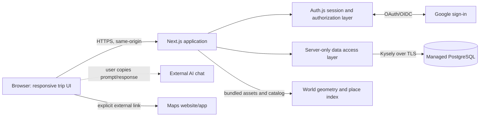
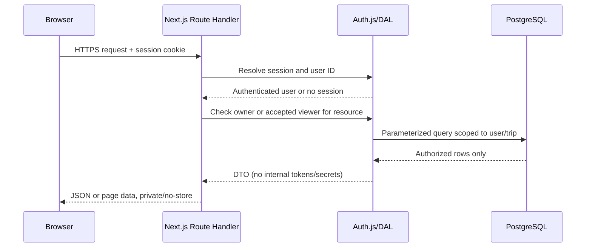

# Travel Planner — Technical Design

**Status:** Implementation baseline, pending deployment configuration  
**Date:** September 26, 2026  
**Product requirements:** [`PRD.md`](../../PRD.md), draft v1.1  
**Revision:** 26 Sep 2026: trip page, map links, day map, budget display, event actions and account/sharing screens added; reconciled after the design review recorded in section 15.  
**Repository state:** Greenfield; this workspace contains planning documents and an import contract, but no application code

## 1. Executive summary

Build the MVP as one TypeScript web application with a server-side data-access layer and one managed PostgreSQL database. Use Google sign-in through Auth.js, store sessions in the database, and keep all trip data reads and writes on the server. The browser never connects directly to PostgreSQL.

The main product-specific risk is the external-AI import boundary. The app must treat the pasted response as untrusted input, validate it against a strict versioned contract, let the owner correct or skip item-level problems, and write the trip and its items atomically only after confirmation. The original pasted response is not stored or logged.

Proposed implementation choices:

- **Web and backend:** Next.js App Router, TypeScript, Node.js runtime, one application deployment.
- **Authentication:** Auth.js with Google OAuth and database-backed sessions; allowlisted owner identity plus invitation-gated viewers.
- **Database:** Managed PostgreSQL, with Supabase Postgres as the initial target.
- **Database access/migrations:** Kysely and its Auth.js adapter; migrations are checked into the repository.
- **Authorization:** The server-side data-access layer is the authorization boundary and checks trip ownership or accepted viewer membership on every request. Database constraints protect integrity, and restricted credentials limit schema changes; they do not independently enforce per-trip access. The browser has no database key.
- **Integrations:** Google is used only for sign-in. Item directions and map links open through ordinary external URLs on click. The trip page draws a schematic day map itself from stored coordinates. The dashboard globe and destination search use bundled map/place data; there is no external map or geocoding request. There is no in-app AI, weather, flight-status, email, booking, or payment provider in this release.
- **Deployment default:** Public HTTPS sign-in shell with trip data private, Google-verified users limited to the configured owner allowlist or a valid trip invitation. If “do not expose the webpage” means no internet-reachable app route at all, deploy behind a private network instead; that changes viewer onboarding and hosting.

These are design decisions for a new codebase, not facts about the existing project. The stack should be confirmed before scaffolding; it is intentionally one deployable app and one database, without a separate API service, queue, cache, or microservice layer.

## 2. Repository and PRD assessment

### Existing project inspection

| Area | Finding | Design implication |
|---|---|---|
| Files | The PRD, this design, import contract, `AGENTS.md`, and project skills are present; no application source exists. | No application conventions or components to preserve. |
| Framework/libraries | None found. | Proposed stack is greenfield, not a migration. |
| Data model/migrations | None found. | This design defines the first schema and migration approach. |
| Tests/configuration | No test, package, build, or deployment configuration found. | Create these with the application; no existing test commands can be run. |
| Git/history | The workspace is not a Git repository. | There are no commits or architectural decisions to inspect. |

There is no implementation conflict with the PRD. The material design choices the PRD leaves open are the JSON shape, authentication/deployment details, trip and viewer persistence, time-zone conversion, and how to represent booking state. This document resolves those with explicit decisions below.

### Product goals and non-goals

**Goals in the PRD**

- Let one signed-in person manage multiple trips in a dashboard.
- Show authorized trip destinations on a global globe while keeping every trip accessible in a synchronized list.
- Create trips either manually or by importing an externally drafted AI response.
- Keep itinerary items editable and visibly distinguish unverified AI suggestions from owner-confirmed booking state.
- Represent multiple flight segments with local departure and arrival times and airport time zones.
- Track item-level planned prices and a trip budget without combining unlike currencies.
- Keep “Needs booking” items visible and show owner-entered due dates in the app.
- Allow named, read-only sharing to a Google identity that matches an invited email.
- Keep trip data unavailable to anonymous users and prevent viewers from mutating trip content.

**Non-goals for this design**

- Generating, repairing, or converting plans with an AI service inside the app.
- Weather, live flight status, review search, street-level basemaps or map tiles, routing or turn-by-turn navigation, geocoding of item locations, or booking integrations. The dashboard destination globe and a schematic per-day trip map drawn from owner-saved coordinates are in scope.
- Email/push/background reminders, payment execution, actual expense accounting, currency conversion, packing lists, attachments, offline operation, or collaborative editing.
- Scaling for a public travel-planning marketplace. The expected use is a small personal dataset and invited viewers.

**Actors**

- **Allowlisted owner:** Can create trips, read their own trips, and perform mutations on them. The owner can also be a read-only viewer of another person’s trip; access is scoped per trip.
- **Invited user:** Can read only trips with an accepted invitation tied to the user’s stable Google account identity. A verified email is required to accept the invitation; later email changes do not break an already accepted grant. Cannot create trips or mutate/invite on another owner’s trip.
- **Trip owner:** Can read and edit that trip, manage its invitations, and delete it.
- **Trip viewer:** Can read only a trip with an accepted invitation tied to the viewer’s `User.id`. Cannot mutate that trip or invite another viewer.
- **Anonymous visitor:** Can load the sign-in/invitation entry page but cannot retrieve trip content or call protected APIs.
- **External AI service:** Chosen and operated by the user outside the app. The app does not call it or receive provider credentials.

### Assumptions and design decisions

| Label | Statement |
|---|---|
| PRD requirement | Google sign-in, private-by-default trips, owner-only writes, named read-only trip viewers. |
| PRD requirement | The first release includes an interactive global trip view with one approximate destination point per located trip and a full list fallback. |
| PRD requirement | The AI response is pasted as JSON; no trip is committed before owner confirmation. |
| Design decision | Only Google identities in a deployment-configured owner allowlist may create or mutate owned trips. A verified invitee may sign in to accept/read a trip invitation but cannot create trips or write trip data. Existing linked Google accounts may reauthenticate for account deletion even with no trip grants; that does not restore trip access. |
| Design decision | The JSON document is `{ formatVersion, trip, items }`; trip fields are nested under `trip`. The PRD describes the required fields but not their exact nesting. |
| Design decision | Item source (`ai` or `manual`) and booking status are separate. The import can set `Needs booking` or `Not required`, never `Booked`. |
| Design decision | A trip’s date range is metadata, not a filter that hides out-of-range itinerary items. Editing the range preserves item dates and warns about out-of-range items. |
| Design decision | Trip-local date/time values remain wall-clock values. Changing the trip time zone reinterprets only non-flight items that inherit the trip time zone, and recomputes their ordering. Explicit item and flight airport time zones remain unchanged. |
| Design decision | Expiration is computed from `expires_at`; no scheduled job is needed to transition invitations to an expired state. |
| Design decision | Resolve a destination against a bundled, versioned Natural Earth place catalog only when the match is exact and unique. Store a nullable point; never invent a marker for an ambiguous or unmatched destination. The owner may set/clear a point. |
| Assumption | The initial dataset is small (personal use: a modest number of trips and at most hundreds of items in a trip). Fetch a full trip at once; do not add caching or complex pagination until real use warrants it. |
| Design decision | The public sign-in surface is allowlisted; trip data routes always require an authenticated owner or accepted trip viewer. A VPN/private-ingress deployment remains necessary if no app route should be internet-reachable. |
| Assumption | The hosted PostgreSQL provider’s backups are sufficient for the initial launch; retention and post-deletion backup behavior must be confirmed against the chosen plan before launch. |

## 3. Architecture

### Component diagram



The application is one deployable unit. Next.js renders authenticated pages and exposes same-origin Route Handlers for data operations. Route Handlers call domain functions in a server-only data-access layer (DAL), which calls PostgreSQL through Kysely. UI components do not construct SQL, use a database connection, or make authorization decisions on their own.

### Responsibilities

| Component | Responsibilities |
|---|---|
| Next.js UI | Sign-in, dashboard globe and synchronized trip list, trip and item forms, import workflow, explicit copy/link actions, loading/error/empty states, responsive and keyboard-accessible interactions. It may do client-side validation for usability, but that validation is not trusted. |
| Auth.js | Google OAuth flow, anti-CSRF/state checks, user/account persistence, database session lifecycle, sign-out. Configure only Google; do not enable dangerous email-based account linking. |
| Route Handlers | Parse HTTP input, enforce request-size limits, obtain the session, call the DAL, map domain results to status codes and stable error bodies. Treat every handler as a public endpoint even though it is same-origin. |
| DAL/domain services | Central `requireUser`, `requireTripReadAccess`, and `requireTripOwner` checks; schema validation; time-zone logic; totals; invitation transitions; transaction boundaries; safe DTO construction. |
| PostgreSQL | Durable trip, item, sharing, and Auth.js data; foreign keys, uniqueness, constraints, indexes, and transactions. No separate task/queue database. |
| Google | Authenticate identity only. The app requests no Gmail, Calendar, Drive, or travel scopes. Do not retain OAuth API tokens after identity is established. |
| Dashboard globe/place catalog | Load bundled world geometry and place search data; never receive private trip data from an outside map service. A client-only WebGL globe displays authorized points, and the semantic list remains available if it fails. |
| External directions and map links | Open a user-requested directions/search URL or the item's saved map link in a new tab. No directions API key, no server-side fetching or resolving of links, no location tracking. |
| Trip page and day map | Full-page trip view with Whole trip and per-day tabs; schematic SVG day map from stored coordinates (no basemap, no tile requests); budget and summary tiles; owner action dialogs (add item, edit trip, import, share, delete). See [Trip page and day map](#trip-page-and-day-map). |
| External AI | User-selected chat, outside the app. The application neither transmits nor repairs pasted content using a model. |

### Runtime and trust boundaries

1. **Browser to app:** HTTPS. Treat all form fields, route parameters, JSON, links, and invitation values as untrusted. Auth.js session cookies are `Secure` in production, `HttpOnly`, and `SameSite=Lax`; OAuth uses the library’s state/PKCE protections. For every state-changing Route Handler, also require the `Origin` to equal the configured canonical app origin and reject missing or mismatched origins; do not treat SameSite cookies as the only CSRF defense.
2. **Application to database:** TLS and a server-only connection string. Do not expose credentials in `NEXT_PUBLIC_*` variables or client bundles. Use a restricted database role for normal queries. Only migrations use schema-owner privileges.
3. **Application to Google:** OAuth/OIDC sign-in only. Require Google’s authenticated `email_verified === true` claim; never trust a request-supplied email or an unverified profile value. Normalize by trimming and lowercasing only—do not rewrite provider-specific aliases. Before Auth.js may create/link a user or establish a session, look up the authenticated `(provider, providerAccountId)` in `Account`. A verified allowlisted owner or pending-invitation email may establish a new account. A Google provider subject already linked to an existing account may reauthenticate that account even if its email changed or its trip grants were revoked; this grants account access only, not trip access. Do not auto-link a different Google subject by email. Trip reads remain bound to the stable `viewer_user_id`, and every trip request is separately authorized by current owner policy or accepted viewer grant. Accept an invitation only when the verified email matches the normalized invited email.
4. **App to external sites:** Directions links and map links (including the day-map Google Maps hand-off) are explicit user actions; the server never fetches, resolves or previews them. Open in a new tab with `noopener`/`noreferrer`; build URLs from encoded, validated user text. Do not send trip content to maps until the user clicks. Bundle globe assets locally so merely viewing the dashboard makes no third-party map request.
5. **Pasted AI response:** The owner is responsible for the external AI provider’s data policy. Warn against entering passport, payment-card, and booking-confirmation codes. The browser sends the response over HTTPS to the app server for validation; the server handles it only in request memory, does not persist it, and must not log request bodies. The app does not forward it to an AI provider.

**Default hosting:** A public HTTPS sign-in shell may be reachable. A verified allowlisted owner or pending invitee may establish a new account; an already-linked Google subject may reauthenticate an existing account for account management even if it has no current trip grants. No unauthenticated page, metadata endpoint, static generation, shared cache, or search crawler can receive trip data. Every personalized response uses private/no-store caching. `TRIP_OWNER_EMAILS` is normalized at startup and is required in production; do not provide open self-service owner registration. Removing an owner email blocks that identity from reading or mutating its owned trips on subsequent data requests; if an owner changes Google email, update the allowlist before expecting owner-trip access. A linked subject without a matching allowlisted email retains only account-management access; accepted viewer grants remain independently authorized. If the user’s requirement is that even the sign-in route is not internet-reachable, put the whole app behind a VPN/private ingress and require viewers to join that network; Google login remains useful for account-level authorization.

### Request flow



Middleware/proxy may redirect an anonymous user to sign-in for a better experience, but it is not the authorization boundary. The DAL repeats authorization checks for every read and write; Next.js documentation likewise warns that Route Handlers and Server Functions must verify access at their own boundary ([Next.js authentication guide](https://nextjs.org/docs/app/guides/authentication)).

## 4. Data model

Use UUID primary keys and UTC timestamps for audit fields. Store calendar dates as SQL `DATE`, and local clock values separately from time-zone identifiers. Do not store money as IEEE floating-point values. Mutable business rows include `created_at` and `updated_at`; mutable `trips` and `plan_items` also include an integer `version` for optimistic concurrency. Immutable import receipts need only `created_at`.

### Entity relationship

```mermaid
erDiagram
    USER ||--o{ TRIP : owns
    USER ||--o{ ACCOUNT : authenticates_with
    USER ||--o{ SESSION : has
    USER ||--o{ TRIP_VIEWER : accepts
    TRIP ||--o{ TRIP_VIEWER : shares
    TRIP ||--o{ PLAN_ITEM : contains
    USER ||--o{ IMPORT_RECEIPT : owns
    TRIP o|--o| IMPORT_RECEIPT : records

    USER {
      uuid id PK
      text email
      timestamptz email_verified
    }
    TRIP {
      uuid id PK
      uuid owner_user_id FK
      text title
      text destination
      numeric(8,5) atlas_latitude
      numeric(8,5) atlas_longitude
      text atlas_source
      date start_date
      date end_date
      text time_zone
      numeric(18,4) budget_amount
      text budget_currency
      integer version
    }
    TRIP_VIEWER {
      uuid id PK
      uuid trip_id FK
      text invitee_email_normalized
      uuid viewer_user_id FK
      text status
      bytea invitation_token_hash
      timestamptz expires_at
    }
    PLAN_ITEM {
      uuid id PK
      uuid trip_id FK
      text type
      text title
      text source
      text booking_status
      date local_date
      time local_time
      text time_zone
      text time_disambiguation
      numeric(18,4) planned_amount
      text planned_currency
      date booking_due_date
      text departure_airport_code
      timestamp departure_local_datetime
      text departure_time_zone
      text arrival_airport_code
      timestamp arrival_local_datetime
      text arrival_time_zone
      text departure_disambiguation
      text arrival_disambiguation
      integer version
    }
    IMPORT_RECEIPT {
      uuid id PK
      uuid owner_user_id FK
      uuid idempotency_key
      bytea payload_hash nullable after trip deletion
      uuid trip_id FK nullable
      timestamptz created_at
    }
```

The diagram omits Auth.js account/session fields and some flight columns for readability. Store flight fields as explicit columns in `plan_items`; do not store local times as UTC or duplicate them in generic item date/time columns.

### Tables and constraints

#### Auth.js tables

Use the Auth.js Kysely adapter’s default table names and required fields: `User`, `Account`, `Session`, and `VerificationToken` (including its expected camel-case column names such as `userId` and `sessionToken`). Do not rename them to plural snake-case tables unless a custom adapter mapping is deliberately added. The `User` table is also the app’s user identity; there is no second profile table in v1. Keep the Google provider subject as the stable provider identity. Normalize email for invitation comparison; do not use email as the primary key.

Store only identity data needed for sign-in. Do not retain Google API access/refresh tokens because no Google API is called after login. Use the Auth.js provider account callback to persist only the required account identity fields, and verify the generated schema/migration supports nullable token fields. Auth.js documents provider account-field filtering and warns that automatic email-based account linking is unsafe by default ([Auth.js provider reference](https://authjs.dev/reference/core/providers)).

#### `trips`

| Field | Type/constraint | Meaning |
|---|---|---|
| `id` | UUID PK | Trip identity. |
| `owner_user_id` | UUID FK `User.id`, not null, `ON DELETE CASCADE` | Sole owner. Sharing never transfers ownership. |
| `title` | Text, required, trimmed, length 1–120 | User-facing title. |
| `destination` | Text, required, trimmed, length 1–160 | Human-readable destination; not a geocoded place ID. |
| `atlas_latitude`, `atlas_longitude`, `atlas_source` | Nullable `NUMERIC(8,5)` pair plus `catalog`/`owner` provenance; all present or all null; bounded to valid latitude/longitude | One approximate dashboard globe point. Created by exact local catalog match or explicit owner edit. See [Atlas v1](atlas-v1.md). |
| `start_date`, `end_date` | SQL `DATE`, required, `start_date <= end_date` | Planned inclusive trip range. |
| `time_zone` | Text, required, valid IANA zone | Default zone for date classification, inherited item times, and booking due dates. |
| `budget_amount`, `budget_currency` | Nullable `NUMERIC(18,4)` + uppercase ISO 4217 code stored as text; both null or both set; amount from 0 through 99999999999999.9999 | Optional trip budget. Never auto-convert item currencies. |
| `version` | Integer, required, starts at 1 | Optimistic-concurrency token. Increment on trip edits and once per transaction that mutates one or more child items. |
| `created_at`, `updated_at` | `timestamptz`, required | Audit/display metadata. |

Any transaction that inserts, updates, or deletes one or more `plan_items` increments the parent trip’s `version` once in that transaction. A new trip/import starts at version 1 after its initial item batch. That revision lets the UI show a time-zone-change impact preview against a consistent trip snapshot and prevents a stale confirmation from overwriting concurrent owner edits without issuing hundreds of redundant parent-row updates during a large import.

#### `import_receipts`

An import receipt is a small idempotency tombstone, not an import-history feature. Store one row per `(owner_user_id, idempotency_key)` with a SHA-256 hash of the canonical normalized commit payload, nullable `trip_id`, nullable `payload_hash`, and `created_at`. A live receipt has both `trip_id` and `payload_hash`; after trip deletion both are null. `owner_user_id` references `User.id ON DELETE CASCADE`; `trip_id` references `trips.id ON DELETE SET NULL`. The unique owner/key constraint serializes concurrent attempts. The row contains no pasted response or normalized trip content and is retained until account deletion. In the same transaction as trip deletion, explicitly clear both `trip_id` and `payload_hash` on associated receipts before deleting the trip. A delayed retry then returns `410 Gone` based only on the tombstone, without retaining a content-derived hash. Requiring a new idempotency key starts a genuinely new import.

#### `trip_viewers`

One row per `(trip_id, invitee_email_normalized)`; that unique constraint prevents duplicate current grants for the same trip/email. Reissuing a pending, expired, or revoked invitation rotates the token and expiry in the same row, invalidating the old link. Reissuing a revoked row clears the previous viewer binding and acceptance/revocation timestamps. An accepted grant must first be revoked before it can be reissued. A user may own one trip and view another; role is determined per trip.

| Field | Type/constraint | Meaning |
|---|---|---|
| `id`, `trip_id` | UUID PK, UUID FK `trips.id ON DELETE CASCADE` | Invitation/grant identity and parent trip. |
| `invitee_email_normalized` | Text, not null | Trimmed/lowercased email used for exact verified-email matching. |
| `viewer_user_id` | Nullable UUID FK `User.id ON DELETE CASCADE` | Set only after acceptance. |
| `status` | `pending`, `accepted`, or `revoked` | `expired` is a derived state when `pending` and `expires_at <= now()`. No cron is needed. |
| `invitation_token_hash` | Nullable bytes, unique while pending | SHA-256 of a random 256-bit token. The raw token is returned only when the owner creates/reissues the link. |
| `expires_at` | `timestamptz`, required for pending state | Seven days from issue time. |
| `accepted_at`, `revoked_at` | Nullable `timestamptz` | Lifecycle timestamps. |
| `created_at`, `updated_at` | `timestamptz` | Audit metadata. |

Check constraints enforce: pending requires token hash and expiry; accepted requires viewer user and accepted time; revoked cannot authorize reads and clears the token hash. Keep the token hash on an accepted grant so a repeated acceptance request with the staging cookie is idempotent for the bound user; it cannot bind a second account. If the success redirect is lost after the cookie is cleared, a normal sign-in/dashboard request reflects the accepted grant. A revoked grant must be reissued through an owner action.

#### `plan_items`

One table covers itinerary items and the booking list. Do not create a separate `booking_tasks` table: the booking list is derived from plan items where `booking_status = 'needs_booking'`.

| Field group | Fields and rules |
|---|---|
| Identity | `id` UUID PK; `trip_id` FK with `ON DELETE CASCADE`; `version` integer. |
| Content | `type` enum: `flight`, `lodging`, `transport`, `meal`, `activity`, `other`; required trimmed `title` of 1–200 characters; nullable `location` up to 500 characters and `notes` up to 5,000; `links` as JSON array of at most 20 `{label,url}` entries (label up to 80; URL up to 2,048 characters) with URL validation. |
| Map pin | `map_url TEXT NULL` (https, up to 2,048 characters; separate from the `links` array); `latitude NUMERIC(8,5) NULL`, `longitude NUMERIC(8,5) NULL`, The two coordinate columns are both null or both set, latitude in [-90,90], longitude in [-180,180]. Coordinates are set only by the server, and only when an owner request carries a `mapUrl` that differs from the stored value and parses (MAP-2); an unchanged value re-sent by the form never re-pins. Import commit never sets `map_url` or coordinates; the item editor's **Use as map link** copies one of the item's `links` into `mapUrl` as an owner edit. Changing `map_url` to an unparseable value or clearing it clears the coordinates. On save the server strips known tracking parameters (`utm_*`, `g_ep`, `entry`, `authuser`, `shorturl`, `g_st`) and rejects links with user information. A flight's arrival pin is derived at read time from the bundled airport list only when the item's `source` is `manual` or its status is `booked`, and is not stored. |
| Provenance | `source` enum `ai` or `manual`; server sets this. The importer cannot submit/change it. AI-origin items show an unverified badge after import; provenance is not a booking state. |
| Non-flight schedule | `local_date DATE NULL`, `local_time TIME NULL`, `time_zone TEXT NULL`, `time_disambiguation` (`earlier`/`later` when a local time repeats), and `duration_minutes INTEGER NULL`. A time requires a date. Null item time zone means inherit the trip time zone. Flight rows cannot populate these generic scheduling columns. |
| Flight schedule | `planned_departure_date DATE NULL` in the trip time zone for a placeholder only; nullable airline, flight number, departure/arrival airport codes, local date-times (`TIMESTAMP WITHOUT TIME ZONE`), IANA time zones, and `earlier`/`later` disambiguation for repeated local times. If a local date-time is supplied, its time zone is required. If departure local date-time is supplied, omit the placeholder date; airport-local departure date/time is authoritative. When both endpoint date-times are present, validate that arrival instant is after departure instant. A placeholder can omit unknown values. Marking booked requires both airport codes, both local date-times, and both time zones. |
| Booking | `booking_status` enum `not_required`, `needs_booking`, `booked`; required. Flights must be `needs_booking` or `booked`; non-flight items may use any state. `booking_due_date DATE NULL`, allowed only while `needs_booking`. Marking booked clears the due date. |
| Planned cost | `planned_amount NUMERIC(18,4) NULL`, `planned_currency TEXT NULL`, nullable `price_label` enum `estimate` or `quote`. Amount/currency must both be null or both set; label must be null iff amount/currency are absent; amount is 0–99999999999999.9999. `price_source` enum `ai` or `owner` (null iff no price). Every imported price is `estimate` with `price_source='ai'`. Any owner save of amount, currency or label sets `price_source='owner'`; "unverified estimate" in the UI means `price_source='ai'` (BUDGET-4). |
| Soft delete | `deleted_at timestamptz NULL`. A delete sets it; every read, total, booking list, cap count and dashboard aggregate excludes rows where it is set. A purge job (or the next trip write) hard-deletes rows deleted more than 10 minutes ago. Trip deletion still cascades immediately. |
| Timestamps | `created_at`, `updated_at` as `timestamptz`; `version` increments on accepted mutations. Creation timestamp provides deterministic tie ordering. |

Use check constraints for known invariants (currency/amount/label pairing, nonnegative amount, `local_time` implies `local_date`, `booking_due_date` requires `needs_booking`, flight rows cannot use `not_required`, a booked flight requires both airport codes, local date-times and IANA zones, flight/non-flight schedule columns do not mix, a flight placeholder date is absent when exact departure local date-time exists, and supplied local date-time requires its matching IANA zone). Validate IANA zones, DST disambiguation, and that flight arrival instant follows departure instant in the domain service; a check constraint cannot verify the full external time-zone database.

All budget and price inputs use nonnegative decimal strings with at most 14 integer digits and four fractional digits, then persist to PostgreSQL `NUMERIC(18,4)`. Reject JSON numeric values for money. Validate uppercase currency codes against a maintained ISO 4217 code list; keep amounts exact and never apply implicit conversion or rounding when storing or summing. Apply the same bounds to imported and manually entered amounts.

The MVP caps each trip at 250 plan items (including flight segments) and each item at 20 links. Enforce the item cap in the domain service under a lock on the parent trip row for manual create/duplicate operations; an import may contain at most 250 items and checks the cap before the transaction inserts. Enforce link count and field lengths in shared validation as well as the import schema. Keep the 1 MiB HTTP body limit as an aggregate request-size ceiling.

### Indexes

- `trips(owner_user_id, start_date)` for the owner dashboard.
- Unique `import_receipts(owner_user_id, idempotency_key)` for serialized import retries; index `import_receipts(trip_id)` for deletion linkage.
- `trip_viewers(viewer_user_id, status, trip_id)` for accepted shared trips.
- Unique `trip_viewers(trip_id, invitee_email_normalized)` and unique token-hash lookup while the hash is non-null.
- `plan_items(trip_id, local_date, created_at)` for non-flight timeline sections.
- Partial `plan_items(trip_id, booking_due_date)` where `booking_status = 'needs_booking'` and a due date exists.
- `plan_items(trip_id, created_at)` for stable ordering and undated/unscheduled items.

Trips are loaded by owner or accepted viewer membership; items are loaded by trip. Flight itinerary sizes are small, so load the trip’s items and compute the departure instant in the domain layer rather than storing a materialized sort key. Add no Redis/cache until measurement shows a real need.

### Deletion and retention

- Deleting a trip is an owner-only transaction: lock the trip and its import receipts, set each receipt’s `trip_id` and content-derived `payload_hash` to null, then delete the trip; foreign keys cascade to plan items and viewer invitations/grants. Import retry also locks the receipt before deciding whether it is live or a tombstone, so a concurrent delete/retry is ordered: the retry either returns the live trip before deletion commits or sees `410 Gone` after it commits. The trip disappears immediately from owner and viewer queries; the content-free idempotency tombstone remains until account deletion. No undo in v1.
- Account deletion deletes the Auth.js user and all owned trips, sessions, accounts, viewer grants, and import receipts through cascading foreign keys. Confirm the destructive action in UI. This resolves the PRD’s account-deletion requirement without a custom identity subsystem.
- Database backups may retain deleted rows until the provider’s retention window expires. Before public launch, record the selected plan’s backup retention and restore behavior in privacy/deployment notes. “Delete” means removal from the live app immediately, not an assertion that every provider backup is synchronously rewritten.
- No audit-history or soft-delete layer is needed for this single-owner-edit model. `created_at`/`updated_at` plus Auth.js session and provider logs are sufficient for initial debugging.

## 5. API and interfaces

All routes are same-origin HTTPS Route Handlers. All responses containing trip data are private/no-store. Reject state-changing requests unless `Origin` exactly matches the configured canonical app origin. Enforce the 1 MiB body limit against actual raw UTF-8 request bytes before JSON parsing (not only the caller-supplied `Content-Length`) and configure hosting ingress with a compatible cap. Error responses use a stable body:

```json
{
  "error": {
    "code": "validation_error",
    "message": "Correct the highlighted fields.",
    "fields": [{ "path": "items[2].flightDetails.departure.timeZone", "code": "invalid_time_zone", "message": "Enter a valid IANA time zone." }]
  }
}
```

Never include SQL, stack traces, session tokens, invitation tokens, or other users’ identifiers in the response.

### Endpoint summary

| Endpoint | Purpose/input | Authorization and behavior |
|---|---|---|
| `GET /api/trips` | Dashboard list, owner-only due items, and `canCreateTrips`. | Signed-in user. Returns allowlisted owned trips plus trips with an accepted viewer grant; response says `role: owner/viewer`. `canCreateTrips` controls the empty state and create actions. No other user’s trips or totals. |
| `GET /api/atlas/places?q=...` | Search the bundled destination catalog; at most ten results for a 2–160-character query. | Signed-in allowlisted owner. No trip data or external geocoder call; validate and bound the query. |
| `POST /api/trips` | Manual trip title, destination, inclusive dates, IANA zone, optional budget/currency. | Allowlisted owner only. Validate fields and create one empty trip. Resolve an exact, unique catalog destination to an approximate point; otherwise save the trip without a point. |
| `GET /api/trips/{tripId}` | Trip details plus items, booking list, role. | Owner/viewer read check; otherwise 404 to avoid disclosing trip existence. |
| `POST /api/trips/{tripId}/time-zone-preview` | `{ "timeZone": "...", "expectedVersion": 4 }`. | Owner only. Returns the inherited timed items whose absolute interpretation changes, booking tasks whose due/overdue classification may change (date values remain unchanged), DST overlaps needing an earlier/later choice, and DST gaps that must be corrected before the zone change. It is read-only. |
| `PATCH /api/trips/{tripId}` | Editable trip fields and `expectedVersion`; optional `atlasLocation` is omitted (no explicit point edit), `{latitude,longitude}` (owner-set point), or `null` (clear point). A time-zone change also includes `confirmTimeZoneImpact: true` and `timeDisambiguationByItem` choices from the preview where needed. | Owner only. Validate date range, time zone, budget pairing, and point bounds. A destination edit rematches catalog points, preserves owner-set points with an editor warning, and obeys an explicit `atlasLocation` edit first. Require matching version and explicit time-zone confirmation. Recompute in a transaction; reject gaps with actionable item paths and reject unresolved overlaps. Apply supplied overlap choices and update affected item versions and the trip atomically. Stale version returns 409. |
| `DELETE /api/trips/{tripId}` | Permanent trip deletion. | Owner only; require request body `{ "confirm": true, "expectedVersion": 4 }`, then delete only if the trip version matches. In the same transaction, lock associated import receipts and clear their trip IDs and payload hashes before deleting. Foreign/non-owner trip returns 404; stale version returns 409. |
| `POST /api/trips/{tripId}/items` | Create a manual non-flight item or flight segment. | Allowlisted owner only. Validate per-type fields; source is forced to `manual`; lock trip and enforce the 250-item cap in the transaction. |
| `POST /api/trips/{tripId}/items/{itemId}/duplicate` | Duplicate a plan item; request includes the source item’s `expectedVersion`. | Allowlisted owner only. Lock trip and enforce the 250-item cap; reject a stale source item with 409. Copy editable content and provenance into a new row; generate a new ID and timestamps; clear due date; copy `needs_booking`/`not_required`, but convert `booked` to `needs_booking` so a duplicate never implies a second confirmed reservation. |
| `PATCH /api/trips/{tripId}/items/{itemId}` | Edit item content, schedule, price, booking status; includes item `expectedVersion` and `confirmTypeChange: true` when switching to/from flight. | Owner only, item must belong to trip. A stale version returns 409. Marking flight booked validates required segment details; marking booked clears due date. Type changes require confirmation before clearing incompatible schedule fields; changing a non-flight `not_required` item to a flight sets it to `needs_booking`. |
| `DELETE /api/trips/{tripId}/items/{itemId}` | `{ "expectedVersion": 2 }`; delete one item. | Owner only; conditional on the item version. Sets `deleted_at` (soft delete, TRIP-8) and increments the parent trip version in the same transaction. 404 when not in authorized trip; stale version returns 409. |
| `POST /api/trips/{tripId}/items/{itemId}/restore` | Undo a deletion within 10 minutes. | Owner only. Clears `deleted_at` on the same row (same ID, source, `created_at`, values) if it is still within the window and the 250-item cap allows; otherwise 410. Increments the trip version. |
| `POST /api/import/preview` | `{ "responseText": "...", "ownerProvidedBudget": MoneyDTO \| null }`; returns parsed trip/items, path-addressed errors, and warnings. | Allowlisted owner only. No database writes. Enforce 1 MiB body limit, at most 250 items and 20 links per item, and all documented field/money bounds. Do not log body. The separately supplied owner budget is authoritative: the preview uses it as the initial `trip.budget`, never trusts an AI-generated budget by itself, and warns if a supplied owner budget is omitted/changed by the AI or if the AI supplies a budget when the owner supplied none. A warning does not block commit; an unprovided AI budget is omitted. The owner may edit the budget in preview; the UI updates the separate owner-controlled value along with it. Correctable trip-field errors and item errors return a preview and must be fixed or excluded before commit; malformed JSON, unsupported version, or unparseable top-level structure returns 422. |
| `POST /api/import/commit` | Normalized trip and accepted items, `ownerProvidedBudget: MoneyDTO \| null`, `Idempotency-Key` UUID, `expectedFormatVersion: 1`. | Allowlisted owner only. Revalidate all fields server-side and require `trip.budget` to equal the current owner-entered `ownerProvidedBudget` value; force `source=ai` and `priceLabel=estimate` for every imported price. The contract has no price-label or coordinate field; owner can edit these after creation. Resolve only an exact, unique destination against the local catalog. Insert an `import_receipts` row, trip and items in one DB transaction. Reuse the existing trip for the same owner/key and same canonical payload hash; same key with different payload returns 409. If the trip was deleted after the original commit, return 410 and require a new key.
| `POST /api/trips/{tripId}/invitations` | `{ "email": "..." }`; responds once with invitation URL and expiry. | Owner only. Normalize/validate email, reject an already accepted grant until it is revoked, create/reissue pending/expired/revoked invitation, rotate token. A reissued revoked grant clears its previous viewer binding. No email is sent. |
| `GET /api/trips/{tripId}/invitations` | Current pending/accepted/revoked viewer entries. | Owner only. Never return raw token or token hash. |
| `DELETE /api/trips/{tripId}/invitations/{invitationId}` | Revoke invitation/access. | Owner only; set revoked state in DB. Subsequent requests fail immediately. |
| `POST /api/invitations/stage` | `{ "token": "..." }` from the invitation URL fragment. | Public entry endpoint; validates a pending, unexpired token without returning trip details and sets a 15-minute `HttpOnly`, `Secure`, `SameSite=Lax`, `Path=/` cookie containing the token hash. Root path is required so the cookie reaches the OAuth callback; only invitation endpoints read it. Check same-origin `Origin`; use a generic invalid-link response. The raw token is not logged or retained. |
| `POST /api/invitations/accept` | Staged token plus authenticated identity (raw token never appears in this endpoint’s URL). | Signed-in verified Google user. Atomically match token hash, expiry, status and normalized email, then bind `viewer_user_id`. Repeated same-user completion is idempotent; mismatch/expired/revoked is denied. |
| `DELETE /api/account` | Request full account deletion; body `{ "confirm": "DELETE" }`. | Current user only. Deletes every owned trip with DASH-5 effects, sessions, accounts and viewer grants (ACCESS-10), then clears the session cookie. The confirmation UI lists owned trips by title from `GET /api/trips` first. |

Auth.js owns `/api/auth/*` endpoints and OAuth callback behavior; its routes also require deployment HTTPS and correct Google redirect URI configuration.

### Response DTOs

Return explicit camel-case DTOs rather than database rows. Do not expose owner IDs, Auth.js records, invite token hashes, import hashes, or internal SQL fields.

```ts
type Role = "owner" | "viewer";
type TripStatus = "upcoming" | "ongoing" | "past";
type MoneyDTO = { amount: string; currency: string };
type TimeChoiceDTO = "earlier" | "later";

type TripSummaryDTO = {
  id: string;
  title: string;
  destination: string;
  startDate: string; // YYYY-MM-DD
  endDate: string;   // inclusive
  timeZone: string;
  status: TripStatus;
  daysToStart: number | null; // upcoming only, trip time zone
  dayIndex: number | null;    // ongoing only, 1-based
  dayCount: number;           // inclusive length
  role: Role;
  atlasLocation: { latitude: number; longitude: number; source: "catalog" | "owner" } | null;
};

type DashboardDTO = {
  canCreateTrips: boolean; // Computed from the server-side owner allowlist.
  trips: TripSummaryDTO[];
  ownerBookingTasks: Array<{
    tripId: string; tripTitle: string; itemId: string; itemTitle: string;
    dueDate: string; state: "upcoming" | "due_today" | "overdue";
  }>;
};

type TripDetailDTO = {
  trip: TripSummaryDTO & {
    version: number;
    budget: MoneyDTO | null;
  };
  items: PlanItemDTO[]; // in documented timeline order
  plannedTotals: Array<{
    currency: string; total: string; unverifiedCount: number;
    byType: Array<{ type: PlanItemDTO["type"]; amount: string }>;
  }>;
  budgetComparison: { currency: string; budget: string; planned: string; remaining: string; over: boolean } | null;
  bookingList: Array<{ itemId: string; title: string; dueDate: string | null; state: "upcoming" | "due_today" | "overdue" | "no_due_date" }>; // read-only for viewers
};

type FlightEndpointDTO = {
  airportCode: string | null;
  localDateTime: string | null; // YYYY-MM-DDTHH:mm, no offset
  timeZone: string | null;
  timeDisambiguation: TimeChoiceDTO | null;
};

type FlightDetailsDTO = {
  plannedDepartureDate: string | null;
  airline: string | null;
  flightNumber: string | null;
  departure: FlightEndpointDTO;
  arrival: FlightEndpointDTO;
};

type PlanItemDTO = {
  id: string; version: number;
  type: "flight" | "lodging" | "transport" | "meal" | "activity" | "other";
  title: string; source: "ai" | "manual";
  location: string | null; notes: string | null;
  links: Array<{ label: string; url: string }>;
  mapUrl: string | null;
  mapProvider: "Google Maps" | "Apple Maps" | "OpenStreetMap" | "Amap" | "Baidu Maps" | string | null; // exact-host match, else the host
  coordinates: { latitude: number; longitude: number; source: "map_link" | "airport" } | null;
  bookingStatus: "not_required" | "needs_booking" | "booked";
  bookingDueDate: string | null;
  bookingDueState: "upcoming" | "due_today" | "overdue" | null;
  plannedPrice: (MoneyDTO & { label: "estimate" | "quote"; source: "ai" | "owner" }) | null;
  localDate: string | null; localTime: string | null; timeZone: string | null;
  durationMinutes: number | null;
  timeDisambiguation: TimeChoiceDTO | null;
  timelineDate: string | null; sortInstant: string | null;
  flightDetails: FlightDetailsDTO | null;
  createdAt: string; updatedAt: string;
};

// Import drafts omit persistence IDs, source, versions, timestamps and computed fields.
type TripDraftDTO = {
  title: string; destination: string; startDate: string; endDate: string;
  timeZone: string; budget: MoneyDTO | null;
};

type PlanItemDraftDTO = {
  type: PlanItemDTO["type"];
  title: string;
  location: string | null; notes: string | null;
  links: Array<{ label: string; url: string }>;
  bookingStatus: "not_required" | "needs_booking";
  bookingDueDate: string | null;
  plannedPrice: MoneyDTO | null; // Import preview has no label; commit assigns estimate and source ai.
  // No mapUrl: import never sets one (MAP-2).
  localDate: string | null; localTime: string | null; timeZone: string | null;
  durationMinutes: number | null;
  timeDisambiguation: TimeChoiceDTO | null;
  flightDetails: FlightDetailsDTO | null;
};

type FieldError = { path: string; code: string; message: string };

type ImportPreviewDTO = {
  trip: {
    values: Partial<Record<keyof TripDraftDTO, unknown>>;
    errors: FieldError[];
    warnings: FieldError[]; // Informational; warning fields are already normalized safely.
  };
  items: Array<{
    index: number;
    values: Partial<Record<keyof PlanItemDraftDTO, unknown>>; // Whitelisted keys only; invalid parsed values remain editable.
    errors: FieldError[];
    included: boolean; // Defaults true; invalid included rows block commit until fixed or explicitly excluded.
  }>;
};

type InvitationDTO = {
  id: string; email: string;
  status: "pending" | "accepted" | "expired" | "revoked";
  expiresAt: string | null; acceptedAt: string | null;
};
```

`GET /api/trips` returns `DashboardDTO`; a trip detail response returns `TripDetailDTO`. Trip creation returns `TripSummaryDTO`; item create/update/duplicate returns `PlanItemDTO`. Import preview returns `ImportPreviewDTO`; malformed JSON, unsupported version, or an unparseable top-level structure returns the standard 422 error body. Correctable trip fields appear with path-addressed errors in the preview, as do item fields. Invalid parsed values remain in the current page state for form correction; unknown properties are rejected and are not returned. Every trip error must be resolved before commit, and each item must be fixed or excluded. Budget mismatch warnings explain that the owner-provided value was used and any unprovided model estimate was ignored; they do not block commit. Commit accepts only a complete trip and complete included rows and returns `{ tripId }`. Invitation creation returns `{ invitationId, invitationUrl, expiresAt }` once; the URL is never stored or returned by `GET invitations`. If the owner loses the URL before copying it, the owner must reissue the pending invitation, which rotates the token and invalidates the prior URL. Invitation acceptance returns `{ tripId }`. Delete/revoke endpoints return `204`.

Booking lists are filtered from `items` where `bookingStatus === "needs_booking"`; due state and planned totals are computed by the server so browser time zone or floating-point behavior cannot change the result. The API returns all trip items once; do not duplicate a second booking-item copy in the detail DTO.

### API validation and error semantics

| Status | Use |
|---|---|
| `200` | Read/update success or successful idempotent retry. |
| `201` | Created trip, item, or invitation. |
| `204` | Successful delete/revoke with no response body. |
| `400` | Malformed HTTP request envelope/body or invalid idempotency-key format. Malformed JSON inside the `responseText` string is an import validation error, not a malformed API envelope. |
| `410` | An import receipt exists but its trip was deleted; require a new idempotency key to create a new trip. |
| `401` | Missing/expired session. |
| `403` | Signed in but forbidden action (e.g. viewer write); use `404` for trip IDs the caller cannot read. |
| `404` | Missing item/trip or no read access to that trip. |
| `409` | Optimistic-version conflict, same idempotency key with a different payload, or incompatible invitation state. |
| `413` | Request body exceeds 1 MiB. For import, explain that the response must be shortened: remove optional notes and links or reduce itinerary detail, then paste again. Do not suggest splitting because v1 cannot merge split imports (unless TRIP-7 is approved). |
| `422` | Well-formed request with invalid fields or malformed/unsupported pasted content; response includes error paths. Item-level import errors that can be fixed/skipped are returned with the parsed preview and do not commit. |
| `500` | Sanitized unexpected error with request ID; user sees retry guidance where the operation is safe. |

Use parameterized queries only. Item and trip writes are conditional on `version = expectedVersion`; increment the row version and `updated_at` in the same SQL statement. Item mutations also increment the parent trip version once per transaction. Transactions that change an item lock/check the parent trip row before changing the child, so a time-zone preview and item-cap check cannot race a child edit. The UI should retain edits on a `409`, explain the record changed in another tab, and let the owner reload before reapplying. There is no merge UI or collaboration protocol.

### JSON v1 contract

The PRD does not yet provide an exact JSON shape. This design chooses a nested `trip` object, strict unknown-key rejection, and decimal strings for prices so a JSON floating-point number cannot alter a monetary value. The normative contract is [`json-v1.schema.json`](json-v1.schema.json), paired with [`import-prompt-v1.md`](import-prompt-v1.md) and [`import-example-v1.json`](import-example-v1.json). The fixture’s budget illustrates an example where the owner supplied that value; it is not a model estimate. Freeze all three together before implementation; after v1 ships, keep it immutable and add a new `formatVersion` for incompatible changes. Import payloads contain only amount/currency for a price. The server assigns the `estimate` label to every imported item price; only the owner can later change it to `quote`.

```json
{
  "formatVersion": 1,
  "trip": {
    "title": "Kyoto weekend",
    "destination": "Kyoto, Japan",
    "startDate": "2027-04-09",
    "endDate": "2027-04-12",
    "timeZone": "Asia/Tokyo",
    "budget": { "amount": "90000", "currency": "JPY" }
  },
  "items": [
    {
      "type": "flight",
      "title": "Outbound flight",
      "bookingStatus": "Needs booking",
      "plannedPrice": { "amount": "680.00", "currency": "USD" },
      "flightDetails": {
        "plannedDepartureDate": "2027-04-09",
        "departure": { "airportCode": "SFO" },
        "arrival": { "airportCode": "KIX" }
      }
    },
    {
      "type": "activity",
      "title": "Visit Nishiki Market",
      "bookingStatus": "Not required",
      "localDate": "2027-04-10",
      "localTime": "10:30",
      "location": "Nishiki Market, Kyoto"
    }
  ]
}
```

The example’s flight is deliberately a placeholder: an AI response cannot mark it booked or invent flight details. A booked segment can be marked only by the owner in the app after entering the required airports, local date-times and zones.

**Parser pipeline:**

1. Enforce body limit; require a string response and a separately validated `ownerProvidedBudget` value or `null`.
2. Trim whitespace. Accept either plain JSON or exactly one surrounding standard Markdown JSON code fence; reject prose before/after the JSON.
3. Use `jsonc-parser` in AST mode with comments and trailing commas disabled. Reject parser diagnostics and repeated decoded property names within the same object before materializing a JavaScript value; plain `JSON.parse` alone is insufficient because it can silently discard a repeated value. Then validate a strict `formatVersion === 1` schema and reject unknown keys/unsupported values with JSON path errors.
4. Validate cross-field rules: `startDate <= endDate`; money amount/currency pair; local time requires date; supplied flight local date-time requires a valid IANA zone; URLs are only `https` or `http`; `bookingStatus` is only `Needs booking` or `Not required`; `Booked` is rejected; flight items must be `Needs booking`; and flight booked-state completeness is checked later at the owner action.
5. Return a preview DTO. The server replaces parsed `trip.budget` with the separately validated `ownerProvidedBudget`; it records a non-blocking warning if the model omitted or changed that value, or supplied one when the owner supplied none. The owner can edit the resulting budget in preview; the client then updates the separate owner-controlled budget value, and commit requires the two current values to match. Malformed JSON, unsupported format versions, and unparseable top-level structure block preview. Correctable trip-field errors and item-level errors remain attached to their fields in the preview; every trip error must be fixed, and each invalid item must be fixed or skipped before commit. Flight preview validation rejects placeholder `plannedDepartureDate` combined with an exact departure local date-time and rejects an arrival instant that is not after departure.
6. On commit, revalidate the normalized preview payload; reject client-supplied `source`, IDs, ownership, `Booked` status, computed totals, and other server-owned fields. The server generates IDs/source and computes totals/statuses.

Unknown fields are not discarded. The preview displays item source labels and AI-provided prices as estimates. If a repair prompt is offered, the browser presents the exact text to be copied; selecting “copy errors only” never includes `responseText`.

## 6. Time zones, money and derived views

### Time-zone rules

- Trip `start_date` and `end_date` are inclusive calendar dates, not UTC instants. Dashboard status uses the current calendar date in the trip IANA zone.
- Non-flight items store date plus optional local time. If `time_zone` is null, the effective zone is the trip’s current zone. If explicitly provided, that item zone wins.
- A date-only item appears in **Unscheduled** for that date; a non-flight item with neither date nor time appears in **Undated**. A time with no date is invalid.
- A flight placeholder uses optional `planned_departure_date` in trip time and appears under **Undated flights** when absent. Exact flight departure/arrival dates use each airport’s zone. A segment is shown on the departure local date and sorted by the departure instant.
- Store local timestamps as local date/time plus IANA zone; never parse a local timestamp as if it were UTC. Convert to instants with one tested time-zone utility module (Temporal API/polyfill or equivalent). Keep conversion in the server domain layer.
- A local time in a daylight-saving gap is invalid. A repeated local time is ambiguous; preview/form UI asks the owner to choose the earlier or later offset and stores `time_disambiguation` with that entry. The server derives the instant from local date/time, effective zone and that choice. A trip-zone preview flags inherited times that become ambiguous or nonexistent under the proposed zone. The owner must choose an offset for overlaps or edit the time/use an explicit item zone for gaps before saving. Explicit item/airport zones do not change when trip zone changes.
- DST ambiguity decisions are rare but material to sorting. Cover gap/overlap cases in unit tests before enabling import.

### Booking due state

No reminder process runs in the background. On dashboard/trip reads, compute `today` for the trip’s IANA zone:

```text
if booking_status != needs_booking: omit
else if booking_due_date is null: show in trip booking list only
else if today < booking_due_date: upcoming
else if today == booking_due_date: due today
else: overdue
```

Changing trip time zone can change the current local day and therefore due/overdue presentation. It does not rewrite the date-only due date. Marking an item booked clears its due date and removes it from the derived list. No cron, scheduler, email provider, or push-token table is built.

### Dashboard and budget calculations

- One query returns a user’s owned trips plus accepted viewable trips; deduplicate by trip ID and attach `role`.
- That same authorized response powers the dashboard list and Atlas points. A trip without a point stays in the list. The globe receives no separate cross-user data feed. The exact matching, point correction, failure states, and WebGL choice are specified in [Atlas v1](atlas-v1.md).
- Status is `upcoming` if local today is before `start_date`; `ongoing` if within the inclusive range; otherwise `past`.
- Only owner trips contribute to the user’s booking due list or future owner-only recorded-spend summaries. In v1, no paid-spend summary exists.
- Planned totals group by currency and item type. A comparison against a trip budget is shown only for the budget’s currency; no hidden conversion or mixed-currency sum.
- Numeric sums use PostgreSQL `NUMERIC` or exact decimal arithmetic in the DAL; never JS binary float addition for money. Return formatted strings plus currency codes.

### Trip page and day map

Product rules are TRIP-1 to TRIP-9, MAP-1 to MAP-7 and BUDGET-6 to BUDGET-7 in the PRD; layout and visual detail are in [Trip page v1](trip-page-v1.md).

- **Route and state.** `/trips/[tripId]` is a full page. The selected tab is kept in a `?day=all|YYYY-MM-DD` search parameter updated with `history.replaceState`, so a day is linkable and one Back returns to the dashboard (TRIP-1). An unknown day falls back to `all`. Tabs cover every date from `startDate` to `endDate` plus out-of-range item dates; Undated sections render only under `all` (TRIP-2). Day numbers are `date − startDate + 1`. Tabs implement the WAI-ARIA tabs pattern (tablist, `aria-controls`, roving `tabindex`, arrow keys). Escape navigates back only when no menu, dialog or editable field has focus.
- **Coordinates.** `PlanItemDTO.coordinates` comes from the stored columns, or for an owner-entered or booked flight from the bundled airport list (IATA code to point) when the arrival code is known (MAP-2). A shared module `src/shared/map-links.ts` implements extraction and is used by the server on save and by the form for preview. It reads `@lat,lon`, `!3dlat!4dlon`, `mlat=&mlon=`, `#map=z/lat/lon`, and `ll|q|query|destination=lat,lon`, decodes once, range-checks, and never performs I/O. Only Google Maps, Apple Maps and OpenStreetMap hosts are parsed; Amap and Baidu links (GCJ-02/BD-09) and shortened links (`maps.app.goo.gl`) yield no coordinates and are never resolved. Unit-test each pattern and rejection.
- **Provider label.** `mapProvider` is a pure function of the WHATWG-parsed URL: exact, case-insensitive hostname match only (`google.com`, `www.google.com` and listed Google ccTLDs with a path starting `/maps`; `maps.google.<tld>`; `maps.app.goo.gl`; `maps.apple.com`; `openstreetmap.org`, `www.openstreetmap.org`; `amap.com` and its subdomains; `map.baidu.com`). Anything else shows its punycode host, so `google.com.evil.example` is labeled by that host. Non-https links and links with user information are rejected on save.
- **Rendering.** `DayMap` is an SVG component with no map library and no data files. It uses a local equirectangular fit (x = lon · cos(lat0), y = −lat, with lat0 the mean stop latitude), a 400 × 340 view box with padding, and a minimum span of 0.02 degrees so a single stop does not divide by zero. Zoom is a view-box scale from 1× to 12× with clamped panning. Pins counter-scale so they keep their size. Labels are tested in screen space and later labels that collide are hidden. The scale bar uses the largest round distance (10 m to 500 km) under about 90 px. Route lines join consecutive non-flight stops of the same day only; flight legs are excluded from lines and distances. Longitudes are unwrapped around the median stop before projection so a day crossing the antimeridian stays compact. Pins within 12 screen pixels of each other render as one marker listing their numbers (for example "1·2·5"). The wheel zooms only when the zoom level can change and otherwise lets the page scroll; touch uses `touch-action: pan-y` with two-finger pinch; **+**/**−** buttons give keyboard and switch access. Pins are `role=button` and respond to Enter and Space. Distances use the haversine formula (R = 6371 km) and are worded as straight-line.
- **Google Maps hand-off.** Built in the client for a single-day view only: `https://www.google.com/maps/dir/?api=1&origin=…&destination=…&waypoints=…`, coordinates to five decimals, URL-encoded, at most eight waypoints (the first 10 stops; the UI notes when stops were left out); one stop uses the search form. Helper text says it opens Google Maps with this day's pinned locations. It is a plain link with `rel="noopener noreferrer"`.
- **Status and tiles.** `TripSummaryDTO` carries `status`, `daysToStart`, `dayIndex` and `dayCount` computed with the trip time zone (section 6), for both the trip page and the dashboard tickets (TRIP-5), so the browser does no time-zone arithmetic. Other tiles are counted from the DTO; items to book count every `needs_booking` item.
- **Money.** The server sums with exact decimal arithmetic in `budget.ts` and returns `plannedTotals` and `budgetComparison` (see `TripDetailDTO`), all as decimal strings; `unverifiedCount` counts prices with `source = ai`. The browser formats with `Intl.NumberFormat` and never adds money. No conversion is applied. A future `conversion: { rates, asOf, source }` field would be additive; live rates would need a server-side provider, a privacy review and a timestamp on every converted figure.
- **Motion.** CSS only, no animation library. `prefers-reduced-motion` disables all animation and transitions, including on `::before`/`::after`. Scroll-reveal classes are added by script only when `IntersectionObserver` exists, so content is never hidden without it. Looping motion (globe pulse and ring, route dash) stops within 10 seconds of the last interaction (WCAG 2.2.2).
- **Visual accessibility.** Body and label text meet 4.5:1 (secondary ink `#766A55`, not `#8A7E69`); text on vermilion uses the dark vermilion `#A63615` background; form borders meet 3:1. Fonts are self-hosted from the app origin; the CSP allows no third-party font, style or script origin on private pages.
- **Event edit and delete.** Each owner event row has a visible three-dot menu (ARIA menu button pattern; Tab or Escape closes it) with Edit event and Delete event. Edit opens the item form (TRIP-9) pre-filled and saves with `PATCH /api/trips/{tripId}/items/{itemId}` and `expectedVersion`; a 409 keeps the user's input for reapply. Delete calls `DELETE` immediately (soft delete), removes the row, and shows a toast with **Undo** that takes focus, stays at least 10 seconds and pauses on hover or focus; Undo calls `…/restore`. A failed delete restores the row with an error. After delete, focus moves to the next event's menu button or the day's add row. Saving a price sets `price_source = owner` (BUDGET-4). Viewers get no menu and the routes reject them.
- **Dialogs.** Add item, edit trip, import, share and delete use a modal with a focus trap and `inert` background, Escape and backdrop close, and inline error text tied to its field with `aria-describedby` and `aria-invalid` that moves focus to the first invalid field. On open, focus goes to the first field or, if none, the first button. On close, focus returns to the trigger, or, if a re-render replaced it, to the element with the same stable selector (for example the same item's menu button); a dialog that replaces its own content keeps the original trigger. Item create uses `POST /api/trips/{tripId}/items` and accepts `mapUrl`, `plannedPrice` and `bookingStatus`. Importing into an existing trip (TRIP-7, proposed; not in the baseline until approved) would add `targetTripId` to `POST /api/import/preview` and a `POST /api/trips/{tripId}/import/commit` route with `expectedVersion` and `Idempotency-Key` that appends items with `source = 'ai'` under the owner check and the 250-item cap (trip row lock). Trip-block errors become warnings, a `timeZone` different from the trip's warns before commit, and out-of-range items get the DASH-6 warning. The import state machine gains an "Append preview" state with the same no-write-before-confirm rule.

### Account, sign-in and sharing screens

- **Sign-in shell.** The only public screen offers **Continue with Google**. States: ready, redirecting, denied (identity not on the owner allowlist and no staged invitation; offer **Try another Google account**), invitation landing (the staged token shows only that an invitation exists, per `POST /api/invitations/stage`; no owner, trip or invited-email detail), and wrong account (staged invitation present, identity does not match; "This invitation is for a different Google account" plus switch account). Private routes render nothing but this shell until a session exists; a deep link to a trip is kept only as a post-sign-in redirect path.
- **Account menu.** Initials avatar, name, email, and a summary of roles. **Sign out** ends the session. **Delete my account** opens a confirmation that lists the owned trips that will be deleted with it and requires typing DELETE, per the rules in section 4 "Deletion and retention" and ACCESS-10.
- **Share dialog (owner).** Shows the ACCESS-8 disclosure, then an email field. Creating an invitation displays the copyable message once, because only a hash is stored. A list shows each viewer or invitation with status (pending, accepted, expired, revoked), expiry, **Revoke** for pending or accepted entries, and **Create new link** for pending, expired or revoked entries (invalidating the previous link, per the reissue rule in `POST …/invitations`). The raw link is never listed.
- **Delete trip (owner).** A danger action in the edit-trip dialog. The confirmation names what happens (invitations revoked, items and booking state removed, no undo) and requires typing the trip title before the button enables. It calls the transactional delete in DASH-5.
- **Viewer experience.** Viewers see all read-only views and none of the add, edit, import, share or delete controls; the server rejects those calls regardless of what the UI shows.

## 7. End-to-end flows

### Sign-in and dashboard

1. Anonymous visitor lands on a sign-in page; no trip title/count/content is included in public HTML or metadata.
2. User selects **Continue with Google**. Auth.js performs the OAuth/OIDC flow with standard callback/CSRF protections.
3. The sign-in callback requires a verified Google email for new accounts and admits an allowlisted owner or a pending invitee. A Google subject already linked to an existing account may reauthenticate that account if its email changed or all trip grants were revoked. Retain only Google’s stable subject, verified email, name, and optional avatar; discard Google API tokens.
4. DAL reads owner and accepted-viewer trips using current authorization. The allowlisted owner sees trip creation actions; an invited viewer sees only trips with an accepted grant; an account with no current grants sees an empty state with account settings and deletion available. A linked account may sign in for account management but cannot read any trip without current authorization.
5. DB/auth provider failures fail closed. The page shows a retry action, not cached/private trip content.
6. Render the authorized trip list immediately and lazy-load the globe. Status filters apply to both. If the globe cannot load or a trip has no point, the list still opens every trip; owners can set a missing point.

### Create/import AI itinerary

1. Owner chooses **Create from an AI plan** and supplies the trip brief, including an optional owner-set budget. The app creates a provider-neutral prompt from those fields and the published prompt/schema/example. Before the explicit copy action, the UI explains that the brief is sent to an external AI provider only if the owner pastes it there and warns against sensitive information such as booking codes, passport, or payment details.
2. The UI copies only after the explicit button press. Owner switches to an external AI tool, asks for JSON, then pastes the result back.
3. During validation, show a loading state. The raw response remains in the current tab’s memory for retry and is sent over HTTPS to the app server for parsing along with the owner-provided budget value from the brief form. It is not in localStorage/sessionStorage, a database, analytics, or logs; the server discards the request body after validation.
4. Malformed JSON, unsupported version, or unparseable top-level structure: show actionable errors, retain the paste in the current workflow, and offer explicit repair-copy choices. Correctable trip-field and item-level errors appear in preview with paths; require trip-field correction and require each invalid item to be corrected or skipped.
5. Preview shows trip dates/time zone, day sections, flight segments, prices labeled estimate, budget warnings, and the number of items that will be skipped. The trip budget starts from the owner-provided value; if the AI omits or changes it, the app keeps the owner’s value and shows a warning. If the AI invents a budget when none was provided, the app omits it and warns that it can be set manually after import. The owner may edit the budget or other parsed trip/item fields; an edited budget updates the separate owner-controlled field sent at commit. Booking state can be set only to `Needs booking`/`Not required`.
6. Owner presses **Create trip**. Client sends the exact accepted values plus the same `ownerProvidedBudget`, creates one UUID idempotency key for that commit attempt, and stores only that key in tab-scoped `sessionStorage`; the normalized payload remains in page memory. The server verifies the trip budget still equals the owner-provided value and canonicalizes the payload for hashing. The UI disables preview edits while the result is unresolved. Server validates and transactionally creates trip and accepted items. No partial import survives.
7. If the response is lost, retry the exact in-memory payload with the same key. After a page reload, the owner must paste the same response and repeat the same preview edits; the tab-scoped key is reused, and an identical canonical payload returns the existing trip. If the payload differs, the server returns 409 and the UI offers a new import attempt with a new key; that may create a second trip. Clear the saved key after success or an explicit start-over action. A failed transaction before commit leaves no receipt/trip and can be retried.
8. After success, every imported item displays **AI draft — verify** origin status. Owner edits individual fields or flight data without regenerating the itinerary.

**Empty/loading/error states:** zero items is a valid trip; invalid JSON has repair actions; no items after all are skipped returns a saved empty trip only if the owner confirms; DB failures retain the current form and offer retry; duplicate identical imports are not detected, but confirmation warns that a new trip will be created.

### Manual trip and item editing

1. Owner creates a trip with title, destination, planned date range, time zone, optional budget and currency. Invalid date ranges or timezone are blocked before save.
   An exact, unique local catalog match supplies an approximate globe point; an unmatched destination leaves the trip usable without a point.
2. Trip detail has an empty itinerary state and a booking list. Owner can add non-flight items and flight segments through explicit forms.
3. Saves use explicit submit actions. UI shows `Saving`, `Saved`, or `Could not save` and retains field values on failure. If another tab changed the record, the version check returns 409; show a reload/reapply path instead of overwriting silently. The owner can duplicate an item; a duplicate of a booked item starts as `Needs booking`, with no inherited due date.
4. Time order is derived from schedule. Editing a local time changes display order; there is no separate drag ordering. Equal instants and undated/date-only items use creation order.
5. Editing trip date range preserves item dates and shows items outside the range with warning treatment. Editing trip time zone first previews affected inherited local-time items and due dates; on confirmation, dates/wall times remain while effective zone changes.
6. Deleting a trip requires typed confirmation; it revokes all associated access and cascades its data. Deleting an item is immediate with Undo for 10 minutes (TRIP-8).

### Viewer invitation

1. Owner enters a viewer email in trip sharing UI. Explain that the entire trip, item locations, prices, and links will be visible; viewer cannot edit.
2. Server verifies owner access, normalizes email, rejects an existing accepted viewer, generates 32 random bytes, hashes token with SHA-256, stores only hash plus seven-day expiry, and returns a copyable message/link once. The product does not send email.
3. Use an invitation URL with token in the fragment (`#token`) so the token is not sent in the initial HTTP request or referrer. Invite page script reads it, immediately removes it from address bar, then sends it over HTTPS to a staging endpoint. Server stores only the hash in a 15-minute, `HttpOnly`, `Secure`, `SameSite=Lax`, `Path=/` cookie so it survives the Google OAuth callback; only invitation endpoints read it. It is not available to browser JavaScript after staging. Set `Referrer-Policy: no-referrer` on invitation pages and load no third-party content there.
4. User signs in with Google if necessary. Completion endpoint atomically checks staged token hash, pending/unexpired status, and the matching verified email. It binds the current user to this trip. The cookie is cleared.
5. Wrong Google account leaves grant unchanged and shows a clear switch-account action; user can retry with another account. Expired/revoked/unknown links do not reveal trip data. Acceptance binds the invitation to one account; a same-user retry is idempotent during the staging-cookie window, while another identity is denied. After success, the existing membership appears in the viewer dashboard.
6. Owner can revoke in sharing UI. Reads fail on the next request. Revocation also hides trip from viewer dashboard; already rendered content in an open tab cannot be recalled until navigation/reload.

This flow is more specific than the PRD’s “trip-specific link” wording because bearer tokens can leak through server logs/referrer headers. The fragment-and-cookie approach avoids putting the raw token in web server logs, but requires a small invitation staging flow.

## 8. State machines and consistency

### Import

```text
Pasted response
  ├─ malformed/version/structure errors ─> Repairable error (no writes) ─> Paste/fix/retry
  ├─ trip-field errors ─> Preview with trip errors ─> Edit until valid
  ├─ item errors ─> Preview with invalid rows ─> Edit or skip until valid
  └─ valid ─> Preview ─> Confirm ─> Atomic commit ─> Trip
                         └─ Cancel ─> No writes
```

Malformed JSON, unsupported versions, and unparseable top-level structures block preview. Correctable trip-field errors are shown in the trip form and block commit until fixed. Item-level errors are explicit and cannot be silently omitted; fix or exclude each invalid row. A preview warning explains when the owner-provided budget was used in place of missing/different AI output, or when an AI budget was ignored because none was provided by the owner. On commit, accepted valid items are inserted; skipped rows are not inserted. Compute the payload hash from canonical serialization of the normalized fields (stable object-key order, preserved item order); never store the serialization itself. In one transaction, insert an `import_receipts` row first, then the trip/items, then set the receipt’s `trip_id`; all commit or roll back together. A unique conflict on `(owner_user_id, idempotency_key)` causes the losing transaction to roll back and read the winner under a row lock: same hash plus a live trip returns the existing trip; a different hash returns 409; a null trip ID returns 410 regardless of hash. Trip deletion locks and clears receipt fields in its transaction, so retry and deletion serialize on the receipt row. This resolves concurrent same-key commits without duplicate trips and prevents a delayed retry from resurrecting a deleted trip. The receipt stores no request body or content-derived hash after trip deletion and remains until owner-account deletion.

### Item booking status

```text
not_required ──owner action (non-flight)──> needs_booking
needs_booking ──owner books──> booked
booked ──owner reopens task──> needs_booking
needs_booking ──owner clears need──> not_required
```

Only the owner can change status. Flights cannot be `not_required`; a new or imported flight starts `needs_booking`. Transition to `booked` validates required flight fields and clears `booking_due_date`; reopening requires a new due date if desired. An imported response can only set `not_required` or `needs_booking`, and a flight import must use `needs_booking`.

### Trip and itinerary dates

Trip status (`upcoming`, `ongoing`, `past`) is derived, not stored. Item ordering is derived from local date/time plus effective zone; create order resolves ties. The trip time-zone edit changes the effective zone for rows whose item-level zone is null; no saved itinerary row is shifted or deleted. Flight item display/sort uses its own segment data.

### Invitation

```text
pending --verified matching Google email before expiry--> accepted
pending --owner revokes-------------------------------> revoked
pending --expires_at passes---------------------------> expired (derived)
expired/revoked --owner reissues----------------------> pending with new token
accepted --owner revokes------------------------------> revoked
```

The accept operation is a conditional update in a transaction. Two concurrent accepts cannot bind the same pending invitation to different users; only one update can match pending status. A retry by the same accepted user is safe/idempotent.

## 9. Security and privacy

### Authentication and authorization

- Require Auth.js database session for every protected route.
- `requireTripReadAccess(userId, tripId)` resolves an allowlisted owner or an `accepted` viewer grant whose `viewer_user_id` equals the current user and whose invitation is not revoked. It intentionally does not grant access by email alone after acceptance; an email change does not break a grant for the same linked Google account.
- `requireTripOwner(userId, tripId)` plus `requireAllowlistedOwner(userId)` is required for every trip create/import/update/delete/share mutation. Being a viewer on one trip never confers write access to it. Account deletion remains available to the authenticated account holder, including a linked Google identity with no current trip grant.
- Route handlers and server actions are treated as public entry points. Never rely only on nav visibility, client-side guards, or a layout redirect.
- A caller who cannot read a trip gets 404 to reduce ID enumeration; an authenticated viewer who attempts a known write gets 403.
- Static caching, CDN caching, `generateStaticParams`, and public metadata are disabled for user data. Set `Cache-Control: private, no-store` on personalized API responses.

### Input and browser security

- Use strict schema validation in the browser for feedback and repeat it on server for trust.
- Reject unsupported scheme URLs; render user text with React’s escaping, never inject HTML from notes or AI output. External links use `rel="noopener noreferrer"`.
- Use parameterized Kysely queries, size-limit pasted input, validate identifiers as UUIDs, and avoid SQL constructed from user-supplied field names.
- Use same-origin requests; require the canonical `Origin` on every mutation and apply secure cookie settings. Do not enable permissive CORS.
- Invitation raw token is random, single-grant, short-lived, hashed at rest, kept in a URL fragment rather than a query string, and never logged. The staging cookie is one-use, short-lived and read only by invitation endpoints; its root path allows it to survive the OAuth callback.
- Do not return invitation token hash or user IDs for other users to the client. Do not log raw request bodies, pasted AI content, emails, session cookies, OAuth codes/tokens, or invite URLs.
- Security headers: HTTPS/HSTS in production, `Referrer-Policy: no-referrer` on invite routes, a restrictive Content Security Policy compatible with Google OAuth (self-hosted fonts; no third-party font, style or script origins), frame denial, and MIME sniffing protection. Final CSP origins are established at deployment.

PostgreSQL does not apply row-level policies in this design, and the runtime database credential can query all trip rows. The DAL is therefore the sole per-trip authorization boundary; a missed check is a data exposure. Keep authorization helpers centralized and make owner/viewer/anonymous regression tests release-blocking. Database constraints are integrity safeguards, not a second tenant authorization layer.

### Secrets and service access

Server-only environment variables: `AUTH_SECRET`, Google OAuth client ID/secret, `DATABASE_URL`, `TRIP_OWNER_EMAILS` (normalized verified owner emails; required in production), and public canonical application origin. No secret is prefixed `NEXT_PUBLIC_`. Separate development and production Google OAuth credentials/callback URIs. Rotate credentials if exposed. Auth.js’s account persistence callback filters tokens because the app only needs identity. Update the allowlist before changing the owner’s Google email.

Use TLS for database connections. Application role needs normal CRUD on app tables but cannot alter schema; migrations use a separate credential. Do not keep a database superuser/service-role key in app code. Do not expose a Supabase Data API key to the browser; if the provider’s Data API is enabled, it must have no permissive anon policy, or it should be disabled because all queries use the server-side PostgreSQL connection. Supabase’s docs describe its Postgres connection modes and server-side poolers; choose the pooler appropriate to the selected app host, and verify driver compatibility before deployment ([connection options](https://supabase.com/docs/guides/database/connecting-to-postgres), [pooling guidance](https://supabase.com/docs/guides/database/connecting-to-postgres/pooling-and-limits)).

### Abuse and privacy limits

- Only configured owner identities can read/create/mutate their owned trip data; invited identities can accept and read only their accepted trips. No global public trip list or search exists.
- Invitation actions require an authenticated owner and are scoped to a trip. The token has 256 bits of randomness; no separate rate-limit service is justified for this personal MVP.
- No guest/anonymous access and no public share URL. A link only starts identity verification.
- Only collect name/email/profile image from sign-in. No location tracking, contacts, passport, payment card, reservation code, or booking confirmation data is required.
- No analytics SDK is necessary for MVP. Use operational logs without user content; collect pilot feedback manually or aggregate counters that cannot reconstruct a trip.
- Deletion removes live data immediately; backup persistence is governed by the selected database plan and must be disclosed before public launch.

## 10. Reliability, performance and observability

### Failure behavior

| Failure | Expected behavior |
|---|---|
| Google OAuth unavailable or callback fails | Show sign-in retry; do not show previously cached/private content without valid session. Existing valid database sessions may continue until expiry if Auth.js can validate them. |
| Database unreachable on read | Return a safe retryable error, not an empty dashboard that looks like data deletion. No stale shared cache is used. |
| Database fails during import commit | Transaction rolls back trip and items together. Client retains the preview and idempotency key for retry. |
| Commit succeeded but HTTP response was lost | Retry the same canonical payload with the tab’s saved key; it returns the existing trip rather than duplicate. After reload, the owner must re-paste the response; the key alone is stored in `sessionStorage`. |
| Save fails | Keep field values in the current form, show error and retry action. Do not mark saved before DB commit. |
| Concurrent edit from another tab | Conditional update sees a different version; return 409, do not overwrite. User reloads and reapplies their changes. |
| Invitation URL is lost before the owner copies it | `GET invitations` never reveals a token. The owner can reissue a pending invitation; reissue rotates token and expiry and invalidates any prior URL. Expired or revoked invitations can also be recreated. |
| Invitation acceptance races | Conditional transaction allows one account to bind; same-account retry is idempotent; other account is denied. |
| Invitation acceptance committed but success response/redirect is lost | The accepted grant appears on the viewer’s dashboard after sign-in; a still-present staging cookie can repeat acceptance idempotently. |
| Expired/revoked link | Show that the link is no longer valid and tell invitee to request a fresh link from the owner; reveal no trip details. |
| Invalid or malicious URL/notes | Reject unsafe schemes; render as escaped text; no script execution. |

There are no external AI, maps API, geocoding API, email, weather, or flight-status availability dependencies in MVP. Google OAuth and database uptime are the main runtime dependencies; a globe asset/WebGL failure affects only the visual map, not the authorized trip list.

### Performance

Do not create scale infrastructure for the assumed personal dataset. Add the indexes listed above; fetch dashboard trips in one bounded query and a selected trip’s items in one query. Compute local status and currency totals over the returned small collection. Do not add Redis, search, background workers, or event sourcing. If trip/item counts become large, add cursor pagination based on observed query latency; preserve the API contract.

Use a Node runtime and a small bounded Postgres pool. If using a serverless app host, prefer its provider-compatible transaction pooler and disable unsupported prepared-statement behavior as needed; verify this with the selected driver. Supabase documents that transaction pooling is intended for short-lived serverless connections and that pooling reduces connection exhaustion ([Supabase pooling guidance](https://supabase.com/docs/guides/database/connecting-to-postgres/pooling-and-limits)).

### Observability

- Structured application logs: request ID, route/action name, status, duration, sanitized error code, and non-sensitive internal operation ID.
- Never log body, trip title/destination/notes, place names, map links, coordinates, prices, email, token, OAuth data, or session ID.
- Host dashboard plus database provider health/connection/backup dashboard are sufficient for MVP. No paid APM/analytics service is required initially.
- Provide an internal health check that verifies app process readiness and a short database connectivity check; response exposes only healthy/unhealthy, not credentials, SQL, or provider detail. Do not use the health route to report user-specific state.
- Track only aggregate counters if convenient: successful/failed import validation, commit success/failure, invitation accept/reject, route 5xx, DB connection errors. Do not attach import fields or emails to those counters.

## 11. Architectural alternatives

### A. One Next.js app and server-only DAL — selected

**Description:** UI, Route Handlers, auth callbacks and domain logic in one TypeScript deployment; one PostgreSQL database.

**Pros:** Few deployments; one language; server-only data boundary; low operational burden; simple local development; routes are easy to integration-test.

**Cons:** UI and backend deploy together; some DAL discipline is required to prevent route code from duplicating authorization.

**Decision:** Use for v1. The project has no independent clients or backend scaling need to justify another service.

### B. Separate SPA and API service

**Description:** React SPA plus independently deployed REST API.

**Pros:** Separate release cycles and language/runtime choices; could support native clients later.

**Cons:** Extra deployment, CORS and token/session plumbing, more secrets and local setup, no current second client.

**Decision:** Do not use until a real non-web client or independent scaling need exists.

### C. Auth.js plus server-only PostgreSQL — selected

**Description:** Auth.js owns Google sign-in and sessions; application DAL owns all trip authorization; PostgreSQL is accessed only from server.

**Pros:** One explicit authorization path, no browser data API, easy to apply invitation-specific access, normal relational transactions, no database RLS policy recursion to debug.

**Cons:** App code must enforce access on every handler; shared code could accidentally omit a check unless DAL helpers and tests are mandatory. Auth.js/Google OAuth configuration is app-managed.

**Decision:** Use a central DAL and resource authorization tests. This matches a single web app and exact per-trip owner/viewer role.

### D. Supabase Auth + direct browser data API/RLS

**Description:** Supabase manages Google Auth and the browser uses the Supabase Data API with PostgreSQL RLS policies.

**Pros:** Integrated auth/database and database-level row authorization; fewer custom route handlers for CRUD.

**Cons:** Invitation acceptance, owner/viewer read-vs-write rules, OAuth session refresh in SSR, and test parity depend on carefully designed RLS policies. It adds another authorization surface for this small application. Supabase’s current Next.js SSR docs recommend `@supabase/ssr` but mark that package beta, which adds API-churn risk ([Supabase SSR guide](https://supabase.com/docs/guides/auth/server-side)).

**Decision:** Not selected initially. Reconsider only if direct Supabase data access materially simplifies implementation after a secure RLS prototype.

### E. SQLite/local single-user database

**Pros:** Minimal cost and setup; no remote database service.

**Cons:** Harder durable deployment/backup and safe concurrent access across hosted instances; less suitable for multi-user sharing and invitation records.

**Decision:** Use PostgreSQL from the start because persistent multi-user access and atomic import/invitation transactions are in the PRD. Keep the relational schema provider-portable.

### F. Public authentication route vs VPN-only application

**Public app with authorization (current default):** Viewers need only a browser and Google account. The sign-in shell is internet reachable, but verified sign-in is limited to the configured owner email or a valid trip invitation, and trip data requires per-resource authorization.

**VPN/private ingress:** No app route is reachable outside the private network. This better matches a strict “not exposed to the internet” interpretation but each invitee must install/join the VPN and the owner must maintain private network access.

**Decision:** Use the allowlisted public sign-in shell for the MVP design. Before deployment, confirm whether “not expose the full webpage” means private trip data or no public route; choose VPN/private ingress for the latter. Google login remains required in either option.

## 12. Implementation mapping

Because no code exists, paths below are proposed starting points, not existing files.

| Area | Proposed files/components |
|---|---|
| App shell/routes | `src/app/(public)/sign-in/page.tsx`, `src/app/(private)/dashboard/page.tsx`, `src/app/(private)/trips/[tripId]/page.tsx`, invite page and error/loading/empty components. |
| Auth | `src/auth.ts`, `src/app/api/auth/[...nextauth]/route.ts`, Auth.js Kysely adapter schema. Google client credentials live in environment, not repository. |
| API | `src/app/api/trips/route.ts`, `src/app/api/trips/[tripId]/route.ts`, item subroutes, `src/app/api/import/preview/route.ts`, `commit/route.ts`, invitation routes, account deletion route. |
| Domain/DAL | `src/server/authz.ts`, `src/server/trips.ts`, `src/server/items.ts`, `src/server/import-schema.ts`, `src/server/import-service.ts`, `src/server/invitations.ts`, `src/server/time.ts`, `src/server/budget.ts`. Mark server-only modules. |
| Database | `src/server/db.ts`, `src/server/db-schema.ts`, `db/migrations/`, seed/dev fixture script. Use Kysely migration files; commit generated SQL or reproducible migration code. |
| Client UI | Import wizard, preview editor, trip form, item editor, flight form, booking list, sharing dialog, status/error/save controls. Client code receives DTOs only. |
| Atlas UI/data | Dashboard list/filter/marker selection, lazy client-only globe, bundled world geometry and place catalog, owner point editor, local catalog search route. See [Atlas v1](atlas-v1.md). |
| Trip page/day map | `src/app/(private)/trips/[tripId]/page.tsx`, `src/components/trip/{TripTabs,DayMap,StopList,CostsSection,SummaryTiles,ActionDialogs}.tsx`, `src/shared/map-links.ts`, `src/server/airports.ts` (bundled IATA points), `src/server/budget.ts`. |
| Import contract | `docs/design/json-v1.schema.json`, `docs/design/import-prompt-v1.md`, `docs/design/import-example-v1.json`; freeze all three together and add a compatibility test before implementation. |
| Configuration | `.env.example` with names only; provider setup guide for Google OAuth; host setup; database URL; canonical app URL; no real secrets. |
| Tests | Unit tests for schema/time/budget/state logic; PostgreSQL integration tests for constraints/transactions/authorization; browser E2E for owner and viewer flows. |
| Documentation | Keep `PRD.md` as product scope, this file as technical design, and [`json-v1.schema.json`](json-v1.schema.json) as the published import contract. Keep the prompt and a representative fixture aligned with that schema before building the importer. |

### Database migrations

1. Auth.js tables (user/account/session) and app tables (`trips`, `trip_viewers`, `plan_items`, including `map_url`, coordinates, `price_source` and `deleted_at`). Bundle the airport list (IATA code to point) as versioned data with its source and license recorded next to the Natural Earth assets.
2. Constraints and indexes in the same initial migration where possible.
3. Seed only a development user and fake trip fixture; never seed production trips.
4. Apply migrations through a dedicated command using a schema-owner credential in deployment. App runtime credential cannot perform DDL.
5. Before production migration, take provider snapshot/backup if available. Rollback migrations only when the reverse operation cannot destroy user-entered data; otherwise use a forward corrective migration.

## 13. Edge cases and expected behavior

| Scenario | Expected behavior | Design implication |
|---|---|---|
| JSON has prose around a code block | Reject; accept only pure JSON or a standard enclosing fence. | Clear path-addressed parse error; no partial trip. |
| JSON repeats a property name in one object | Reject the document before preview; never let parser last-value-wins behavior silently discard content. | AST duplicate-key check before schema validation. |
| Unsupported version/unknown property | Block or mark relevant item invalid; never silently drop. | Strict versioned parser and schema. |
| One item is invalid | Preview identifies it; owner edits or skips; no commit until every included item is valid. | Error paths stay associated with item index. |
| Pasted flight says `Booked` | Reject unsupported booking state. | Only app owner action changes to booked. |
| Flight placeholder lacks segment fields | Allow as `Needs booking`; if planned date absent, show in Undated flights and trip booking list. | Booking state independent of departure details. |
| Booked flight missing one airport/time/zone | Prevent status transition and focus missing fields. | Owner action validation and DB/service invariant. |
| Item local time has no timezone | Inherit trip zone for non-flight. | Effective zone resolved in DAL; flight date/time must carry airport zone. |
| Local time falls in DST gap or repeated hour | Explain; ask owner to choose a valid time/offset; do not silently shift. | Central timezone module, DST unit tests, preview UI. |
| Change trip time zone | Preserve local values; reinterpret inherited times and due state; keep explicit item/airport zones; preview affected items first. | Conditional trip update and recomputation, no mass rewrite. |
| Date range excludes item | Keep item; show out-of-range warning; do not hide it. | Timeline uses item dates, dashboard trip status uses trip dates. |
| Destination is ambiguous or has no catalog match | Save trip with no point; show it in the list and offer owner correction. | No guessed marker or hidden trip. |
| WebGL or globe asset fails | Replace canvas with a short error; keep filters, list, open-trip action and point editor available. | Globe is progressive enhancement of the dashboard. |
| User edits budget currency | Do not convert any price; totals remain grouped by item currency. | Exact decimal amounts and explicit currency grouping. |
| Owner and viewer both open trip | Both can read; only owner can change; changes by owner appear after viewer reload. | Per-request ACL; no real-time subscription. |
| Viewer guesses another trip UUID | Return 404 with no metadata. | Resource-scoped access check in DAL. |
| Viewer calls write endpoint directly | Return 403/404; no DB mutation. | Server checks; hiding controls is not sufficient. |
| Invitation uses wrong Google identity | Deny; preserve pending invitation; provide account switch. | Compare normalized verified emails server-side at acceptance. |
| Accepted viewer changes their Google email | Keep access for the same linked Google subject and `User.id`; email alone neither grants nor revokes an accepted trip grant. | Stable account identity for reads; require verified email only at invitation acceptance. |
| Viewer grant is revoked, then viewer requests account deletion | Permit the already linked Google account to reauthenticate and delete its own identity; return no trip data without a current grant. | Existing provider subject can establish an account-management session; trip DAL checks remain independent. |
| Invite expires/revoked or accepted twice | Expired/revoked denied. Same accepted user may retry idempotently; a different user cannot claim it. | Conditional transaction and derived expiry. |
| Trip deletion with active invitations | Remove trip and all invite rows; existing viewer requests fail. | FK cascade and immediate query authorization. |
| Commit response times out after DB commit | Retry returns existing trip for same key/payload; retry after deletion returns 410. | Unique `(owner_user_id, idempotency_key)` receipt and transaction. |
| Two owner tabs edit same item | One update wins; other receives 409 and can reload/reapply. | Version column and compare-and-swap update. |
| DB unavailable | Preserve current user form and show retry; do not pretend data was saved or show empty dashboard as success. | Distinguish 5xx state from empty state. |
| User deletes account | Delete owned trips (listed in the confirmation), sessions and shares in one operation; provider backup retention applies. | Cascade policy, confirmation UI, backup policy notice. |
| Owner deletes an item, then closes the tab | Deletion is already on the server; Undo remains possible from the trip page for 10 minutes via the restore route. | Soft delete with `deleted_at`, purge after the window. |
| Restore after 10 minutes or after the cap is full | 410 or 409 with a message; the item stays deleted. | Restore route checks. |
| Map link on a look-alike host (`google.com.evil.example`) | Labeled by its real host; no coordinates are parsed. | Exact-host provider match. |
| Imported item with a Google Maps link in `links` | Shown as an ordinary link; not pinned until the owner chooses **Use as map link** and saves. | Import never sets `map_url`. |
| Amap or Baidu link | Labeled, never pinned. | Parser allowlist. |
| Imported flight placeholder with an arrival airport | Not pinned until the owner enters the flight manually or marks it Booked. | Airport pin rule. |
| Deep link to a trip while signed out | Only the sign-in shell renders; after sign-in the app redirects to the trip if authorized. | Private route guard. |
| User deletes account after losing trip access | Permit account deletion after reauthentication with the same linked Google identity; trip data remains inaccessible without current grants. | Account-level session recovery is independent from trip authorization. |

## 14. Testing strategy

Testing is part of the implementation plan; no tests were added or run while producing this design.

### Unit tests

- Provider label spoofing (`google.com.evil.example/maps`, `evil.example/google.com/maps`, `user@maps.google.com`), tracking-parameter stripping, Amap/Baidu never pinned, unchanged `mapUrl` does not re-pin, antimeridian unwrap, clustered pins.
- Map-link parsing: each supported pattern, percent-encoded input, out-of-range and non-numeric coordinates, shortened links (no coordinates), non-https rejection, provider labels; saving, changing and clearing `map_url` sets and clears `map_link` coordinates; import commit sets none. Day-map projection (single stop, identical stops, high latitude), label collision, scale-bar choice, haversine distances, and the eight-waypoint cap on the hand-off URL.
- Budget: per-currency totals by type, comparison only for the budget currency, no mixed sum, `NUMERIC` exactness, unverified-estimate counts.
- Prompt/example/schema alignment; JSON fence handling, duplicate-key detection, strict version parsing, unknown-key rejection, item/link/money bounds, required fields, amount/currency pairing, URL schemes, item correction/skip rules, and `Booked` rejection.
- Date-only/undated placement; local-time conversion and order; flight date placement/order, placeholder/exact-date consistency, and positive duration; DST gaps and overlaps; trip-zone changes; inclusive trip status boundaries.
- Booking state transitions and due/overdue calculation across DST and trip-zone boundaries.
- Exact currency grouping/totals using decimal values (e.g. `0.1 + 0.2` should remain exact); no mixed-currency sums.
- DTO construction does not expose invitation hash, OAuth values, or fields the viewer is not allowed to see.

### PostgreSQL integration tests

- Create trip and items in one transaction; simulate item insert failure and assert full rollback.
- Run two concurrent commits with the same owner/key/payload and assert one trip plus the same returned `tripId`; same key/different payload returns 409; retry after deleting the imported trip returns 410; different key creates a new trip as duplicate detection is out of scope.
- Race an idempotent retry against trip deletion; verify receipt locking yields either a live-trip retry completed before deletion or a 410 tombstone after deletion, and that `payload_hash` is null after deletion.
- Import with an owner-supplied budget that matches, differs from, or is omitted by the AI output; verify only the owner value is committed and mismatches produce a preview warning. If no owner budget is supplied, verify an AI budget is omitted and warned.
- Import body over 1 MiB returns 413 with recovery text to shorten notes/omit links; no partial preview or write is created.
- Concurrent manual item create/duplicate operations cannot exceed 250 items; amount/link caps apply equally to manual and imported data.
- Foreign-key cascade on trip delete and account delete.
- Owner can read/write/share own trip; viewer can read accepted trip; viewer cannot mutate/delete/invite; unrelated account cannot read; revocation blocks next request.
- Duplicate an AI item and a booked item; verify content/provenance behavior and that booked duplicates become `Needs booking` without a due date. Reject a flight import marked `Not required`.
- Invitation pending/expired/revoked/wrong email/success/retry/race. Verify raw token never stored, accepted grants follow stable account identity after email change, and an accepted link cannot bind another account.
- A revoked viewer can reauthenticate with the same linked Google subject, has no trip access, and can delete their own account.
- Invitation staging removes the fragment before sending the token, returns no trip details, and the staging cookie survives the OAuth callback but expires after 15 minutes.
- Version mismatch returns conflict without overwriting new values.
- Constraints reject invalid price pair, due date on non-Needs-Booking item, invalid date range, invalid flight status/fields.

### API/E2E tests

- Anonymous access to dashboard, trip endpoints, preview/commit, and invitation management returns no trip data.
- A new unlisted Google identity cannot establish an app account; an existing linked subject can sign in for account deletion but sees no trips without current grants. Removing an owner address blocks owner-trip reads even for a still-valid session; a pending invitee can sign in and accept, an accepted viewer remains authorized after an email change for the same Google subject, and an accepted viewer cannot call owner mutation routes. Missing or mismatched `Origin` is rejected on every state-changing endpoint.
- Full AI import: valid fenced JSON → preview → edit/skip → atomic commit → manual edit.
- Invalid import leaves no trip; failed commit can be retried; page reload behavior is clear because raw data is not persisted.
- Manually create/edit/delete/duplicate trip items; preserve out-of-range items; verify time-zone preview, version conflict, DST overlap choices, DST gap recovery and resulting display.
- Share invitation with a second Google test account; wrong-account mismatch, accepted viewer reads, viewer write denial, owner revoke.
- Lose a just-created invitation URL, confirm the stored URL is not recoverable from the GET response, reissue it, and verify that the prior URL no longer works.
- Responsive keyboard path through sign-in, import, trip editor, invite dialog and error summary. Check labels, focus order, visible focus, contrast and error associations.
- Trip page: delete an item, close the tab, reopen, and confirm it is gone and restorable within 10 minutes; focus lands on Undo and returns sensibly; the event menu closes on Tab; tabs work with arrow keys; one Back returns to the dashboard; signed-out deep links render no trip content; the trip page makes no third-party request (fonts, tiles, geocoders); reduced motion stops all animation.

Do not add load-testing infrastructure. A short smoke test should confirm one dashboard and one trip page remain responsive with a realistic personal dataset.

## 15. Independent design review and revisions

This pass treated the design as untrusted and checked its auth boundary, import contract, concurrency behavior, DTOs, invitation recovery, and roadmap implications. Each finding states the problem and impact, affected requirement, correction, and tradeoff. Findings from the independent second pass are included below.

| Severity / status | Problem and why it matters | Affected requirement | Revision | Tradeoff |
|---|---|---|---|---|
| P1 — revised | Public sign-in plus self-service creation admitted any Google account, creating an open sign-up surface and unused accounts even though this is a personal tool. | ACCESS-1, ACCESS-7, privacy | Require a verified Google email in `TRIP_OWNER_EMAILS` or on a pending invitation to create a new account. Existing linked Google subjects may reauthenticate for account management; only currently allowlisted owners can access owned trips and viewers require accepted `User.id` grants. | The owner must maintain the allowlist. Removing an address blocks owned-trip access on subsequent requests; a second owner requires a configuration change. |
| P1 — revised | Public authentication still leaves the sign-in route internet-reachable; Google login protects data but does not make the application private-network-only. | ACCESS-7; user privacy intent | Keep a public sign-in shell as the default, gate it as above, and preserve VPN/private ingress as the deployment choice if no route may be public. This must be decided before deployment. | VPN ingress protects the whole surface but makes every viewer join the private network. |
| P1 — revised | The JSON Schema had no copyable prompt or representative fixture, so a user could not reliably produce the format and the import contract could not be checked end-to-end. | IMPORT-1, IMPORT-5, IMPORT-9 | Add [`import-prompt-v1.md`](import-prompt-v1.md) and [`import-example-v1.json`](import-example-v1.json); align them with the schema and require a pilot before relying on the format. | External models may still omit fields or fabricate details; the app must validate and the owner must review. |
| P1 — revised | Import contract said prices defaulted to estimates while the API also implied the preview could change a price to a quote, despite no such field or control. | IMPORT-6, BUDGET-1, BUDGET-4 | Every imported amount is forced to `estimate`; preview has no label field. The owner may change it to `quote` after creation. | One extra edit for a known quote; no ambiguity or ability for an external model to mark a quote. |
| P1 — revised | Item counts, link counts, and monetary magnitude were not bounded. A valid-looking request could consume excessive validation/transaction work or overflow the intended database precision. | IMPORT-2, IMPORT-5, IMPORT-8, PLAN-1, BUDGET-1 | Cap trips at 250 items and each item at 20 links; cap amounts at 14 integer plus 4 fractional digits using `NUMERIC(18,4)`; apply identical bounds to manual forms and imports and retain the 1 MiB aggregate request limit. | Extremely large itineraries or amounts are rejected; these limits fit the personal-project use case. |
| P1 — revised | SameSite cookies and OAuth state alone did not specify CSRF checks for application mutation endpoints. | ACCESS-5, ACCESS-7, all mutation APIs | Require the `Origin` of every state-changing Route Handler to match the configured canonical app origin; reject missing/mismatched values and retain secure SameSite cookies. | Reverse-proxy/canonical-origin configuration must be correct in each environment. |
| P1 — revised | Auth.js adapter table naming can silently diverge from its expected schema if pluralized or snake-cased independently. | ACCESS-1, persistence | Use the Kysely adapter’s default `User`, `Account`, `Session`, and `VerificationToken` tables and expected columns; do not rename without explicit adapter mapping. | Keeps framework conventions in the database; custom naming remains possible only with added mapping work. |
| P2 — revised | Two simultaneous commits with the same idempotency key can both miss a prior row; a unique constraint alone did not define how the losing request responds. | IMPORT-8 | Insert a receipt under the unique `(owner_user_id, idempotency_key)` key in the same transaction as trip/items. On a uniqueness race, roll back and read the winner; compare hashes and return the existing trip or 409. | Requires explicit conflict recovery and a small receipt table. |
| P2 — revised | The server retry key had no defined client lifetime. A lost response followed by a reload could lose the key or reuse it with edited content, causing duplicate creation or a confusing 409. | IMPORT-8; retry recovery UX | Save only the pending UUID key in tab-scoped `sessionStorage`; keep the exact payload in memory, disable edits until resolved, reuse the key after re-paste, and create a new key only after an explicit new-import action. | Reload recovery still requires the user to re-paste; if the normalized payload changes, a fresh key can create another trip. |
| P2 — revised | A tombstone that retained `payload_hash` kept a content-derived value after trip deletion; a retry racing with deletion could also read a stale live receipt and return a trip just as it was being removed. | DASH-5, IMPORT-8, deletion privacy, concurrency | On trip deletion, lock and clear both `trip_id` and `payload_hash`; retry locks the same receipt and returns 410 for a tombstone without comparing hashes. Deletion and retry serialize on that row. | Adds row locking and keeps a content-free receipt until account deletion; a retry ordered before deletion can still return the live trip, which is then deleted afterward. |
| P2 — revised | The response DTO section referenced an undefined flight DTO, omitted persisted schedule choices/duration, duplicated `role`, and described preview rows using persisted-item fields that do not exist before commit. | API consistency, IMPORT-6, PLAN-1, FLIGHT-1 | Define separate persisted and draft DTOs, a complete nullable `FlightDetailsDTO`, path-addressed `FieldError`, and `ImportPreviewDTO` whose invalid rows can contain partial values. | More explicit types to maintain, with clearer client/server ownership of fields. |
| P2 — revised | The invitation URL is returned once and cannot be recovered from storage, but the failure behavior suggested reopening the share UI could copy it. | ACCESS-2, ACCESS-3, ACCESS-6 | Explain that `GET invitations` never returns the token. If the owner loses the link, reissue the pending invitation; rotation invalidates the old link. | The owner must copy/send the replacement link again; token secrecy is preserved. |
| P2 — revised | A direct booking milestone could tempt v1 to add generic provider abstractions without knowing whether the product needs a link handoff, partner API, or checkout. | Future booking milestone; BOOK-1 | Keep ordinary external links and booking state in v1; create no provider/checkout abstraction. Scope the next milestone around booking handoff and confirmation, with payment/card handling explicitly decided then. | No in-page booking in v1; avoids maintaining speculative integration code. |
| P2 — retained launch decision | Managed backups and public ingress have operational/privacy consequences that cannot be resolved from the greenfield repository alone. | ACCESS-7, deletion/privacy | Before launch, choose public sign-in versus private ingress and record the selected database plan’s backup retention/restore behavior. | VPN setup and backup retention add deployment steps; deferring the choice blocks deployment, not local design work. |
| P1 — revised | An accepted viewer’s invitation is bound to `viewer_user_id`, but sign-in still depended on their current verified email matching the original invite. A Google email change could lock out a legitimate viewer. | ACCESS-4, ACCESS-5, ACCESS-6 | Use the stable linked Google provider subject and `User.id` for reauthentication and accepted-grant reads; use verified email only to accept a pending invitation. | Existing accounts need the same linked Google identity; replacing the Google account requires a new invitation. |
| P2 — revised | A revoked viewer with no remaining grant could not reauthenticate to call account deletion, leaving identity data without a working self-service exit. | Privacy/account deletion requirement | Allow an already-linked Google subject to establish an account-management session even without trip grants; keep trip authorization separate and expose account deletion in the empty state. | Creates a restricted no-trip session path that must remain distinct from authorization to read trip data. |
| P1 — revised | The external AI could invent a trip budget that looked like the owner’s planned budget, undermining budget trust even though item prices are marked as estimates. | IMPORT-2, IMPORT-6, BUDGET-2, BUDGET-4 | Carry the optional owner-provided budget separately from the prompt through preview and commit. Use only that value, warn when AI output differs or appears without an owner value, and ignore an unprovided AI budget. | One additional request field and warning state; owners cannot import a model-suggested total directly as their budget. |
| P1 — revised | The prompt did not clearly require a separate item per flight segment or define the wall-clock/time-zone rules for daily and flight times, allowing multi-leg flights or shifted local times to be misrepresented. | IMPORT-1, IMPORT-2, FLIGHT-1, PLAN-1 | Require one item per flight segment, 24-hour `HH:mm` for activity local time, and explicit event/airport IANA zones when different from the trip zone. | Slightly longer prompt; the owner may still need to correct uncertain segment details in preview. |
| P2 — revised | The strict schema’s theoretical maximum could exceed the 1 MiB HTTP envelope; a schema-valid response could fail with an unhelpful size error after JSON request-envelope escaping. | IMPORT-2, IMPORT-5, IMPORT-6 | Tell the external AI to cap output at 400 KiB UTF-8 for envelope margin; return a 413 recovery message to shorten notes/omit links, without suggesting split imports that v1 cannot merge. | Very large itineraries lose optional detail; avoids a larger request/parser envelope and unsupported multi-part import flow. |
| P2 — revised | The representative example included an invented zero-price item and a placeholder `example.com` link, which could teach the model to treat unknown activities as free or emit a fake source. | IMPORT-1, IMPORT-5, BUDGET-1 | Remove the unsupported price and placeholder link from the fixture; keep the prompt explicit that uncertain prices/links are omitted. | The fixture no longer demonstrates a populated link field; the schema still documents it without asserting a real destination. |
| P1 — revised (26 Sep) | Account deletion was specified two ways (PRD: identity only; TD: cascade owned trips). | ACCESS-10 | PRD aligned to the cascade; confirmation lists owned trips and requires typing DELETE. | Deleting an account is heavier but leaves no orphaned trips. |
| P1 — revised (26 Sep) | Undo for item delete sent `DELETE` only when the undo window closed, so a closed or crashed tab lost the delete, and re-creating could not restore provenance. | TRIP-8 | Immediate soft delete with `deleted_at` and a 10-minute restore route. | One extra column and a purge step. |
| P1 — revised (26 Sep) | Map provider label used substring matching, so a look-alike host could appear as "Google Maps". | MAP-1 | Exact-hostname match after URL parsing; user information rejected. | Some legitimate regional hosts need adding to the list. |
| P1 — revised (26 Sep) | It was unclear whether imports could set a map link, and any edit re-sending the link could silently pin a stop. | MAP-2, IMPORT-7 | Import never sets `map_url`; coordinates parse only when the saved link changes. | One extra click for the owner to adopt an imported link. |
| P2 — revised (26 Sep) | Import into an existing trip was stated as decided in some places and proposed in others, and it contradicted IMPORT-8. | TRIP-7, IMPORT-8 | Marked proposed everywhere; IMPORT-8 wording covers both outcomes; append behavior specified. | Waits for an owner decision. |
| P2 — revised (26 Sep) | AI-supplied flight airports, Amap/Baidu coordinates and flight legs distorted pins and distances. | MAP-2, MAP-4 | Airport pins only for manual or booked flights; Amap/Baidu never pinned; flights excluded from lines and distances. | Fewer pins by default. |
| P2 — revised (26 Sep) | Unverified price label could never clear; DTOs, tabs, Back/Escape, the form fields, the wrong-account screen, link recreation, logging and fonts were underspecified or inconsistent. | BUDGET-4, TRIP-1, TRIP-2, TRIP-9, ACCESS-9, ACCESS-11 | `price_source`; DTO fields; tab and numbering rules; `replaceState`; item form spec; wrong-account state; create new link for any non-accepted entry; never-log list; self-hosted fonts. | More UI states to build and test. |

The follow-up pass closed the remaining material auth, budget-trust, prompt, body-size, and deletion-race gaps. Remaining launch decisions are whether the sign-in surface itself must be private-network-only and which managed database plan/backups to use. No provider booking abstraction is justified until that later milestone is scoped.

## 16. Requirements-to-design traceability

| PRD requirement(s) | Design decision | Component | Validation |
|---|---|---|---|
| ACCESS-1 | Auth.js Google OAuth, database session, verified-email owner allowlist/invite gate, linked-subject account recovery, server-side session check. | Auth.js, DAL | New unlisted identity denied; linked revoked viewer can sign in only for account management; anonymous API tests. |
| ACCESS-2, ACCESS-3 | Private owner rows; pending invitation per trip/email; copied one-time link, no mail provider. | Invitation service, DB | Invite creation and no-anonymous-access tests. |
| ACCESS-4 | Accept only verified Google email matching normalized invite email; after acceptance, use stable linked account identity. | OAuth callback, invitation service, DAL | Wrong-account, match, and post-email-change access tests. |
| ACCESS-5 | Read access by owner/accepted viewer; writes require trip owner. | DAL, all routes | Viewer read/write-denial tests. |
| ACCESS-6 | Revoke row immediately; future resource checks deny; reissue rotates token. | Invitation service | Revocation and reissue tests. |
| ACCESS-7 | Public sign-in shell; verified allowlist/invitation for new accounts and linked Google identity for existing account recovery; every trip route is separately authorized and private/no-store. | Auth.js callback, Next.js pages, Route Handlers | New unlisted identity denied; revoked linked account has no trip access; invitee read-only; anonymous route and response-header tests. |
| ACCESS-8 | Sharing UI disclosure; whole-trip read only; no field-level ACL. | Sharing dialog, trip DTO | E2E disclosure and role tests. |
| DASH-1–4 | Relational trips owned by user; dashboard query combines owned and accepted shared rows; empty state; empty trip valid. | Dashboard, `trips` | Multi-trip/empty-state E2E. |
| DASH-5 | Owner-only transactional delete; cascades items and shares. | Trip service, DB | Cascade integration test. |
| DASH-6 | Trip fields editable with explicit zone/date/budget effects and version check. | Trip editor, trip service | Time-zone/date-range/currency edit tests. |
| ATLAS-1–7 | One authorized point per located trip; exact local catalog match; owner correction/clear; synchronized filters/list; client-only globe with failure fallback; no external map data transfer. | Dashboard, trip service, bundled catalog/assets; [Atlas v1](atlas-v1.md) | ACL, match ambiguity, point edit/conflict, list/failure/accessibility checks. |
| IMPORT-1 | Versioned provider-neutral prompt, JSON Schema, and representative fixture; no compatibility promise beyond pilot. | Prompt UI, schema fixture | Prompt contract test/pilot. |
| IMPORT-2–5 | Strict published schema v1, duplicate-key rejection, errors by JSON path, only known fields, 250 item/20 link bounds, 14 integer plus 4 fractional money digits, owner-controlled trip budget, server-assigned estimate labels, 400 KiB prompt target and `1 MiB` request guard. | Import validator | Unit and API validation tests. |
| IMPORT-6 | Preview edits invalid rows, skip, cancel; no write before confirm. | Import wizard | E2E confirms DB remains empty until commit. |
| IMPORT-7 | Server forces source AI; importer rejects `Booked`; booking state separate. | Import service, item service | Import status and owner booking tests. |
| IMPORT-8 | No partial write; same-key concurrent retry resolution; deleted-trip tombstone; no cross-trip duplicate detector. | Import service, `import_receipts` | Transaction, race, and post-delete retry tests. |
| IMPORT-9–10 | Copy warning, exact repair-copy preview, explicit action, no raw response logging. | Import UI, logging policy | UI test and log redaction review. |
| PLAN-1–3 | Store local date/time; deterministic order; CRUD, duplicate behavior, save/error/version states. | Items, time module | Time ordering, duplicate, CRUD, conflict tests. |
| PLAN-5 | AI-origin badge and no wording implying current/confirmed data. | Item UI | Copy/content review. |
| ACCESS-9–11 | Sign-in shell states (ready, denied, invitation landing, wrong account), account menu with cascade deletion, share dialog with one-time link display, revoke and create new link. | Auth UI, invitation service | E2E for denied identity, wrong account, invitation landing, revoke, account deletion. |
| TRIP-1–9 | Full-page trip route with `?day=` state; owner-only action dialogs, floating add control, per-event Edit and Delete with undo; tiles from DTO; motion policy; proposed append-only import into an existing trip. | Trip page, import service | E2E owner and viewer control visibility; reduced-motion check; import-into-trip preview and cap tests. |
| MAP-1–7 | Item `map_url` plus server-parsed coordinates, bundled airport list, SVG `DayMap` with no basemap, client-built Google Maps hand-off, list equivalents for every pin. | `map-links`, `DayMap`, DTOs | Parsing unit tests; browser test that the trip page makes no third-party request; keyboard test for pins. |
| PLAN-4 (extended) | An item's saved map link opens on click, else a Google Maps search or directions URL built from encoded text. | Item display | URL construction and provider-label tests. |
| FLIGHT-1–3 | Separate flight fields/time zones; one item per segment; placeholders allowed and always `needs_booking` until owner marks booked; owner-only completeness validation; no live API. | Flight editor, import, DB | Multi-segment/DST/status tests. |
| BOOK-1–4 | Booking enum and due date stored on `plan_items`; view derived; due/overdue is local-date calculation, no notifications. | Booking list, dashboard | State transition/time-zone tests. |
| BUDGET-1–5 | Planned decimal amount/currency/label; item-price imports default to estimate; trip budget comes only from owner input; sum by currency/type; compare only to same-currency budget; no payment records. | Budget domain/UI and import preview | Owner/AI budget mismatch warning, exact-decimal/currency grouping tests. |
| BUDGET-6–7 | Server-side exact totals by currency and type, comparison for the budget currency only, tile shown only when data exists. | `budget.ts`, costs section | Same-currency total, over-budget and mixed-currency display tests. |
| Security/reliability section | Authz every request, safe URLs/text, HTTPS/cookies, failure preserves current edit state, no AI provider. | All server routes, host | Security integration checks and failure tests. |
| Mobile/keyboard requirement | Responsive layouts and accessible form/error/focus behavior. | UI components | Keyboard and responsive E2E/manual review. |
| Roadmap non-goals | V1 uses external links only; no provider/checkout interface or payment/card handling. Scope later booking handoff separately. No weather, email, in-app AI conversion, actual paid spending, packing, offline, or collaboration. | Product boundaries | Scope review before PRs. |

## 17. Implementation sequence

1. **Freeze the import contract:** validate the JSON Schema and example fixture, review the copyable prompt, and pilot it with representative trips. Treat v1 as immutable after release; add a new `formatVersion` and validator for incompatible changes.
2. **Confirm deployment choices:** public allowlisted sign-in versus VPN-only ingress, managed database/provider, and backup retention. Owner allowlisting and invite-only viewer access are the design defaults; no open self-service trip creation.
3. **Create the Next.js TypeScript app skeleton** with Node runtime, environment validation, CI/lint/typecheck, private route layout, and Auth.js Google sign-in. Verify that unsigned pages/routes return no user data.
4. **Create database schema/migrations and DAL** for Auth.js tables, trips, viewer grants, plan items, and import receipts. Add owner allowlist/read ACL tests before building UI.
5. **Build manual trip CRUD and dashboard** first so core domain can be exercised without AI import. Add date range/time zone/budget edits, account/trip deletion, and the authorized list. Add the Atlas nullable point, deterministic catalog matching, point editor, and lazy globe per [Atlas v1](atlas-v1.md) before release.
6. **Build non-flight item and flight forms** with date/time conversion, owner-only writes, booking state/due list, planned currency totals, external map links, and the trip page, day map and event menu with soft delete and restore ([Trip page v1](trip-page-v1.md)).
7. **Implement import validation and UX** from the frozen schema: validator, error model, preview editing/skipping, and explicit repair-copy controls.
8. **Implement atomic import commit** with server revalidation, SQL transaction, receipt insertion, concurrent same-key conflict recovery, post-delete 410 behavior, and no persistence/logging of the source response.
9. **Add read-only invitations** with one-time token, Google email match, expiration, revocation, security regression tests, and account deletion.
10. **Finish responsive/accessibility, backups/privacy notice, security headers, production OAuth URLs, deploy smoke test, and pilot instrumentation.**

Implementation may adjust order if Auth.js or hosting setup needs an earlier database. Keep authorization and data-integrity tests ahead of invitation UX.

## 18. Final design summary

### Key decisions

- One Next.js TypeScript app with server-side routes and a centralized DAL; no separate backend service.
- Auth.js Google OAuth, database sessions, and per-trip authorization on every data route.
- Verified owner email allowlist for all trip creation/mutation; invited verified users can accept and read only their shared trips.
- Managed PostgreSQL with Kysely migrations and transactional trip/import/invitation behavior.
- Strict versioned external JSON import with a copyable prompt and fixture; preview and revalidate; atomically commit only after owner confirmation.
- Local date/time plus IANA zone as the schedule representation; exact flight segment fields use airport-local times/zones.
- One plan-item record holds booking status/due date; booking list is derived.
- Public allowlisted sign-in shell as deployment default; VPN-only ingress remains the alternative if public reachability itself is unacceptable.
- An interactive dashboard globe backed by bundled geography and one approximate destination point per located trip; the complete authorized list remains usable without WebGL.
- External booking links only in v1; a later milestone must choose handoff versus provider integration before adding booking interfaces.
- A schematic, basemap-free day map built from owner-saved map-link coordinates; no tiles, geocoding or link resolution.
- Item deletion is an immediate soft delete with a 10-minute restore.

### Assumptions to validate

- AI tools used in the pilot can reliably produce the strict JSON contract without the owner editing raw JSON.
- Invited people accept a Google sign-in requirement and read-only access.
- An in-app due-date list is enough for the first milestone without email/push reminders.
- A managed PostgreSQL plan and provider backups fit project budget/privacy expectations.
- A trip’s default time zone is a reasonable fallback for general itinerary times; multi-zone items can set explicit zones.

### Open questions

1. Does “not expose the full webpage directly on the internet” mean private trip data only, or no internet-reachable app routes? The design defaults to an allowlisted public sign-in shell; choose VPN-only ingress if the latter.
2. Which managed PostgreSQL plan will be used, and what backup retention applies after deletion? Confirm and document before launch.
3. Is TRIP-7 (import into an existing trip) approved?
4. Is the paper-and-ink visual direction, including the forest accent, approved ([Trip page v1](trip-page-v1.md))?

### Risks

- Strict JSON format may make external-AI import too brittle; validate with actual trips before investing in AI conversion.
- Authorization mistakes can expose private itineraries; the DAL pattern and owner/viewer regression tests are release-critical.
- Time-zone and DST ambiguity can display/sort items incorrectly; centralize conversion and test transitions.
- Public hosting exposes the sign-in surface even when data is protected; VPN-only deployment costs convenience for viewers.
- The owner allowlist prevents open self-service but needs a deployment change when owner identities change or a second owner is added.
- Managed backup retention can delay physical erasure; disclose provider behavior and choose a suitable plan.
- External AI output may not satisfy the strict contract; pilot the prompt before treating it as a low-friction import path.
- Auth.js, Next.js, and the host may update APIs; pin dependencies, update deliberately, and keep OAuth/database smoke tests.

### Definition of done

- An unauthenticated request cannot retrieve any trip content, counts, invitee lists, or dashboard aggregates.
- Unlisted Google identities cannot create sessions or read/create trips; removing an owner address blocks owned-trip reads on subsequent requests; invited identities can read only accepted grants, and all owner mutations require the allowlisted identity.
- An owner can create/edit/delete multiple trips and all supported item types; read-only viewers can access only accepted invited trips and cannot mutate them.
- Import prompt and example conform to the frozen schema; importing supported JSON works without raw-JSON editing; malformed/invalid rows have actionable recovery; no commit happens before confirmation; failures cannot leave partial trips; concurrent same-key retry returns the same trip; retry after deletion returns 410.
- Schema and manual forms enforce item/link/money bounds; mutation routes reject missing or mismatched `Origin`.
- AI origin and price estimates are visibly unverified. Imported data never sets `Booked`; required booked-flight details are enforced.
- Trip date/time-zone edits follow the documented behavior; flight segments sort by departure instant and display dates in airport zones; DST ambiguous/nonexistent times do not silently shift.
- Booking lists and due/overdue states match trip-zone calendar dates; no email/background reminder is implied.
- Planned cost totals use exact decimals, remain grouped by currency, and compare only against a matching-currency budget.
- Invitation creation, acceptance, expiry, wrong-account denial, revoke, and reissue pass integration tests; raw tokens and OAuth secrets never reach logs or browser data APIs.
- Account/trip deletion removes live records with documented backup retention; failed saves/imports preserve recoverable form state.
- Mobile and keyboard-accessible flows work for sign-in, dashboard, import, edits, sharing, and errors.
- The Atlas shows only authorized trips, synchronizes with status filters, supports owner point correction, and never hides an unlocated trip or blocks the list when WebGL/assets fail. No third-party map request is made on dashboard view.
- The trip page meets TRIP-1–9 and MAP-1–7: provider labels cannot be spoofed, imports never pin, deletes survive closing the tab and can be undone, and no third-party request is made.
- Provider credentials, migration roles, production callback URLs, TLS, no-store behavior, privacy/backup note, and a production smoke test are in place.

## 19. Technical references

These references support current framework integration choices; versions should be pinned and rechecked when implementation starts.

- [Next.js authentication guide](https://nextjs.org/docs/app/guides/authentication) — session/authorization concepts and securing Route Handlers/Server Functions.
- [Auth.js provider reference](https://authjs.dev/reference/core/providers) — OAuth provider configuration, account callbacks, and account-linking behavior.
- [Auth.js Kysely adapter](https://authjs.dev/getting-started/adapters/kysely) — supported relational database adapter and required Auth.js table shape.
- [Microsoft `jsonc-parser`](https://github.com/microsoft/node-jsonc-parser) — AST parsing/offsets used to detect duplicate property names before normalizing untrusted JSON. Configure it to reject comments and trailing commas so the accepted format stays JSON v1.
- [Supabase PostgreSQL overview](https://supabase.com/docs/guides/database/overview) — managed PostgreSQL, backups and recovery feature overview.
- [Supabase PostgreSQL connection methods](https://supabase.com/docs/guides/database/connecting-to-postgres) and [pooling/limits](https://supabase.com/docs/guides/database/connecting-to-postgres/pooling-and-limits) — choose connection mode based on the selected app host.
- [Supabase Next.js SSR authentication](https://supabase.com/docs/guides/auth/server-side) — considered alternative; at review time the guide labels `@supabase/ssr` beta.
- [Natural Earth populated places](https://www.naturalearthdata.com/downloads/10m-cultural-vectors/10m-populated-places/) and [terms](https://www.naturalearthdata.com/about/terms-of-use/) — local catalog and globe geometry source.
- [react-globe.gl](https://github.com/vasturiano/react-globe.gl) — proposed client-only WebGL component; pin and review the version during implementation.
